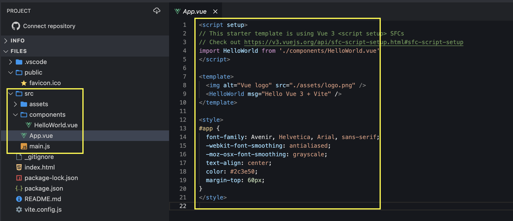
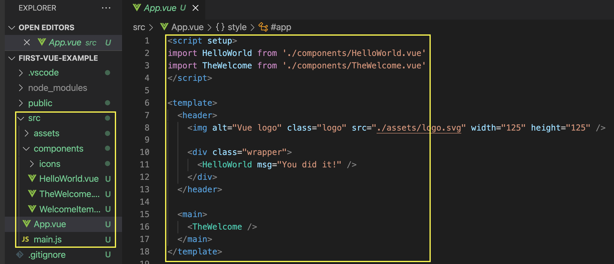
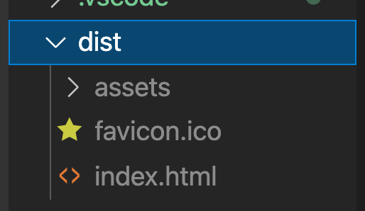

## Introduction to VUE

#### 0. [Preface](#preface)

#### I. [Setup the HTML & CSS](#chapter1)

#### II. [Quick Start](#chapter2)

#### III. [Understand how VUE create an application](#chapter3)

- [3.1 App Instance](#ch3-1)
- [3.2 The Root Component](#ch3-2)
- [3.3 Mount the App](#ch3-3)
- [3.4 In-DOM Root Component Template](#ch3-4)
- [3.5 App Configurations](#ch3-5)
- [3.6 Multiple App Instances](#ch3-6)

#### IV. [My Open questions](#chapter4)

#### V. [Source Code Reference](#summary)

<div id="preface" />

### 0. Preface

What is first step if you wanna learn a huge thing? --> go to the official site to get started ! ✌️
https://vuejs.org/
After viewing the video, what caught my eyes at first about VUE?

- "progressive" JS framework
- Core Library + addon (state manage, SSR, Router, Test, IDE, CLI, etc.) --> VUE eco-system (I feel like this is similar like React's core concept)

Then they say go to the "[Vue Master](https://www.vuemastery.com/courses)" website, which VUE provides many classes and resources from their official community to teach and educate developers.

But, let's skip that and keep going! --> Because I am already good enough to directly start coding with VUE as a professional front-end developer.

Let's go to the Docs and quickly get started! (https://vuejs.org/guide/introduction.html)

<div id="chapter1" />

### I. Introduction

Let's have a first glance at the entry code example for VUE app:

```js
import { createApp } from "vue";

createApp({
  data() {
    return {
      count: 0
    };
  }
}).mount("#app");
```

```js
<div id="app">
  <button @click="count++">
    Count is: {{ count }}
  </button>
</div>
```

Uhm, it makes me a little bit suprised at some unfamiliar syntax, questions already come to my mind. But let's keep reading the doc!

They said the progressive framework can provide the following core capabilities :

- Enhancing static HTML without a build step
- Embedding as Web Components on any page
- Single-Page Application (SPA)
- Fullstack / Server-Side-Rendering (SSR)
- Jamstack / Static-Site-Generation (SSG)
- Targeting desktop, mobile, WebGL or even the terminal

Now during my walkthrough the Core features, I will try to relate or compare with the React framework.

| Capability             | VUE                                                                                                                                                                                                                                                                                                                                                                                                                           | React                                                                                                                             |
| ---------------------- | ----------------------------------------------------------------------------------------------------------------------------------------------------------------------------------------------------------------------------------------------------------------------------------------------------------------------------------------------------------------------------------------------------------------------------- | --------------------------------------------------------------------------------------------------------------------------------- |
| Single-File Components | Vue components using an HTML-like file format called **Single-File Component** (also known as `*.vue` files, abbreviated as **SFC**). <br> They have `<script>, <template>, <style>` tags in one single file `.vue`, which is pretty cool, and easy to work as a single HTML page.                                                                                                                                            | N/A: I don't think react has the similar light weight support in one file. No `.react` file, right? yes.                          |
| API Styles             | VUE looks cool on this one, they provide more flexibility and various ways to support syntax to define a component.<br> 1) Options API (brand new way): more close to the native JS object syntax that you need to describe and define this component. ([link](https://vuejs.org/guide/introduction.html#api-styles)) <br> 2) Composition API (similar to react and ES6 classes)L: contain the "state, functions, lifeHooks". | the 2nd Composition API syntax is similar to React, but good to know the 1st brand new way that close to native JS object syntax. |

wanna to show the Code example, then you can feel more about the VUE syntax.

1.  Options API

    ```js
    <script>
    export default {
      // Properties returned from data() becomes reactive state
      // and will be exposed on `this`.
      data() {
        return {
          count: 0
        }
      },

      // Methods are functions that mutate state and trigger updates.
      // They can be bound as event listeners in templates.
      methods: {
        increment() {
          this.count++
        }
      },

      // Lifecycle hooks are called at different stages
      // of a component's lifecycle.
      // This function will be called when the component is mounted.
      mounted() {
        console.log(`The initial count is ${this.count}.`)
      }
    }
    </script>
    ```

2.  Composition API
    Don't worry the `setup` attribute, which is a hint that makes Vue perform compile-time transforms that allow us to use Composition API with less boilerplate.

    ````js
    <script setup>
    import { ref, onMounted } from 'vue'

        // reactive state
        const count = ref(0)

        // functions that mutate state and trigger updates
        function increment() {
          count.value++
        }

        // lifecycle hooks
        onMounted(() => {
          console.log(`The initial count is ${count.value}.`)
        })
        </script>
        ```
    ````

<div id="chapter2" />

### II. Quick Start

- With Build Tools
- Without Build Tools (this is cool 😎 ), different from React

#### 2.1 With Build Tools: online vs local

**Online:**
They provide a Vite.js blablabla...., but don't go that deep, and then just go to their already integrated tool [StackBlitz](https://vite.new/vue) , similar like a sandbox environment, that you can run your VUE code online.



Key takeaways:

- folder structures under `src`: similar to many other JS frameworks, we have a entry point `App.vue` and we have `/component` folder to define our component `<HelloWorld>`
- in first page `App.vue`:
  - import is similar like ES6 module import, no difference
  - in `<template>` tag to render the component, no difference

**Local**
Run the command line to create a vue project, I love this cli, which is really smart and provide you with multiple options for the add-ons:

```sh
npm init vue@latest
```

Then it will tell you how to run it:

```
cd <your-project-name>
npm install
npm run dev
```

When you see the folder structure and code, is pretty similar with the online tool, so you can have a very high level feeling that how VUE projects looks like and how it will work!



Then for "Build & Bundle", you will need to run this command, more info here: [Production Deployment Guide](https://vuejs.org/guide/best-practices/production-deployment.html).

```
npm run build
```

After this, you will have a `/dist` folder like this:



<div id="chapter3" />

### III. Understand how VUE create an application

<div id="ch3-1" />

#### 3.1 App Instance

in the `main.js` under the `/src` folder, it's the starting point to create the whole app.

```js
import { createApp } from "vue";

const app = createApp({
  /* root component options */
});
```

<div id="ch3-2" />

#### 3.2 The Root Component

Since we have another file `App.vue` under the `/src` folder, we will import it as the root component.

```js
// import the root component App from a single-file component.
import App from "./App.vue";
```

Then it will become:

```js
// main.js
import { createApp } from "vue";
import App from "./App.vue";

const app = createApp(App);
```

<div id="ch3-3" />

#### 3.3 Mounting the App

The mechanism is similar like reactApp, there will be a root element in html, and we will mount our whole APP in the correct DOM place.

For VUE project, we have an entry HTML file called `index.html` outside of `/src` folder, which defines the top level DOM structure:

```html
<body>
  <div id="app"></div>
  <script type="module" src="/src/main.js"></script>
</body>
```

So with the "id" attribute, and imported the `main.js` as script, then we can use the function to `mount()` the APP inside this HTML.

```js
const app = createApp(App);
app.mount("#app");
```

<div id="ch3-4" />

#### 3.4 In-DOM Root Component Template

If we don't have a root component like `App.vue`, then we don't need to use the prev syntax in section 3.3. Vue will automatically use the container's `innerHTML` as the template if the root component does not already have a `template` option.

Eg: in `index.html` file, we already have defined HTML code:

```html
// index.html
<div id="app">
  <button @click="count++">{{ count }}</button>
</div>
```

Then in `main.js` we don't need to create any APP, the JS code becomes the below:

```js
import { createApp } from "vue";

const app = createApp({
  data() {
    return {
      count: 0
    };
  }
});

app.mount("#app");
```

<div id="ch3-5" />

#### 3.5 App Configurations

- `.config` object for app to use
  I feel like this pretty similar to React's `ErrorBoundary` concept, which can catch any error in the whole app. But this is more light-weight in the JS file, not the component level. Maybe it's more close to the error handling as an interceptor , eg: when we use "axios", we can define a global error config.
  `app.config.errorHandler = (err) => { /* handle error */ }`
- register an component (like to define an alias for a component): [api link](https://vuejs.org/api/application.html#app-component)

You can also browse the full list of application instance APIs in its [API reference](https://vuejs.org/api/application.html).

<div id="ch3-6" />

#### 3.6 Multiple App Instances

This is interesting , since VUE can integrate the `index.html` with the real DOM easily, which support any customized html code, so we can **mount** multiple instances.

```js
const app1 = createApp({
  /* ... */
});
app1.mount("#container-1");

const app2 = createApp({
  /* ... */
});
app2.mount("#container-2");
```

<div id="chapter4" />

### IV. My Open Questions

These things that I want to deep explore and understand in future.

#### 4.1 VUE also use Virtual Dom, how does it work?

<div id="summary" />

### V. Source Code Reference

- first vue project example: [link](https://github.com/jialihan/VUE-Onboarding/tree/main/first-vue-example)
