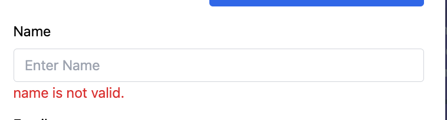

## Section 10 Form Validation - VUE

Why perform form validation on the frontend?

- it's **optional** on frontend
- provides immediate feedback
- save resources on the server side by reducing the number of requests to submit a form
- validation should **always** be peformed on the server side as well

3rd party validation library for VUE:

- `VUELIDATE`: https://vuelidate-next.netlify.app/
- ✅`Vee-Validate`: https://vee-validate.logaretm.com/v4/
  ```
  npm i vee-validate --save
  npm install vee-validate@next --save
  ```

### 10.1 register the vee-validate plugin

create a folder `/includes` or `/plugins` to put your plugin config files.

- register the plugin
  ```js
  // main.js
  app.use(VeeValidation, { foo: 100 });
  ```
- add the config file for this plugin:
  ```js
  // in /plugins/validation.js
  import { Form as VeeForm, Field as VeeField } from "vee-validate";
  export default {
    install(app, options) {
      app.component("VeeForm", VeeForm);
      app.component("VeeField", VeeField);
    }
  };
  ```
- `app.component()` method: Component registration in Vue - [global registration](https://vuejs.org/guide/components/registration.html):

  ```js
  const app = createApp({});
  app.component(
    // the registered name
    "MyComponent",
    // the implementation
    {}
  );
  ```

### 10.2 validation component

#### 10.2.1 check required field

- `require` attribute in HTML: [mdn-doc](https://developer.mozilla.org/en-US/docs/Web/HTML/Attributes/required), eg: ` <input type="text" required />`
- the vee [Field component](https://vee-validate.logaretm.com/v4/api/field) is responsible for a single input, it will generate an input tag by default, eg: `<vee-field as="span" type="text" />`

#### 10.2.2 validation process

10.2.2.1 use the `<Field />` component

10.2.2.2 assign a name to the input: `<vee-field name="firstName" />`

10.2.2.3 add the rules: [@vee-validate/rules](https://vee-validate.logaretm.com/v4/guide/global-validators#vee-validaterules): `npm install @vee-validate/rules`

```js
import { defineRule } from "vee-validate";
import { required } from "@vee-validate/rules";
install(app, options) {
// define rules: <ruleName, execFuntionForThisRule>
defineRule('required', required)
}
```

Applying the rule in template:

- way 1: use `:rule` bind the attribute
  ```html
  <vee-field type="text" name="firstName" :rule="'required'" />
  ```
- way 2: use `:validation-schema` to outsource the rules into an config object. A simple validation schema can be an object containing field names as keys and validation functions as the value for those keys:

```vue
<template>
  <vee-field :validation-schema="schema" />
</template>
<script>
export default {
  data() {
    return {
      // vee validation schema object
      schema: {
        name: "required",
        email: "",
        password: ""
      }
    };
  }
};
</script>
```

10.2.2.4 Handle the error
Import and register the [ErrorMessage component](https://vee-validate.logaretm.com/v4/api/error-message/):

```js
import { ErrorMessage } from "vee-validate";
app.component("ErrorMessage", ErrorMessage);
```

Use the component in template:

> The ErrorMessage component accepts an as prop that allows to control the root node to render for your error messages, by default it will render a span if none provided if there is an error message for the field.

```vue
<ErrorMessage name="email" as="p" />
```

Note: the `name` is the same in `<Field name="yourID" />` as a unique identifer attribute.

For example:


#### 10.2.3 add additional rules

10.2.3.1 we can bind an object to the `:rule=""` attribute.

```
:rule="'required'"
:rule="{
    required: true
}"
```

10.2.3.2 add multiple rules on one element

```js
schema: {
    // vee validation schema object
    name: 'required|min:3|max:100|alpha_spaces',
}
```

10.2.3.3 vee validation strategy

- follow the `fast exit` strategy: it will stop validating the input field upon encountering an error.
- validation will not peform on an empty field **until the initial value has changed**.

### 10.3 validating the email

"email" rule: [doc](https://vee-validate.logaretm.com/v2/guide/rules.html#email)

```vue
<vee-field type="email" placeholder="Enter Email" name="email" />
<ErrorMessage class="text-red-600" name="email" />
```

### 10.4 validating Number

rule for "numberic" value: [doc](https://vee-validate.logaretm.com/v2/guide/rules.html#max-value)

- `max_value`: A numeric value representing the greatest value allowed.
- `min_value`: The field under validation must be a numeric value and must not be less than the specified value.

```js
age: 'required|min_value:18|max_value:100',
```

### 10.5 validating password

the `confirmed` rule([doc](https://vee-validate.logaretm.com/v4/guide/global-validators#confirmed)): The field under validation must have the same value as the confirmation field.

```vue
<Form>
  <Field name="password" type="password" />
  <Field name="confirmation" type="password" rules="confirmed:@password" />
</Form>
```

### 10.6 validating Dropdown and Checkbox

For dropdown, we need to change the `<Field />` component into the `<select>` tag:

```
<Field as="select" />
```

For checkbox:

- how to detect the element is checked or not: `document.getElementById("lifecheck").checked;`
- the default value of this checkbox is `value=undefined` if you didn't give it a default value
- understand the `value=` attribute ([mdn doc](https://developer.mozilla.org/en-US/docs/Web/HTML/Element/input/checkbox#value))
- **Note**: `If a checkbox is unchecked when its form is submitted, neither the name nor the value is submitted to the server.`
- validating checkbox input: [doc](https://vee-validate.logaretm.com/v4/examples/checkboxes-and-radio#validating-checkbox-inputs)

### 10.7 Validate the Form

Before the submit, we should force to validate those inputs if user doesn't trigger validation on their own.

Steps:

- 1. add the `@submit="submitForm"` event handler, we will make use of the "[default event](https://developer.mozilla.org/en-US/docs/Web/API/HTMLFormElement/submit_event)" behavior of this "submit" event.
- 2. No need the `v-model` directive to bind the input element, because the `vee-validate` library do it for us.

### 10.11 Slot Property

- Vue doc: [link](https://vuejs.org/guide/components/slots.html#scoped-slots)
- available after VUE version `v2.6+`
- Reference: section [10_11]()
- 复习：`v-for， :key`: to render a list, must have a unique key (section 2.21)

### 10.12 render multiple ErrorMessage

Problem:
If you want to render multipe errors for a specific field, eg: `password` field to render every error:

- must contains `!?*...special char`
- length must larger than 6
- etc....

#### 12.1 the ":bails" prop - [doc](https://vee-validate.logaretm.com/v3/api/validation-provider.html#props)

The `bails` prop will tell the `<Field />` element to use the "fast-exit" strategy when it's `true`. We can set it to `false`, which means every rules will be checked even if the previous rule fails.

#### 12.2 receiving "errors" array on parent compoent

> Note: the `errors: []` will only be available if we set ":bails=false", otherwise, parent only can receive a single error prop: `{ field, error}`.

```
:bails="false" v-slot="{ field, errors }"
```

Final code example:

```html
<vee-field name="password" :bails="false" v-slot="{ field, errors }">
  <input type="password" placeholder="Password" v-bind="field" />
  <div class="text-red-600" v-for="error in errors" :key="error">
    {{ error }}
  </div>
</vee-field>
```

### 10.13 Add default value for DropDown

use `:initial-values` attribute to receive initial
`<Field />` value for those form element. Please see the [doc](https://vee-validate.logaretm.com/v4/guide/components/handling-forms#initial-values) here.

```jsx
<vee-form :initial-values="userData" />
```

### 10.14 Custom ErrorMessage

Root cause:
when we define the `defineRules(name, validateFunc)`, the 2nd argument `validateFn()` can `return true / error string`. We can override those **global validator functions** to return error strings.

Solution:
use `import {configure} from 'vee-validate';` to override the error messages using the config option `generateMessage`, please see the [doc](https://vee-validate.logaretm.com/v4/api/configuration/) here.

| Option          | Type                                       | Description                                                                                                                                                                                                                                                                                                                                                                               |
| --------------- | ------------------------------------------ | ----------------------------------------------------------------------------------------------------------------------------------------------------------------------------------------------------------------------------------------------------------------------------------------------------------------------------------------------------------------------------------------- |
| generateMessage | `(ctx: FieldValidationMetaInfo) => string` | A message generator function for i18n libraries and a fallback for rules with no messages. For more information about the [`FieldValidationMetaInfo`](https://github.com/logaretm/vee-validate/blob/main/packages/shared/types.ts#L1-L9) type and the purpose of this, see the [Global Message Generator Guide](https://vee-validate.logaretm.com/v4/guide/i18n#global-message-generator) |

For example:

```js
configure({
  generateMessage: (ctx) => {
    const messages = {
      required: `The field ${ctx.field} is required.`,
      min: `The field ${ctx.field} length is too short`,
      max: `The field ${ctx.field} length is too long`,
      email: `The field ${ctx.field} must be a valid email`,
      country_excluded: `Due to restrictions, we do not provide access from this location`,
      password_mismatch: `The password doesn't match.`,
      tos: `you must accept the Terms of Service`
    };
    const message =
      messages[ctx.rule.name] ?? `The field ${ctx.field} is invalid`;
    return message;
  };
});
```

### 10.15 Validation Triggers

When will the `<Field />` trigger validator function?

- 1. After the `"change"` event
- 2. If the `v-model` is applied an input, when the model data is changed.
- 3. After the `'blur'` event
- 4. After the form's submission

Example 1: configure the `validateOnBlur: true (default value)` option ([doc](https://vee-validate.logaretm.com/v4/api/configuration/))

Example 2: configure the `validateOnChange: true (default value)` option

Example 3: configure the `validateOnInput: false (default value)` option: when you type each keyboard key

Example 4: configure the `validateOnModelUpdate: true (default value)` option: when any `v-model` data changed.

### 10.16 Showing Alerts

10.16.1 important to disable the button during submission

```html
<button type="submit" :disabled="isSubmittingRegister">Submit</button>
```

Referenced article: https://hackernoon.com/how-we-spent-30k-usd-in-firebase-in-less-than-72-hours-307490bd24d

10.17 Summary the Form validation process

- 1. use `<Field />` element on each field, remember to add a `name=` attribute as unique identifier of this "Field" element.
- 2. use `<Form>`, and bind `:validation-schema="object"` for vee-validate rules configuration.
- 3. adding rules, for example: `email: "required|email"`
- 4. error handling: add the `<ErrorMessage name="" />` component, the `name=` attr **must match** the `<Field/>` element's name.
- 5. enforce the validation when submit the form, setup `@submit="onSubmitFunc"` event listener, it will **auto-enforce** the validation, if any errors, it won't perform the "submit()" func.
- 6. handle when submitting the form: disable the submit button and showing the alert after submit success
