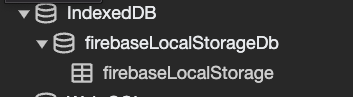

## Section 11 Authentication - VUE

### 11.1 setup firebase

- [firebase](https://firebase.google.com/) as the BE solutions for web application
- create the Test mode database
- [rules](https://firebase.google.com/docs/rules):
- setup SDK in our app: [doc](https://firebase.google.com/docs/web/setup): `npm i firebase@8`
- config the firebase in app: `/includes/firebase.js`
  ```js
  import firebase from "firebase/app";
  import "firebase/auth";
  export default firebase.initializeApp(firebaseConfig);
  ```

### 11.2 user registration

- `firebase.auth()`: [doc](https://firebase.google.com/docs/reference/js/v8/firebase.auth.Auth)

- method: `createUserWithEmailAndPassword(email, pw)`

### 11.3 handle the response

AuthError: [doc](https://firebase.google.com/docs/reference/js/v8/firebase.auth.AuthError)

[Common Error Codes](https://firebase.google.com/docs/reference/js/v8/firebase.auth.AuthError#common-error-codes):

- auth/account-exists-with-different-credential
- auth/credential-already-in-use
- auth/email-already-in-use

### 11.4 exporting services - firestore

create references of our services:

```
// create a service in this app
const auth = firebase.auth();
const db = firebase.firestore();

export { auth, db };
```

### 11.5 store the form data

- `collection`: the data you store in DB, you have to select a collection, before you modify the database.
- `Documents`: multiple docs can be in same collection, eg: `User Collection`

```js
// create a collection in DB
const usersCollection = db.collection("users");
await usersCollection.add({
  name: values.name,
  email: values.email,
  age: values.age,
  country: values.country
});
```

### 11.6 authentication workflow

```
client  ---- auth-data --->  server
        <---- token -------
local storage
```

- **Stateful** auth: eg: session storage
- **Stateless** Auth:
  - the server does **NOT actively keep track of who's logged in**.
  - eg: Firebase uses the `token` to verify the user

Understand the [Firebase Request](https://firebase.google.com/docs/reference/rules/rules.firestore.Request#auth) object:

- uid - the UID of the requesting user.
- token - a map of JWT token claims.

### 11.7 register and sign in

use the pinia to store the user's login state:

11.7.1. define the user store in pinia

```js
import { defineStore } from "pinia";
export default defineStore("user", {
  state: () => ({
    isLoggedIn: false
  })
});
```

11.7.2. modify this state in Components

```js
computed: {
  ...mapWritableState(useUserStore, ["isLoggedIn"])
},
```

11.7.3. when login success, toggle this property:

```js
// modify the local state in pinia's store
this.isLoggedIn = true;
```

### 11.8 Actions in Pinia

复习：`redux` **dispatch actions** - [blog doc](https://jialihan.github.io/blog/#/react/day04?id=question-2)

#### 11.8.1 [Actions](https://pinia.vuejs.org/core-concepts/actions.html)

they are **functions** for outsourcing business logic.

Benifits are:

- available to all components
- can be async
- can commit multiple mutations

Compare Actions vs. Component:

- define `logic` in `components` if the changes affect the element or its children.
- define `logic` in `actions` if the changes affect the store/state

#### 11.8.2 create the Action in pinia

create actions: [pinia-doc](https://pinia.vuejs.org/core-concepts/actions.html)

```js
export default defineStore("user", {
  state: () => ({
    age: 18
  }),
  actions: {
    async register(values) {
      // TODO
    }
  }
});
```

#### 11.8.3 Consume the Action in Components: [pinia-doc](https://pinia.vuejs.org/core-concepts/actions.html#Without-setup-)

1. Actions are invoked like regular functions and methods:

```html
<button @click="store.randomizeCounter()">Randomize</button>
```

2. If you would prefer not to use Composition API at all, you can use the mapActions() helper to map actions properties as methods in your component: ([doc](https://pinia.vuejs.org/core-concepts/actions.html))

```js
import { mapActions } from "pinia";
import { useCounterStore } from "../stores/counter";

export default {
  methods: {
    // gives access to this.increment() inside the component
    // same as calling from store.increment()
    ...mapActions(useCounterStore, ["increment"]),
    // same as above but registers it as this.myOwnName()
    ...mapActions(useCounterStore, { myOwnName: "increment" })
  }
};
```

### 11.9 connect the User and their Data

In firebase application, there is a `uid` to each `Document` in firestore.
`createUserWithEmailAndPassword` : [doc](https://firebase.google.com/docs/reference/js/v8/firebase.auth.Auth#createuserwithemailandpassword)

Returns `Promise<UserCredential>`([doc](https://firebase.google.com/docs/reference/js/v8/firebase.auth#usercredential)):

```
UserCredential: { additionalUserInfo?: AdditionalUserInfo | null; credential: AuthCredential | null; operationType?: string | null; user: User | null }
```

And the `User.uid` - [doc](https://firebase.google.com/docs/reference/js/v8/firebase.User) as a unique identifier to connect the user's data.

Firebase methods:

- `collection.doc()`
- `document.set()`
- User object: `user.updateProfile(})` - [doc](https://firebase.google.com/docs/reference/js/v8/firebase.User#updateprofile)
  ```
  updateProfile ( profile :  { displayName ?: string | null ; photoURL ?: string | null } ) : Promise < void >
  ```

### 11.10 persist user authentication

Issue:
if user refresh the page, page lose the auth information, we want to login the use back in a certain time.

**Solution**:
load the firebase first **before** load the VUE instance: [onAuthStateChanged](https://firebase.google.com/docs/reference/js/v8/firebase.auth.Auth#onauthstatechanged) method

```js
firebase.auth().onAuthStateChanged(function (user) {
  if (user) {
    // User is signed in.
  }
});
```

Use the lifehook `created()` which happens between `beforeCreated` and `beforeMount()`:

- **hook**: `beforeCreate`
- initialize `data()` and `methods`
- **hook**: `created`
- Vue `mount()` the app and **compile the template** code and process it.
- **hook**: `beforeMount`
- Vue replace property with complied template

#### 11.10.2 How does firebase persist the current User logged in?



> Firebase Auth utilizes **in-memory, LocalStorage, SessionStorage and IndexDB** internally depending on the platform, availability and authentication state persistence settings. Removing the data from the storage will result in subsequent onAuthStateChanged() to return null.

### 11.11 Login and Logout the user

- `signInWithEmailAndPassword(email, password)` - [doc](https://firebase.google.com/docs/auth/web/password-auth#sign_in_a_user_with_an_email_address_and_password)
- use `window.location.reload();` to force to refresh the page after the api that the user is already logged in.
- map multiple stores: 复习 [section 9.11.2](https://jialihan.github.io/blog/#/VUE/section9) - each store will be accessible as its `<id> + 'Store'`.
  ```js
    computed: {
      ...mapStores(useModalStore, useUserStore)
    },
    // access the props: userStore.isLoggedIn
  ```
- 复习： `v-if on <template>` - [section 2.19.3](https://jialihan.github.io/blog/#/VUE/section2), **when toggle more than one element, use an invisible wrapper.** ([vue-doc](https://vuejs.org/guide/essentials/conditional.html#v-if-on-template))
- Log out function: `auth.signOut();` - [doc](https://firebase.google.com/docs/auth/web/password-auth#next_steps)

  ```js
  import { getAuth, signOut } from "firebase/auth";
  const auth = getAuth();
  signOut(auth)
    .then(() => {
      // Sign-out successful.
    })
    .catch((error) => {
      // An error happened.
    });
  ```

- the `signOut()` method will clear the browsers's "Storage", also the pinia state is reset correctly: `isLoggedIn=false`.

### 11.12 JSON Web Tokens

#### 11.12.1 web tokens

- encoded strings for storing data
- digitally signed

#### 11.12.2 JWT (json web token) - [doc](https://jwt.io/)

- token is generally created on the Backend
- Algorithm to decode the token, then into **3 sections**:
  - Header: `algo` and `type: 'JWT'` fields
  - Payload: Data stored in this token
  - Verify signature: to verify the content of the web token.
- base64 decode: https://www.base64decode.org/

#### 11.12.3 SSL certificate on server side

The process works like this: ([link](https://www.kaspersky.com/resource-center/definitions/what-is-a-ssl-certificate))

- A browser or server attempts to connect to a website (i.e., a web server) secured with SSL.
- The browser or server requests that the web server identifies itself.
- The web server sends the browser or server a copy of its SSL certificate in response.
- The browser or server checks to see whether it trusts the SSL certificate. If it does, it signals this to the webserver.
- The web server then returns a digitally signed acknowledgment to start an SSL encrypted session.
- Encrypted data is shared between the browser or server and the webserver.

This process is sometimes referred to as an **"SSL handshake."** While it sounds like a lengthy process, it takes place in milliseconds.

### 11.13 Debugging issues

- if password is short eg:3, browser will mark it as BAD request to firebase
- CORS issue in google firebase
