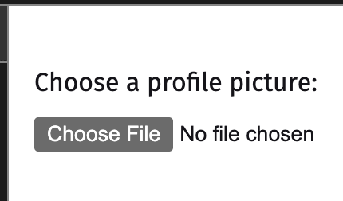
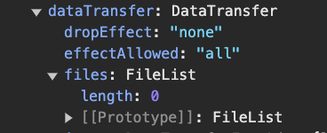
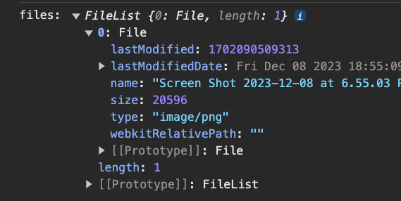
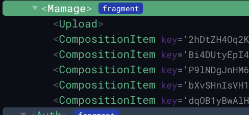
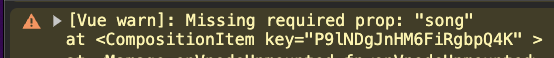
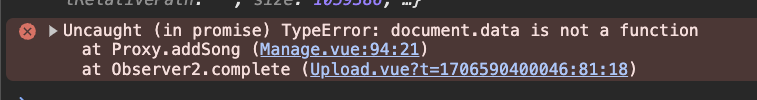

## Section 13. Uploading Files

<div id="p0" />

### O. Preface

Client:

- transferring the file to the server
- providing a way to access the file

Server:

- Validate the upload
- store the file
- file permissions
- create the API to the client to send the file

Basic File upload element: [mdn doc](https://developer.mozilla.org/en-US/docs/Web/HTML/Element/input/file)
`<input>` elements with type=`"file"` let the user choose one or more files from their device storage. Once chosen, the files can be uploaded to a server using [form submission](https://developer.mozilla.org/en-US/docs/Learn/Forms), or manipulated using JavaScript code and the [File API](https://developer.mozilla.org/en-US/docs/Web/API/File_API/Using_files_from_web_applications).

`accept=` attribute: specify types of file, eg: `.jpg, .pdf, video/*, audio/*`, [mdn doc](https://developer.mozilla.org/en-US/docs/Web/HTML/Attributes/accept).

```html
<label for="myfile">Choose a profile picture:</label>
<input
  type="file"
  id="myfile"
  name="fileupload"
  accept="image/png, image/jpeg"
/>
```



**Example: submit with PHP** ([w3school link](https://www.w3schools.com/php/php_file_upload.asp))

Some rules to follow for the HTML form above:

- Make sure that the form uses method="post"
- The form also needs the following attribute: `enctype="multipart/form-data"`. It specifies which content-type to use when submitting the form

```html
<form action="upload.php" method="post" enctype="multipart/form-data">
  Select image to upload:
  <input type="file" name="fileToUpload" id="fileToUpload" />
  <input type="submit" value="Upload Image" name="submit" />
</form>
```

**Example: submit form with JS**
refer to this [page](https://www.freecodecamp.org/news/how-to-submit-a-form-with-javascript/)

```html
<form action="" id="myForm">
  Select image to upload:
  <input type="file" name="fileToUpload" id="fileToUpload" />
  <input type="submit" value="Upload Image" name="submit" />
  <!-- <button type="submit">Submit</button> -->
</form>
```

```js
let myForm = document.getElementById("myForm");
loginForm.addEventListener("submit", (e) => {
  e.preventDefault(); // prevent the default submit action
  // handle submit
  console.log("form submit event!");
});
```

<div id="p1" />

### 1. Create Upload Component in VUE

复习:

- Component **naming convention** in vue: [eslint-plugin-vue](https://eslint.vuejs.org/rules/component-name-in-template-casing)

  - `PascalCase` (**default**) ... enforce tag names to pascal case. E.g. `<CoolComponent>`. This is consistent with the JSX practice.
  - `kebab-case` ... enforce tag names to kebab case: E.g. `<cool-component>`. This is consistent with the HTML practice which is case-insensitive originally.

- difference between `/src/views` and `/src/components`, th of them contains vue components. But the `/views` contains the index/top level routing component to show the base of the page, eg: `/views/Home.vue`, `/views/About.vue`: ([stackoverflow link](https://stackoverflow.com/questions/50865828/what-is-the-difference-between-the-views-and-components-folders-in-a-vue-project)).

<div id="p2" />

### 2. Drag and Drop Events

Please refer to this [JS demo and doc](https://github.com/jialihan/JavaScript-Onboarding/tree/master/drag-api)

Listenning to native drag events:

- `@drag=""`
- `@dragstart=""`
- `@dragend=""`
- `@dragover=""`: the element is being hovering something over it's top, the element under the dragging element fires this event. 当被拖动元素在目的地元素内时触发
- `@dragenter=""`
- `@dragleave=""`
- `@drop=""`: this event can be fired by releasing the mouse or by pressing the ESC key.'

And add the event modifier: `@drag.prevent.stop`:

- `.stop`: The propagation of the click event will stop.
- `.prevent`: This is used to prevent the reloading of the webpage. **NOTE:** the `default behavior of browser drop` the file is that browser will open the file in another tab.

**Review:**
[Accessing Event Argument in Inline Handlers](https://vuejs.org/guide/essentials/event-handling#accessing-event-argument-in-i
nline-handlers)

```vue
<div @drop.prevent.stop="onUpload($event)" />
```

### 3. upload the File

A bug in chrome to debug Drag event property:

**Before**: we cannot find any file data in the `$event.dataTransfer`



**After:**

```js
// access each property in the data
const { files } = $event.dataTransfer;
console.log("event:", files);
```



File **Mime Types**:
[mdn doc](https://developer.mozilla.org/en-US/docs/Web/HTTP/Basics_of_HTTP/MIME_types), `type/subtype;parameter=value`.

**Audio** mime types: [wiki page](https://en.wikipedia.org/wiki/HTML5_audio#Supported_audio_coding_formats).

复习：

- `break;` cannot stop the `forEach() loop`: [doc-ways to break the forEach loop](https://byby.dev/js-foreach-break)
- but `return;` can stop the `forEach() loop`

#### 4. upload file to Firebase Storage

4.1 Enable the storage on firebase console:

```
match /{allPaths=**} {
    allow read, write: if request.auth != null;
}
```

4.2 setup storage service in VUE code

```
import "firebase/storage";
const storage = firebase.storage();
export {storage};
```

<div id="p4_3" />

4.3 consume the storage service in VUE code
Creating storage reference from the root to each child folder to keep the structure cleaner.

```js
// Root ref: storageBucket: "xxx.com"
const storageRef = storage.ref();
// sub folder in the storage: xxx.com/songs/example.mp3"
const songsRef = storageRef.child(`songs/${file.name}`);
songsRef.put(file);
```

upload from a file: [firebase doc](https://firebase.google.com/docs/storage/web/upload-files#upload_from_a_blob_or_file)

```js
// 'file' comes from the Blob or File API
ref.put(file).then((snapshot) => {
  console.log("Uploaded a blob or file!");
});
```

4.4 handle the upload response
server validation rules - [firebase-rule-syntax](https://firebase.google.com/docs/storage/security/core-syntax)

```
 allow write:
        if request.auth != null
        && request.resource.contentType == "audio/mpeg"
        && request.resouce.size < 10* 1024* 1024;
```

```
// audo file size:
10 * 1024 * 1024 = 10mb; // mb kb byte
```

**Monitor upload progress**: [firebase doc](https://firebase.google.com/docs/storage/web/upload-files#monitor_upload_progress)

- `'state_changed'` observer, called any time the state changes
- `bytesTransferred` : number
- `totalBytes`: number

**css styles**:

```
style="
    {
    width: upload.current_progress + '%';
    }
"
```

**Improve styles:**

- use FontAwesome library: https://fontawesome.com/
- use Tailwind `text_color`: https://tailwindcss.com/docs/text-color

**Error codes in firebase**: [doc](https://firebase.google.com/docs/storage/web/handle-errors)

复习：

- `array.push()` returns the **new length** of the array.

#### 5. firebase snapshot vs. references

Firebase [References](https://firebase.google.com/docs/storage/web/create-reference):

- an object that points to a location in your application
- allow you to read/wrtie references
- create new instances

eg: `storage.ref()`

Firebase **Snapshot**:

- an object that is a copy of a location in your application `(it's created for your events automatically, you annot manually create)`
- `read-only`, but memory efficient
- immutable

##### 6. Fallback Upload

the Drop and Drag API can be easy to get errors, and some browsers cannot use, eg: [Can I use Drag and Drop ?](https://caniuse.com/dragndrop)

use the Native `<input>` to let user to select a file:

```html
<!-- add a native support to upload a file -->
<input type="file" multiple @change="onUpload($event)" />
```

how to get the data from the `<input />`'s event?

```js
const files = $event.dataTransfer
  ? [...$event.dataTransfer.files] // when drag & drop api
  : [...$event.target.files]; // when native file select input
```

##### 7. cancel the upload task

7.1 When user leave the page while the task is inprogress:

```js
  beforeUnmount() {
    this.uploads.forEach((upload) => {
      upload.task.cancel();
    });
  },
```

Result: in the console:

```
// info log:
error upload: FirebaseError: Firebase Storage: User canceled the upload/download. (storage/canceled)
```

7.2 Another approach to cancel: use Navigation guard: `beforeRouteLeave(to, from, next)` and Refs

Why use references? - not a major solution in vue, a alternative solution when others doesn't work.

- Allows you to select elements, easier to select elements
- Components are re-usable. This makes it harder to select elements.
- References are `scoped` to their `instances`.

Use a `ref=""` attribute:

```html
<app-upload ref="upload" />
```

Access the ref in [this.$refs](https://www.w3schools.com/vue/ref_objRefs.php) object

```js
// option2: solution to cancel
  beforeRouteLeave(to, from, next) {
    this.$refs.upload.cancelUploads();
    // !!! Important: user cannot navigate to next page until this function is called.
    next();
  },
```

#### 8. Cautious using Refs

8.1 References cannot change the value of VUE instance or its data. You only have `direct access to the DOM itself without updating the vue instances`.

8.2 how Vue's reactivity works?
VUE instance do everything for you to update the Dom.

```
Data changes -> vue instance is updated => vue updates the template => templates rendered onto the DOM
```

```vue
<h1 ref="greeting">{{ title }}</h1>
```

```js
const app = Vue.createApp({
  data: () => ({
    title: "Hello",
  }),
}).mount("#app");

app.$refs.greeting.innerText = "another hello";
```

Result: the `this.title` is not updated in Vue instance.

#### 9. query the database (fetch data from firebase)

use "[create()](https://vuejs.org/api/options-lifecycle.html#created)" lifehook to start fetch the data async.

```js
async created() {
    // earliest momnent we can fetch the data async
    const snapshot = await songsCollection
        .where("uid", "==", auth.currentUser.uid)
        .get();
},
```

#### 10. render a list of data

10.1 store the data in local component's `data()`.

10.2 create `<Item>` component in the list of data

```vue
<composition-item v-for="song in songs" :key="song.docId" />
```



10.3 Prop validation
JS code:

```js
export default {
  name: "CompositionItem",
  // Prop validation
  props: {
    song: {
      type: Object,
      required: true,
    },
  },
};
```

If prop is wrong, console will have the reminder messages:



How to fix the prop? - bind the `:song (as a prop)`

```vue
<composition-item v-for="song in songs" :key="song.docId" :song="song" />
```

#### 11. validate the Form

use `<vee-form>`, 复习：[section10 - vue form validation](https://jialihan.github.io/blog/#/VUE/section10)

```html
<vee-form :validation-schema="schema" :initial-values="song">
  <div class="mb-3">
    <label class="inline-block mb-2">Song Title</label>
    <vee-field name="modified_name" />
    <ErrorMessage class="text-red-600" name="modified_name" />
  </div>
</vee-form>
```

复习：

- `props validation` in component: [section6 - 10](https://jialihan.github.io/blog/#/VUE/section6?id=_10-validate-props)

#### 12. firebase collections API summarize

12.1 delete a document: https://firebase.google.com/docs/storage/web/delete-files, and add the firebase rule: `allow delete: if request.auth != null; `. Refer: [Storage Security Rules](https://firebase.google.com/docs/firestore/security/rules-structure#granular_operations)

12.2 复习：[section4 - storageRef](#p4_3)

```js
const storageRef = storage.ref();
const songRef = storageRef.child(`songs/${this.song.original_name}`);
```

12.3 Difference of Ref vs. Snapshot



```js
const songRef = await songsCollection.add(song);
const songSnapshot = await songRef.get();
this.addSong(songSnapshot);
```

#### 13. Router Leave Guards

13.1 Solution:
ask the user "do you want to leave this page"?

Add `input` event listener:

```
@input="updateUnsavedFlag(true)"
```

13.2 `confirm()` alert function: https://developer.mozilla.org/en-US/docs/Web/API/Window/confirm

UI result:

