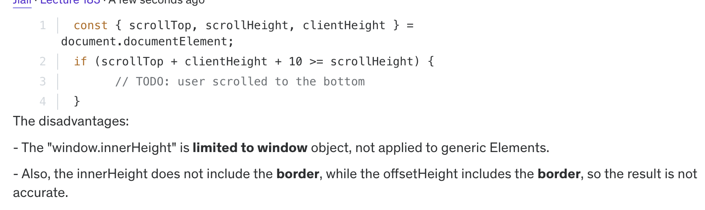
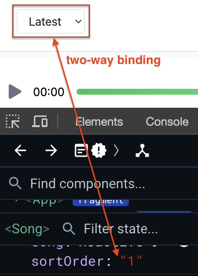
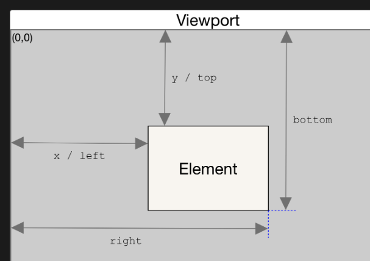

## Section 14_01 Infinite scrolling in Vue

### 1. open questions

- when to perform a request for more songs?
- to ensure not making multiple request

### 2. decide scrolling position

2.1 event listener for "scroll"

- add event listener when page inital loads
- [remove event listener](https://developer.mozilla.org/en-US/docs/Web/API/EventTarget/removeEventListener#matching_event_listeners_for_removal) when component `unmounts`.

```js
window.addEventListener("scroll", this.handleScroll);
window.removeEventListener("scroll", this.handleScroll);
```

2.2 calc height positions
复习：

- [infite scroll doc](https://jialihan.github.io/blog/#/javascript/infinite-scroll?id=p2)
- ✅ `srollHeight = scrollTop + clientHeight`
- ❌ `OffsetHeight = window.innerHeight + scrollTop`



2.3 Pagination API request from firebase
Doc:

- [Paginate data with query cursors](https://firebase.google.com/docs/firestore/query-data/query-cursors)
- [Orderby and limit data with Cloud Firestore](https://firebase.google.com/docs/firestore/query-data/order-limit-data)

```js
snapshots = await songsCollection
  .orderBy("modified_name")
  .startAfter(lastDoc)
  .limit(this.maxPerPage)
  .get();
```

### 3. dynamic route params

doc: [Dynamic Route Matching with Params](https://router.vuejs.org/guide/essentials/dynamic-matching.html)

| pattern                        | matched path             | $route.params                            |
| ------------------------------ | ------------------------ | ---------------------------------------- |
| /users/:username               | /users/eduardo           | `{ username: 'eduardo' }`                |
| /users/:username/posts/:postId | /users/eduardo/posts/123 | `{ username: 'eduardo', postId: '123' }` |

Route config:

```js
  {
    name: "song",
    path: "/song/:id",
    component: Song,
  },
```

Consume in templates:

```vue
<div>
    {{ $route.params.id }}
</div>
```

### 4. Form validation - 复习

- `vee-form`: the `as='select'` prop - [doc](https://vee-validate.logaretm.com/v4/api/field/)
- [validation schema](https://vee-validate.logaretm.com/v4/guide/components/validation/): `:validation-schema="object"`

### 5. fetch data and re-render data

5.1 display the comments data from firebase

```js
async getComments() {
    const snapshots = await commentsCollection
    .where("sid", "==", this.$route.params.id)
    .get();
    // ...
}
```

5.2 sortByOrder - use `v-modle` and `computed prop` to reflect the changes in re-renders.

- [Computed with v-model](https://skirtles-code.github.io/vue-examples/patterns/computed-v-model#computed-with-v-model)
- In Vue, `two-way binding` is accomplished using the `v-model` directive.
  

### 6 Vue Watchers and QueryParams

#### 6.1

```
Protocal  dpmain  /(path)  '?'  queryParams
```

For example:
`https://www.youtube.com/results?search_query=sunflower`
Youtube is using `search=` queryParam when user update the search and the page content re-renders.

#### 6.2 Vue Watchers

Use [VUE - watcher](https://vuejs.org/guide/essentials/watchers.html) to track the property changes in components:

what objects can be watched?
doc: [watchers in components](https://v2.vuejs.org/v2/guide/computed.html#Watchers)

> watch's first argument can be different types of reactive "sources": it can be a ref (including computed refs), a reactive object, a getter function, or an array of multiple sources.

For example: `this.data.sortOrder` property,

```
  watch: {
    sortOrder(newVal) {
      if (newVal === this.$router.query?.sortOrder) {
        return;
      }
      this.$router.push({
        // name: "somereoute", // Not needed here, but if you want to redirect
        query: {
          sortOrder: newVal,
        },
      });
    },
  },
```

#### 6.3 compare with "Path params" approach

- path param: be sused for `returning` a single or multiple resources
- query param: be used for `sorting /filtering` through data

### 7. eslint rule "no plusplus ++ or --"

doc: https://eslint.org/docs/latest/rules/no-plusplus

### 8. Howler.js - play audio

Doc: https://howlerjs.com/

#### 8.1 Create a Player Store:

- manipulate the state in store instead of the component, multiple pages need to play the song.

```js
import { defineStore } from "pinia";

export default defineStore("player", {
  state: () => ({
    current_song: {},
  }),
  actions: {
    async newSong(song) {
      this.current_song = song;
    },
  },
});
```

#### 8.2 Playing using Howler

play the song

```js
async newSong(song) {
    this.current_song = song;

    this.sound = new Howl({
    src: [song.url],
    html5: true,
    });

    this.sound.play();
}
```

Pause/stop the song

- define the "[Pinia: getters](https://pinia.vuejs.org/core-concepts/getters.html)" in the store
- They receive the `(state)` as the **first parameter** to encourage the usage of arrow function:

```js
getters: {
    doubleCount: (state) => state.count * 2,
},
```

Add the toggle Font-awesome Icon in template: [fa-play icon](https://fontawesome.com/v4/icon/play).

```html
<i
  class="fa text-gray-500 text-xl"
  :class="{ 'fa-lay': !playing, 'fa-pause': playing }"
></i>
```

### 9. Audio current position and duration

Howl api:

```js
this.sound.on("play", () => {
  console.log("on play event listener");
  requestAnimationFrame(this.progress);
});
```

[requestAnimationFrame()](https://developer.mozilla.org/en-US/docs/Web/API/window/requestAnimationFrame) is used to instruct the browser to execute a callback immediately before repainting the DOM.

复习：[JS-single thread](https://jialihan.github.io/blog/#/javascript/engine?id=_11-single-threaded-javascript)
Browser cannot execute JS and paint the DOM in the same thread:

- JS exec
- UI thread

### 10.progress bar in audio

use vue's directive `:style` to bind the dynamic "50%" percentage in CSS.

```
style="width: 50%"
:style="{ width: playerProgress }"
```

### 11. avoid multiple song playing

```js
async newSong(song) {
    // avoid playing multiple songs in the same time
    if (this.sound instanceof Howl) {
    this.sound.unload();
    }
    // ...
}
```

### 12. change audio position

> Note:
> anytime we have logic for mutating the state, we should put the logic in the store. eg: "@click.prevent='updateSeek'"

The [Element.getBoundingClientRect()](https://developer.mozilla.org/en-US/docs/Web/API/Element/getBoundingClientRect) method returns a `DOMRect` object providing information about the size of an element and its position `relative to the viewport`.



### 13. router-link: hash to a section

add a hash section:

```
:to="{ name: 'song',
  params: { id: song.docId }, hash: '#comments'
}"
```

Receiving the [v-slot props](https://vuejs.org/guide/components/slots.html#scoped-slots):

```vue
<MyComponent v-slot="{ text, count }">
  {{ text }} {{ count }}
</MyComponent>
```

复习： [v-slot](https://v3.router.vuejs.org/api/#v-slot-api-3-1-0) api:

> When using the `v-slot` API, it is required to pass one single child to `router-link`. If you don't, `router-link` will wrap its children in a `span` element.

```
<router-link
  to="/about"
  custom
  v-slot="{ href, route, navigate, isActive, isExactActive }"
>
  <NavLink :active="isActive" :href="href" @click="navigate"
    >{{ route.fullPath }}</NavLink
  >
</router-link>
```

- `href`: resolved url. This would be the `href` attribute of an `a` element
- `route`: resolved normalized location
- `navigate`: function to trigger the navigation. **It will automatically prevent events when necessary**, the same way `router-link` does. **Since we add a "custom" prop, we need to tell Vue-Router when to navigate.**
- `isActive`: `true` if the [active class](https://v3.router.vuejs.org/api/#active-class) should be applied. Allows to apply an arbitrary class
- `isExactActive`: `true` if the [exact active class](https://v3.router.vuejs.org/api/#exact-active-class) should be applied. Allows to apply an arbitrary class

### 14. router-view with transitions

doc: https://router.vuejs.org/guide/advanced/router-view-slot

```vue
<router-view v-slot="{ Component }">
  <component :is="Component" />
</router-view>
```

the slot allows us to use a `Transition component` to transition([复习:css transitions](https://jialihan.github.io/blog/#/VUE/section7?id=_71-css-transitions)) between route components:

```
<router-view v-slot="{ Component }">
  <transition name="fade">
    <component :is="Component" />
  </transition>
</router-view>
```
