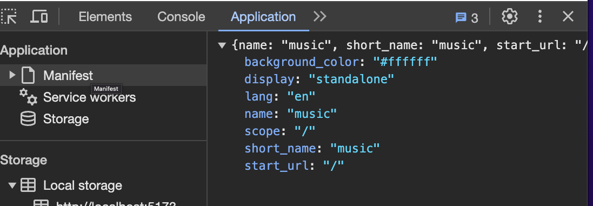
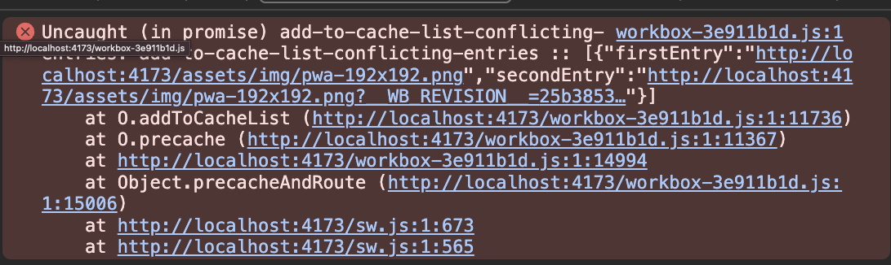
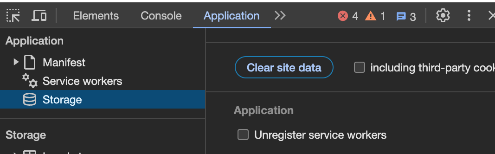

## Section 17 Progressive web apps

a set of fetaures that bring existing mobile features onto the Web. For example, some mobile features:

- open from home
- offline support
- background sync
- push notifications
- geo location
- access to hardware

Solution:
still write js, css and html, but there are APIs available in browsers we can leverage to bring a mobile experience to our mobile users.

Requirement of progressive web app:

- **capable**: ability to access camera, get user location
- **reliable**: sync state after short loss of connection, and be responsible on every touch using the browser's cache api strategy.
- **installable**: able to click the icon and directly take the users to our app.

PWA vs. SPA

- PWA is a term to describe a set of features and APIs in the browser.
- purely additive to [SPA/traditional sites](https://business.adobe.com/blog/basics/differences-between-traditional-web-apps-and-single-page-apps#what-is-a-traditional-web-application)
  - `multi-page application`: is typically consumed in a read-only format, MPAs function in a “traditional” way, meaning every change to the display requires the server to render a new page within the browser.
  - A `single-page application` functions directly within the browser and doesn’t have to be rerendered during use. SPAs rely on `JavaScript and web APIs` to communicate with the server.

### 1. Manifest File

how to make the app installable?

- let user add the app to the home screen
- when click the icon, directly open the app.

[Install Criteria](https://web.dev/articles/install-criteria)

what is a manifest file?
a JSON file that describes our application, assign a name, add icons, and set orientations of our app.

- `short_name` or `name`
- `icons`
- `start_url`
- `display`: must be one of `fullscreen`, `standalone`, or `minimal-ui`
- `prefer_related_applications` must not be present, or be `false`.

### 2. Vue plugin for PWA

doc: [vite pwa plugin](https://github.com/vuejs/vue-docs-zh-cn/blob/master/vue-cli-plugin-pwa/README.md)

```
npm i vite-plugin-pwa -D
```

config the pwa plugin in vite:

```js
import { VitePWA } from "vite-plugin-pwa";
VitePWA({
      registerType: "autoUpdate",
      devOptions: {
        enabled: true,
      },
    }),
```

### 3. generate a manifest file

3.1 background
The plugin won't generate a manifest file until the project has been built.

There are some warnings and errors, but it might not go away due to the local dev server, the PWA must be served from a real server.



3.2 produce the manifest file
We can produce the above `manifest.webmanifest` file by running the **build command**:

```
npm run build
```

then we can see the file under the path: `dist/manifest.webmanifest`.
Notes:

- `dispaly: standalone`: it indicates the app is independent of the browser, and it will remove the address bar in the browser, then the user won't be able to navigate away to another site.

  3.3
  in the `dist/index.html`, to tell the browser to load the manifest file.
  eg:

```
 <link rel="manifest" href="/manifest.webmanifest"><script id="vite-plugin-pwa:register-sw" src="/registerSW.js"></script>
```

### 4. configuring the manifest file

[Doc]:

- [vite web-app manifest](https://vite-pwa-org.netlify.app/guide/pwa-minimal-requirements.html#web-app-manifest)
- mdn [Manifest](https://developer.mozilla.org/en-US/docs/Web/Manifest)

example code:

```js
VitePWA({
    //...
    manifest: {
    name: "music app",
    theme_color: "#ff5e3a",
    icons: [
        {
        src: "/assets/img/pwa-192x192.png",
        sizes: "192x192",
        type: "image/png",
        },
    ],
    },
}),
```

### 5. offline support with service workers

#### 5.1 What is a service worker?

- it's a JS file that in the background
- it can run parallel to an application
- application code and service worker code cannot block each other. because it runs in a separate thread in the background.

what tasks can service worker do?

- caching files
- push notifications
- backround syncing
- etc..

Limitations of service worker?

- unable to access the DOM
- limited browser support, it's a new feature

#### 5.2 create a service worker

two approaches to create it:

- create the file manually
- ✅to use [Workbox](https://developer.chrome.com/docs/workbox/): easier to use, and vite plugin already configured, we just need to **register** it.

Register it in vite project:

```js
import { registerSW } from "virtual:pwa-register";

registerSW({ immediate: true });
```

> Note: we need to enable "caching" to make the PWA works "offline"

The preview server is different from the dev server, not watching file changes.

```
npm run preview
```

then make it "online" then "offline" mode, partial of the page is working, **only js, css and html** files are working. But images, audio is NOT working.

### 6. caching strategy

caching: a concept where copies of data and assets are stored for faster delivery.

caching strategy:
it works well for static assets, eg: css files.

```
client --> cache --> network
```

if data driven app, when user goes offline, we can have a `cache in browser` to make the page not empty.

another strategy:

```
client --> network --> cache
```

### 7. Workbox

Problem:
service worker cannot cache the images in pwa app in vite.

Solution: extend the [Workbox](https://developer.chrome.com/docs/workbox/) to cache static assets, eg: images, but **NOT cache the api requests**.

Doc: [Vite - service worker precache](https://vite-pwa-org.netlify.app/guide/service-worker-precache.html)

Bug1:
on my local it cannot cache one png image file:



solution:

```js
workbox: {
    globPatterns: ['**/*.{js,css,html,png,jpg,}'],
    globIgnores: ['assets/img/pwa-192x192.png']
}
```

**Bug2**:
uncheck the `Unregister service worker` in Application/storage tab.



### 5. firebase data persistence

5.1
doc: [enablePeristence](https://firebase.google.com/docs/reference/js/v8/firebase.firestore.Firestore#enablepersistence)

```js
const db = firebase.firestore();
db.enablePersistence().catch((err) => {
  console.log(`firebase persistence error: ${err}`);
});
```

Considerations if user `offline`:

- unable to authenticate
- storage is limited
- unable to upload files

#### 5.2 handle offline updates

how to detect user is onLine?
[navigator.onLine](https://developer.mozilla.org/en-US/docs/Web/API/Navigator/onLine) property.

solution:

- add a condition check to return the function
- mark this is a failure upload task.

```js
if (!navigator.onLine) {
  this.uploads.push({
    task: {},
    current_progress: 100,
    name: file.name,
    variant: "bg-red-400",
    icon: "fas fa-times",
    text_class: "text-red-400",
  });
  return;
}
```
