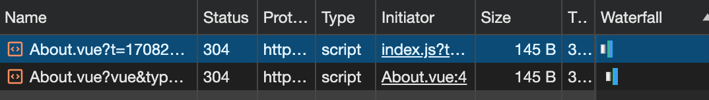
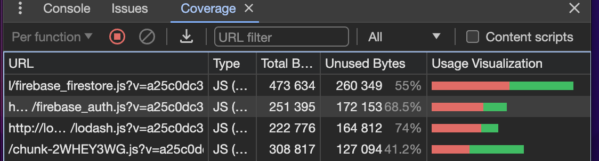

## Vue - Performance Optiomizations

`optimizations` can be for a lot of things:

- performance
- speed
- size
- dev experience
- etc..

### 1. component global registration

Steps of register globally:

- a. search for component files
- b. loop through the results
- c. import each component file
- d. prep the filename to be a valid component name
- e. register the component

Helpful functions:

- Vite internally uses [Lodash](https://lodash.com/), the module already installed in vite project. eg: [`_.upperFirst()`](https://lodash.com/docs/4.17.15#upperFirst)
- [glob import](https://vitejs.dev/guide/features#glob-import): `import.meta.glob("./dir/*.js")`
- [app.component()](https://vuejs.org/guide/components/registration#global-registration): vue component register function. eg: `      // prefix the name and export default
app.component(`Base${componentName}`, module.default);`

How to do it?
1.1 Create a [plugin](https://vuejs.org/guide/reusability/plugins)

```js
const myPlugin = {
  install(app, options) {
    // configure the app
  },
};

app.use(myPlugin, {
/_ optional options _/
})
```

1.2 implement the `install()` func to register each component:

```js
  install(app) {
    //glob(): func to search files by patterns
    const baseComponents = import.meta.glob("../components/base/*.vue", {
      eager: true,
    });
    Object.entries(baseComponents).forEach(([path, module]) => {
      const componentName = _.upperFirst(
        _.camelCase(
          path
            .split("/")
            .pop()
            .replace(/\.\w+$/, ""),
        ),
      );

      // ../components/base/button.vue Button
      // console.log(path, componentName);

      // prefix the name and export default
      app.component(`Base${componentName}`, module.default);
    });
  },
```

### 2. perceived performance

The _`feeling`_ of performance that a user experienes when using your app.

Problem:
the [async created()](https://vuejs.org/api/options-lifecycle.html#created) hook, vue will NOT wait the data been received to render other components.

Solution:
use the [navigation guard - beforeRouteEnter](https://router.vuejs.org/guide/advanced/navigation-guards.html#Using-the-options-API), because **navigation guards run before the component is loaded.**

Replace the `this.` with `vm` instance on the `next()` function callback:

> However, you can access the instance by passing a callback to `next`. The callback will be called when the navigation is confirmed, and the component instance will be passed to the callback as the argument:

```js
beforeRouteEnter (to, from, next) {
  next(vm => {
    // access to component public instance via `vm`
    // this.name = ...
    vm.name = to.params.name;
  })
}
```

### 3. Dynamic route imports

**Problem**: reduce the bundle size

A bundle contains our HTML, CSS, JS code.

**Solution:**
load the component only needed, the feature is called "Vite Chunks": a file that is separate from the bundle but can still be loaded into the bundle. but not be the part of core bundle.

create a chunk, eg:

```js
// import Home from "@/views/Home.vue";
const Home = () => import("@/views/Home.vue");
```



> Note: once a chunk is loaded, vite will not load the chunk again.

### 5. Progress Bar

one **downside** of separating the bundle into chunks is `longer loading time` between pages switching.

We should provide a way to indicate the chunk is downloading.

Solution:
use [NProgress.js](https://ricostacruz.com/nprogress/)

```
npm i nprogress
```

### 6. Code Coverage (tool)

**Benefits:**
the code coverage tool will tell you in real time which parts of your code aren't being used. Then we can know which part of code need put into `vite chunks`.

Open the dev tools:



### 7. reduce bundle size tool - Rollup Visualizer

Vite is using [Rollup visualizer](https://github.com/btd/rollup-plugin-visualizer) for building project, so plugins compatible with Rollup are also compatible with Vite. We can borrow plugins from Rollup community.

```
npm i -D rollup-plugin-visualizer
```

config the plugin in `vite.config.js` file:

```js
 plugins: [
    vue(),
    visualizer({ open: true }), // allow to open the html on browser
  ],
```

For example: optimize lodash module imports:

```js
// import _ from "lodash";
import upperFirst from "lodash/upperFirst";
import camelCase from "lodash/camelCase";
```
