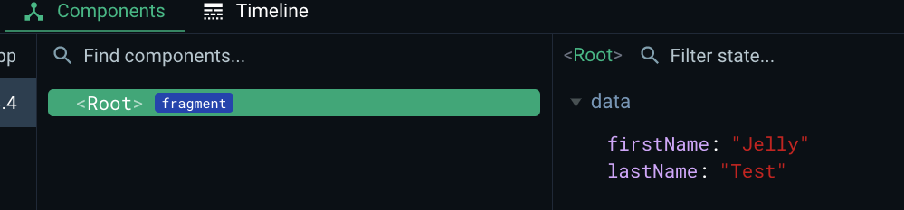

### 2.1 use Vue from CDN

1. [doc](https://vuejs.org/guide/quick-start.html#using-vue-from-cdn): where all top-level APIs are exposed as properties on the global `Vue` object.

```
  <body>
    <div id="app"><p>Hello world</p></div>

    <script src="https://unpkg.com/vue@3/dist/vue.global.js"></script>
    <script src="app.js"></script>
  </body>
```

2. `createApp`

```
Vue.createApp({}).mount("#app");
```

Open the HTML on local machine, you will see the below image:


### 2.2 vue dev tools (chrome extension)

link: https://chrome.google.com/webstore/detail/vuejs-devtools/nhdogjmejiglipccpnnnanhbledajbpd

### 2.3 data() method

A function that returns the **initial reactive state** for the component instance. The function is expected to return a **plain JavaScript object**, which will be made reactive by Vue. ([doc link](https://vuejs.org/api/options-state.html#data))

```
Vue.createApp({
  data() {
    return {
      firstName: "Jelly",
      lastName: "Test"
    };
  }
}).mount("#app");
```

Use VUE tools to check data is populated into vue elements:


**!!!复习**： shorthand syntax to defind a method in an `object / class` ([mdn-doc: method definitions](https://developer.mozilla.org/en-US/docs/Web/JavaScript/Reference/Functions/Method_definitions)):

```
const obj = {
  foo: function () {
    // old way
  },
  bar() {
    // shorthand syntax
  },
};
```

### 2.4 js expressions in template

- Expressions([mdn doc](https://developer.mozilla.org/en-US/docs/Web/JavaScript/Guide/Expressions_and_operators)) are allowed in template in vue selected elements.
  ```
    <div id="app">
      <!-- js expressions inside templates in selected elements by vue -->
      {{2 + 2 }}
    </div>
  ```
- text interpolation: all data props are exposed directly by their names -[] [Template Syntx - vue doc](https://vuejs.org/guide/essentials/template-syntax.html#text-interpolation)
  ```
    <div id="app">
      <!-- all data props are exposed directly by their names -->
      {{firstName}}
    </div>
  ```

### 2.5 multiple vue instances

1. same `.app` selector, but **VUE instance will only be mounted to one element**. If the selector find multiple elements in the `mount()` function, it will return the **1st element it finds**.

```
<div class="app">
    {{firstName}} {{lastName}}
</div>
<!-- 2nd instances of mounted element -->
<div class="app">
    {{firstName}} {{lastName}}
</div>
```


2. Two vue instances for each root element - allowed ✅

```javascript
Vue.createApp({
  data() {
    return {
      firstName: "Jelly",
      lastName: "Test"
    };
  }
}).mount(".app");

Vue.createApp({
  data() {
    return {
      firstName: "Jelly2",
      lastName: "Test2"
    };
  }
}).mount(".app2");
```

```vue
<div class="app">
    {{firstName}} {{lastName}}
</div>
<!-- 2nd instances of mounted element -->
<div class="app2">
    {{firstName}} {{lastName}}
</div>
```


### 2.6 access the instance data()

1. vue proxies ([doc](https://vuejs.org/api/options-state.html#data)):
   The component instance also proxies all the properties found on the data object, so `this.foo` will be equivalent to `this.$data.foo`.

- What is a proxy? - "a figure that can be used to represent the value of something in a calculation".
  

### 2.7 methods in app

1. not recommend to use `arrow function` ❌, due to the proxies in Vue, and we are using "this" key word in the function.
2. use the `methods:` field to define functions, directly used in template

```javascript
methods: {
  // define functions for our application
  getFullName() {
    // not recommend to use arrow functions, due to the proxies in VUE, since we are using the "this."
    return `${this.firstName} ${this.lastName.toUpperCase()}`;
  }
}
```

use in template:

```
{{`${firstName} ${lastName.toUpperCase()}`}}
{{getFullName()}}
```

### 2.8 Directives

**Definition:**

> directive are attributes that change the behavior of the element it's applied to.

This is an attribute to the browser, but it's a **directive** to VUE. [v-cloak](https://vuejs.org/api/built-in-directives.html#v-cloak): it will wait for VUE app to mount itself onto the document.

```html
<div id="app" v-cloak></div>
```

Add code to hide our component:
it will remove itself to where it's applied to. It helps to hide the elements which applied to.

```css
[v-cloak] {
  display: none;
}
```

<div id="section2_9_v-model" />

### 2.9 two way binding

1. [v-model](https://vuejs.org/api/built-in-directives.html#v-model): create a 2 way binding on a form input element. this directive does require a value, which is an expression.
   - Wrong example: `v-model="{{firstName}}"` ❌
   - Correct: `v-model="firstName"` ✅ - the string is already treated as an expression.


2. reactivity: when any changes to the `data()` is immediately reflected on the page.
   In vallina JS, similar to the event listener:

```javascript
const inputEL = document.getElementById("first-name");
inputEL.addEventListener("keyup", function () {
  const p = document.querySelector("p");
  p.innerText = this.value;
});
```

- 2.1) change on html UI page
  
- 2.2) change in JS code, eg: in console
  

### 2.10 v-bind attribute

1. 复习知识：

- `<a target="_blank">`: [mdn doc](https://developer.mozilla.org/en-US/docs/Web/HTML/Element/a)
- `<hr />`: adding a horizontal line - [mdn doc](https://developer.mozilla.org/en-US/docs/Web/HTML/Element/hr)

2. [v-bind](https://vuejs.org/api/built-in-directives.html#v-bind) directive

```html
<a href="https://www.google.com" target="_blank">Google page</a>
<a v-bind:href="url" target="_top">Google page</a>
```

**shorthand** way: use `:(colon)`

```html
<a :href="url" target="_top">Google page</a>
```

### 2.11 outputing Raw HTML

1. eg: malicious html injected to the page, as known as XSS attack.
2. [v-html](https://vuejs.org/api/built-in-directives.html#v-html): this directive will allow us to output **unescapable** html, the value of this directive is also an expression.

```
data() {
  return {
    raw_url:
      '<a href="https://www.google.com" target="_blank">Google page</a>'
  };
},
<p v-html="raw_url"></p>
```


3. security risks

- VUE `data()` will always output as `raw text`, so it's safe!!!
- be careful when you intentionally output HTML - `v-html`, user can change the links to the harmful sites, eg: `vm.raw_url='<a href="https://www.badsite.com/">Google</a>'`

### 2.12 event listening

1. use [v-on:eventName](https://vuejs.org/api/built-in-directives.html#v-on) directive to bind the function, the shorthand is `@eventName`:

- function name, with or without `()`
- js expressions directly, eg: `counter++`

```html
<button type="button" v-on:click="add()">ADD</button>
<button type="button" @click="add()">ADD_v2</button>
<button type="button" v-on:click="age--">Dec</button>
```

2. customized bind the value vs. v-model
   **Before**: [v-model](#section2_9_v-model) auto binds

```html
<input type="text" v-model="lastName" />
```

**After**: `v-bind attribute` + `input event listener`

```html
<input type="text" :value="lastName" @input="updateLastName" />
```

```javascript
methods: {
  updateLastName(event) {
    this.lastName = event.target.value;
  }
}
```

3. passing data with events
   If using inline statement, the statement has access to the special `$event` property: `v-on:click="handle('ok', $event)"`.
   for example:

```html
<input
  type="text"
  :value="lastName"
  @input="updateLastName('prefix:', $event)"
/>
```

```js
updateLastName(msg, event) {
  event.preventDefault();
  console.log("message: ", msg);
  this.lastName = event.target.value;
}
```

4. event modifier - [vue doc](https://vuejs.org/guide/essentials/event-handling.html#event-modifiers)
   It is a very common need to call `event.preventDefault()` or `event.stopPropagation()` inside event handlers.

To address this problem, Vue provides event modifiers for v-on. Recall that modifiers are directive postfixes denoted by a dot.

- `.stop`
- `.prevent`
- `.self`
- `.capture`
- `.once`
- `.passive`

Syntax:

```html
<input
  type="text"
  :value="lastName"
  @input.prevent="updateLastName('prefix:', $event)"
/>
```

### 2.13 keyboard events

1. [keyboard modifiers](https://vuejs.org/guide/essentials/event-handling.html#key-modifiers)

```html
<input type="text" @keyup.enter="updateMiddleName" />
```

it equals to the vallina JS:

```js
if (event.key === "Enter") {
}
```

2. Quick note: js get keyCode ([tool link](https://www.toptal.com/developers/keycode))

### 2.14 v-model modifiers

1. html tag `<input type="number" />` will only allow user to type numbers in the box. ([doc](https://developer.mozilla.org/en-US/docs/Web/HTML/Element/input/number))

2. three [v-model modifiers](https://vuejs.org/guide/essentials/forms.html#modifiers):

- `.lazy`: synced after **"change"** instead of **"input"**
- `.number`
- `.trim`

### 2.15 computed property - ([doc](https://vuejs.org/guide/essentials/computed.html))

```js
data() {}
methods: {},
computed: {
  getFullName() {
    console.log("computed: full name updated");
    // not recommend to use arrow functions, due to the proxies in VUE, since we are using the "this."
    return `${this.firstName} ${
      this.middleName
    } ${this.lastName.toUpperCase()}`;
  }
}
```

Vue stores the value of the property, not the function, so it's not the "function" in the template:

- `{{fullName}}`: ✅
- `{{fullName()}}` or `{{fullName('abc')}}` : ❌


### 2.16 watcher - [doc](https://vuejs.org/guide/essentials/watchers.html)

```js
watch: {
  age(newVal, oldVal) {
    // could be async
    setTimeout(() => {
      this.age = 18;
    }, 3000);
    console.log("new value: " + newVal, "oldValue: " + oldVal);
  }
}
```


### 2.17 Class and style bindings - [doc](https://vuejs.org/guide/essentials/class-and-style.html)

**1. bind to object**
We can pass an object to `:class` (short for `v-bind:class`) to dynamically toggle classes:

```html
<div :class="{ active: isActive }"></div>
```

**2. bind to arrays** - [doc](https://vuejs.org/guide/essentials/class-and-style.html#binding-to-arrays)

```html
<div class="circle" :class="[selectedColor, circle_classes]">Hi!</div>
```

### 2.18 binding styles

复习：
html style tag ([mdn doc](https://developer.mozilla.org/en-US/docs/Web/API/HTMLElement/style)): `'font-wight':bold` or `fontWeight:bold`

1. [doc](https://vuejs.org/guide/essentials/class-and-style.html#binding-to-objects-1): bind to objects

```
<div
  class="circle"
  :class="[selectedColor, circle_classes]"
  :style="{ width: size + 'px', height: size +'px', lineHeight: size+'px'}"
>
  Hi!
</div>
```

2. [doc](https://vuejs.org/guide/essentials/class-and-style.html#binding-to-arrays-1): binding to arrays

```js
computed: {
  circle_styles() {
    return [
      {
        width: this.size + "px",
        height: this.size + "px",
        lineHeight: this.size + "px"
      },
      {
        transform: "rotate(30deg)"
      }
    ];
  }
}
```

Or in HTML:

```html
<div
  :style="[{ width: size + 'px', height: size +'px', lineHeight: size+'px'}, { transform: 'rotate(30deg)'}]"
></div>
```

### 2.19 Conditional Rendering

3. When `v-if` is false, the element will be removed from the dom, instead of hiding it.

eg:


2. **Syntax**: [doc](https://vuejs.org/guide/essentials/conditional.html)

```html
<p v-if="mode==1">show v-if directive content</p>
<h3 v-else-if="mode==2">v-else-if</h3>
<p v-else>v-else</p>
```

3. `<template>` tag in VUE
   it serves as an **invisible** wrapper. The final rendered result will not include the `<template>` element.

```html
<template v-else-if="mode==2">
  <p>Bonus content</p>
  <h3>v-else-if</h3>
</template>
```

final result in dom:
[!image](../assets/vue-section2-2_19_02.png)

### 2.20 v-show directive - [doc](https://vuejs.org/guide/essentials/conditional.html#v-show)

**Syntax**:

```html
<i v-show="mode==1">v-show</i>
```

it didn't remove the element, just hide it.

```html
<i style="display:none;">v-show</i>
```

**Summary**:
The difference is that an element with:

- `v-show` will always be rendered and remain in the DOM;
- `v-show` only toggles the display CSS property of the element.
- `v-show` doesn't support the `<template>` element, nor does it work with `v-else`.

### 2.21 List rendering

1. Doc: [link](https://vuejs.org/guide/essentials/list.html#list-rendering)

2. Syntax:

```html
<!-- array -->
<li v-for="(item, index) in items">
  {{ parentMessage }} - {{ index }} - {{ item.message }}
</li>
<!-- with index alias -->
<li v-for="({ message }, index) in items">{{ message }} {{ index }}</li>
<!-- object -->
<li v-for="(value, key, index) in myObject">
  {{ index }}. {{ key }}: {{ value }}
</li>
```

3. Maintaining State with key ([doc](https://vuejs.org/guide/essentials/list.html#maintaining-state-with-key))

Vue is moving the data but not moving the element in the dom, if not using the `key` attribute.

> When Vue is updating a list of elements rendered with `v-for`, by default it uses an `"in-place patch"` strategy. If the order of the data items has changed, instead of moving the DOM elements to match the order of the items, Vue will **patch** each element in-place and make sure it reflects what should be rendered at that particular index.

```html
<div class="card" v-for="person in people" :key="person.name">
  <h3>Name: {{person.name}}</h3>
  <p>Message: {{person.message}}</p>
  <input type="text" />
</div>
```
