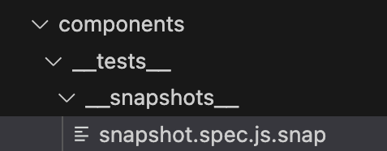
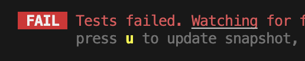

## Vue/Vite - Testing

testing of all things:

- functions
- components
- events
- etc..

Type of auto tests:

- Unit: `smaller sections` of the app, faster and reliable.
- Snapshot tests: compare 2 images of the snapshots
  - **problems:** hard to test on different browsers/OS
- end to end (E2E): a flow of app from start to finish is behaving correctly, eg: `open browser -> load url -> press button -> select value -> compare results -> end`
  - **problems**: slow, difficult to debug, tests fail due to api down.

**Which to use?**
test **all** of them.

**Don't overdo it!**

- creating too many tests can be hard to maintain.

**what to tests?**

```
input --> component --> output
```

### 1. introduction to Vite Testing

what tool to use for testing?

- 🔥Vitest: official tool built by vite, most popular
- other tools: [Mocha](https://mochajs.org/), [Jasmine](https://jasmine.github.io/), [Jest](https://jestjs.io/)

Things need to know:

- test files never bundled with the app, they runs independently.
- tests don't run in browser, **runs in Node**.
- its own environment built on top of JSDOM, Vite installs a 3rd party dependency called JS-DOM.

### 2. add the Vitest UI

It's already included in vite project in `package.json`:

```
"test:unit": "vitest --environment jsdom",
```

**Optional**:
a package to generating the test reports in browser, which is easy to read the reports.

```
npm i -D @vitest/ui
```

then update the command:

```
"test:unit": "vitest --environment jsdom --ui",
```

⚠️**Debuggin issue**:

- [@vitest/ui](https://vitest.dev/guide/ui) and `vitest` must be in the **same version**
- node version: `nvm use 16`: [error](https://stackoverflow.com/questions/69062820/error-cannot-find-module-timers-promises)

### 3. write first test

3.1 basic [syntax](https://vitest.dev/guide/)
Test assertion: it evaluates to either true/false.

- [expect()](https://vitest.dev/api/expect.html) func
- [.toBe()](https://vitest.dev/api/expect.html#tobe) api

```js
import { test } from "vitest";

test("name", async () => {
  /* ... */
}, 1000);
```

3.2 using [globals](https://vitest.dev/config/#globals)
it uses the namespace for function to avoid each import in every test file:

```js
// vitest.config.ts
import { defineConfig } from "vitest/config";
export default defineConfig({
  test: {
    globals: true,
  },
});
// NOT needed
// import {test} from 'vitest'
```

3.3 sanity test
write a test which will always pass to check there is not tooling issue to cause test failure, to exclude the reason of code bug.

```
import { expect } from "vitest";

test("sanity test", () => {
  expect(true).toBe(true);
});
```

3.4 `it()` acts same as `test()`
The [Jest docs](https://jestjs.io/docs/api) state [it is an alias of test](https://jestjs.io/docs/api#testname-fn-timeout). So they are exactly the same from a functional point of view. They exist both to enable to make a readable English sentence from your test.

### 4. lib: vue test utils

#### 4.1 mount the component

[jsdom](https://github.com/jsdom/jsdom) library will take care of creating a virtual dom that has a similar API to the document API in the browser.

[vue/test-utils](https://test-utils.vuejs.org/guide/) library:

```js
import { mount } from "@vue/test-utils";
test("renders inner text correctly", () => {
  const wrapper = mount(About);
  expect(wrapper.text()).toContain("about");
});
```

#### 4.2 shallowMount vs Mount

diff: [shallowMount()](https://v1.test-utils.vuejs.org/api/shallowmount.html#shallowmount) will limit how many children components the instance may have.

pros of `shallowMount`:

- much faster
- efficient
- with stubbed child component

a **short syntax** of `shallowMount`:

```
const wrapper = mount(About, { shollow: true });
```

### 5. pass data to components

Mounting options: [propsData](https://v1.test-utils.vuejs.org/api/options.html#propsdata)

```js
const wrapper = mount(Component, {
  propsData: {
    msg: "aBC",
  },
});
```

### 6. stubbing components

vue test-utils []"stubs:{}"](https://v1.test-utils.vuejs.org/api/options.html#stubs):

- [RouterLinkStub](https://v1.test-utils.vuejs.org/api/components/routerlinkstub.html#routerlinkstub)

```js
const wrapper = shallowMount(SongItem, {
  propsData: {
    song,
  },
  //   global: {
  //     components: {
  //       "router-link": RouterLinkStub,
  //     },
  //   },
  stubs: {
    RouterLink: RouterLinkStub,
  },
});
```

select an element: [find()](https://v1.test-utils.vuejs.org/api/wrapper/#find) function.

```js
wrapper.find(".text-gray-500");
```

### 7. avoid boolean assertions

this is not helpful:

```js
expect(compositionAuthor.text() === song.display_name).toBe(false); // FAILURE
```

### 8. test Children components

wrapper's api:

- [findAllComponents()](https://v1.test-utils.vuejs.org/api/wrapper/#findallcomponents): use any [valid selector](https://v1.test-utils.vuejs.org/api/selectors.html), eg: css selector/vue component.
  ```js
  import Bar from "./Bar.vue";
  const bar = wrapper.findAllComponents(Bar).at(0);
  ```
- Mounting options: [data()](https://v1.test-utils.vuejs.org/api/options.html#data)
  ```js
  const wrapper = mount(Component, {
    data() {
      return {
        bar: "my-override",
      };
    },
  });
  ```

### 9. mocking methods/functions

using global [mocks](https://v1.test-utils.vuejs.org/api/options.html#mocks) as mouting option.

```js
const component = shallowMount(Home, {
  global: {
    mocks: {
      $t: (message) => message,
    },
  },
});
```

### 10. testing attributes

testing dynamic attribute, no need to test static attribute.

use [wrapper.attributes()](https://v1.test-utils.vuejs.org/api/wrapper/#attributes), which returns all attributes on the root element of the mounted wrapper component.

```js
import { mount } from "@vue/test-utils";
import Foo from "./Foo.vue";

const wrapper = mount(Foo);
expect(wrapper.attributes().id).toBe("foo");
expect(wrapper.attributes("id")).toBe("foo");
```

use [wrapper.classes()](https://v1.test-utils.vuejs.org/api/wrapper/#classes) api,

```js
expect(wrapper.classes()).toContain("hover:bg-gray-50");
```

### 11. test pinia stores and actions

doc: [testing store](https://pinia.vuejs.org/cookbook/testing.html), good patterns:

- in `beforeEach()` hook to reset the pinia state:

  ```js
  beforeEach(() => {
    // creates a fresh pinia and makes it active
    // so it's automatically picked up by any useStore() call
    // without having to pass it to it: `useStore(pinia)`
    setActivePinia(createPinia());
  });
  ```

- testing the Store does **NOT** need to mount a component, which are **objects can test in isolation**

### 12. mock Promises

For example: we want to mock the response of firebase async call.

mock a dependency use `vi.mock()` function, eg: syntax is:

```js
vi.mock("@/includes/firebase", () => ({
  auth: {
    signInWithEmailAndPassword: () => Promise.resolve(),
  },
}));
```

You can `import { vi } from 'vitest'` or access it globally (when [global configuration](https://vitest.dev/config/#globals) is enabled).

```js
// global config
// vitest.config.ts
import { defineConfig } from "vitest/config";
export default defineConfig({
  test: {
    globals: true,
  },
});
```

### 13. test Router Component

```js
expect(wrapper.findComponent(RouterLinkStub).props().to).toEqual({
  name: "song",
  params: { id: song.docId },
});
```

### 14. Snapshot Testing

Snapshot testing is when 2 images of an application are compared.

Serialized values:

- images are `unreliable` because different browsers and sizes can cause a test to fail. even if it;s off by one pixel.
- Vitest will serialize a value, any JS value that can be converted to a string.

how it works in [vitest for snapshot testing](https://vitest.dev/guide/snapshot)?

```
does snapshot exist?
- No: generate snapshot -> PASS
- Yes: if match --> PASS
       else not match --> FAIL
```

💡**Tips:**

- snapshot tests should always pass multiple times if you haven't changed the test or application.
- it's highly susceptible to failure. so limit your tests 1-3 per component.
- install [Jest extension](https://marketplace.visualstudio.com/items?itemName=Orta.vscode-jest) to highlight the `.snapshot` file, unfortunately vite didn't provide a extension for it.



If failure when changes are made, you need to update the snapshot:



### 15. End to end testing

a way to check if an application is behaving correctly by automating a browser to mimic user behavior.

creating a program that cna click links, fill out forms, scroll around, etc.

**Problems:**

- very **slow** to run
  - turn on a server
  - open browser
  - nagivate to app
  - run your tests
  - capture actions/screenshots/videos
  - generate reports
- **Unreliable**: any api needs to work, test may fail
- Difficult to debug

**Why write e2e tests?**

- useful for seeing your app fully functional without having to manually tests
- allow you to see everything is working together.

**What should tests?**

- Major User actions, eg: login, checkout, etc..

Tools:

- 🔥[cypress](https://www.cypress.io/): well documented.
- fortunately vite project already configured it, we can use it directly.
  Default configuration by Vite:

  ```js
  // in cypress.config.js file
  const { defineConfig } = require("cypress");

  module.exports = defineConfig({
    e2e: {
      specPattern: "cypress/e2e/**/*.{cy,spec}.{js,jsx,ts,tsx}",
      baseUrl: "http://localhost:4173",
    },
  });
  ```

### 16. write an E2E test

```js
describe("Audio Test", () => {
  it("audio player", () => {
    // 1. visit home page
    cy.visit("/");

    // 2. click on first song
    cy.get(".composition-name:first").click();

    // 3. play audio
    cy.get("#play-btn").click();

    // 4. wait 5 seconds
    // eslint-disable-next-line cypress/no-unnecessary-waiting
    cy.wait(3000);

    // 5. pause audio
    cy.get("#player-play-btn").click();
  });
});
```
