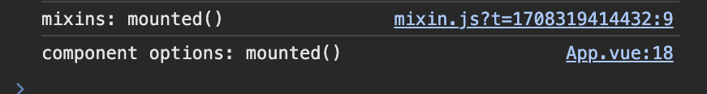
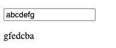
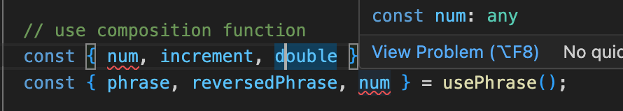

## Section 21 - Composition API

Tips:

- it's an `alternative syntax` for writing components.
- purely `additive`, not a replace of the compoennt's options API.
- Completely `optional`
- it does **NOT** impreove performance.
- it does **NOT** improve security.

Why use composition API?
vue doc: [Options API vs Composition API](https://vueschool.io/articles/vuejs-tutorials/options-api-vs-composition-api/)

- it offers better Typescript support out of the box.
- better organization: ** it offers a more flexible and expressive way of defining component behavior.**
- better **Reusability**: in old way, you need to abstract the logic into a mixin. But it's not flexible. The Composition API addresses these issues by **providing a more flexible and expressive way** of defining component behavior through **composables**. It allows developers to use a **functional, reactive programming style** to build components

### 1. Mixins

[Mixins](https://vuejs.org/api/options-composition.html#mixins):
An array of option objects to be mixed into the current component.

VUE merged the mixins with component options, eg: below syntax:

```js
// App.vue
import mixin from "@/mixin";
export default {
  name: "App",
  mixins: [mixin],
};
```

> Note: the component's original options always has **higher priority than mixins**.But the same **lifecycle** function will **both run**.

```js
export default {
  name: "App",
  mixins: [mixin],
  data() {
    return {
      offset: -1, // initial load shows "-1"
    };
  },
};
```



### 2. Reactive References

#### 2.1 "setup" - a must in composition api

[Doc](https://vuejs.org/api/composition-api-setup):
We can declare `reactive state` using Reactivity APIs and expose them to the template by **returning an object** from `setup()`.

it will be called when the component is created.

syntax:

```js
export default {
  name: "App",
  setup() {
    let num = 0;
    return {
      num,
    };
  },
};
```

How to update the state?
❌WRONG:

```JS
<button type="button" @click.prevent="increment">click me</button>
export default {
  name: "App",
  setup() {
    let num = 0;
    function increment() {
      num++;
    }
    return {
      num,
      increment,
    };
  },
};
```

**Reactivity**

- reactivity is the process of updating the template whenever a chane in the data occurs.
- we need to tell VUE which variables should be keep track of.

✅**Solution: use `ref`**
[ref-doc](https://vuejs.org/api/reactivity-core.html#ref)

```js
let num = ref(0);
function increment() {
  num.value++;
}
```

### 3. reactive function

use [reactive()](https://vuejs.org/api/reactivity-core.html#reactive) function: Returns a reactive proxy of the object.

```js
const user = reactive({
  name: "john",
  age: 20,
});
```

### 4. ref() vs. reactive()

doc](https://vuejs.org/guide/extras/composition-api-faq.html#ref-vs-reactive)
| ref() | reactive |
| --------------------------------- | ------------------------ |
| primitive values | objects |
| must be accessed by `.value` prop | can be accessed directly |

**Limitations:** ([doc](https://vuejs.org/guide/essentials/reactivity-fundamentals.html#limitations-of-reactive))

- it lose reactivity if you use **spread operator**: `{...user}`

**How to solve it?**
[toRefs()](https://vuejs.org/api/reactivity-utilities#torefs) convert reactive object into separate refs.

```js
return {
  ...toRefs(user),
};
```

### 5. watchers

a way to watch props on components, if a prop changes, we can run a function to exec further logic.
vue have 2 function to implement:

- [watchEffect()](https://vuejs.org/guide/essentials/watchers.html#watcheffect): it allows us to **track the callback's reactive dependencies automatically**.

  ```js
  const phrase = ref("");
  const reversedPhrase = ref("");
  watchEffect(() => {
    reversedPhrase.value = phrase.value.split("").reverse().join("");
  });
  ```

  

- [watch()](https://vuejs.org/guide/essentials/watchers.html#deep-watchers):
  ```js
  watch([phrase], ([newVal, oldVal]) => {
    reversedPhrase.value = newVal.split("").reverse().join("");
  });
  ```

### 6. computed function for computed property

it's the same in component options while in composition api.

[computed() function](https://vuejs.org/guide/essentials/computed#computed-properties) returns a reactive reference, while `watch()` function does not.

```js
import { computed } from "vue";
const double = computed(() => {
  return num.value * 2;
});
```

### 7. lifecycle functions

two functions are **renamed**:

- `onBeforeMount()`
- `onMounted()`
- `onBeforeUpdate()`
- `onUpdated()`
- `onBeforeUnmount()` -> `beforeDestroy()`
- `onUnmounted()` -> `destroyed()`
- `onActivated()`
- `onDeactivated()`

> Note: composition api does NOT support `beforeCreated()` and `created()`functions because `setup()` runs between those two. it's the best practive to put the code in correct hooks.
> beforeCreated() -> setup() -> created()

Code example:

```js
import { onBeforeMount, onMounted } from "vue";
setup() {
    // lifecycle functions
    onBeforeMount(() => {
        console.log("onBeforeMount() is called");
    });
    onMounted(() => {
        console.log("onMounted() is called");
    });
}
```

### 8. Props

we don't have direct access to `this.props` in child component, we need to use the `setup(props, ctx)` argument to access props.

doc: [setup() props](https://vuejs.org/api/composition-api-setup#accessing-props)

```js
setup(props, ctx) {
    const flag = computed(() => {
        // Note: setup() runs before the components, props, data, methods and computed props are registered.
        // so cannot access "this." here.
        return props.user.name === "john";
    });
    return {
        flag,
    };
}
```

### 9. Template Refs - [doc](https://vuejs.org/guide/essentials/template-refs#template-refs)

```html
<!-- template refs -->
<button type="button" ref="btn">Button</button>
```

#### how to access template refs?

[doc-access the refs](https://vuejs.org/guide/essentials/template-refs#accessing-the-refs):
use `this.refs`, the value on ref attribute **must match to the name of the reactive reference returned in setup()** func.

```js
// template refs
const btn = ref(null); // initial value must be null

onMounted(() => {
  console.log("onMounted() is called");
  // here still using the reactive reference
  btn.value.addEventListener("click", () => {
    console.log("btton clicked");
  });
});
```

### 10. emitting events

```js
// emitting events: same as "this.$emit()"
ctx.emit("eventName", {});
```

doc: [setup() context](https://vuejs.org/api/composition-api-setup#setup-context)

```js
export default {
  setup(props, context) {
    // Attributes (Non-reactive object, equivalent to $attrs)
    console.log(context.attrs);

    // Slots (Non-reactive object, equivalent to $slots)
    console.log(context.slots);

    // Emit events (Function, equivalent to $emit)
    console.log(context.emit);

    // Expose public properties (Function)
    console.log(context.expose);
  },
};
```

### 11. Advantages of Composition API

Reasons for composition API (better than mixins):

- better TS support
- organization: we are NOT bound to define everything in specific locations.
- reusability

**Composition function's Goal:**

- put things together
- combining two or more functions to produce a new function, to be `reusable`

Code example:

```js
import { useNumber } from "@/hooks/number";
import { usePhrase } from "@/hooks/phrase";
// use composition function
const { num, increment, double } = useNumber();
const { phrase, reversedPhrase } = usePhrase();
```

#### Issue: conflicting names



Solution: rename in JS when destructuring

```js
// use composition function
const { num, increment, double } = useNumber();
const { phrase, reversedPhrase, num: phraseNum } = usePhrase();
```

### 12. Router Hooks

in the past:

```html
<h1>route param: {{ $route.params.member }}</h1>
```

How to access route params in `setup()` func?

- [useRoute()](https://router.vuejs.org/guide/advanced/composition-api#Accessing-the-Router-and-current-Route-inside-setup) hook
- `useRouter()` hook: similar to `this.$router`

code example:

```js
import { useRoute, useRouter } from "vue-router";
setup() {
    const route = useRoute(); // this.$route
    const router = useRouter(); // this.$router

    console.log(route.params.member);

    router.push({
        hash: "#test",
    });
}
```

### 13. Pinia Hooks

[Pinia](https://pinia.vuejs.org/cookbook/options-api.html) has large support for the composition API in vue. also easy to use.

in `setup()` func:

```js
setup() {
    // pinia hooks
    const store = useCounterStore();
    return {
    store,
    };
}
```

access store's state, actions in template directly:

```html
<p>{{ store.number }}</p>
<p>{{ store.doubleCount }}</p>
<button type="button" @click.prevent="store.increment">press me</button>
```

### 14. verifying reactivity

doc:

- [isRef()](https://vuejs.org/api/reactivity-utilities#isref)
- [isReactive()](https://vuejs.org/api/reactivity-utilities#isreactive)

```js
import { isRef, isReactive } from "vue";

console.log(isRef(num));
console.log(isReactive(accounts));
```

### 15. the setup attribute

`<script setup>` which means the code inside will be wrapped by the setup function. Then **no need to add a setup func**.

Note:

```js
// Note: must destructure explicitly due to "<script setup>" tag, if the var is used in template.
const { name } = toRefs(user);
```
