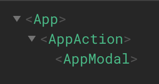

## Section 22 Component Design Pattern

they are not tied to a specific problem, they are **general** and can be applied to a broad spectrum of problems.

### 1 controlled components

#### 1.1 what is controlled components

controlled components are a design pattern for forms.

- a component that outputs an input for a form, eg: txt box, checkbox, radio button,etc..
- does NOT have its own state
- relies on the parent component's data
- emit an event when user attempts to change the input.

Eg: `<EmailInput />`'s input value' is controlled by the parent `<App />` component, controlling by 2 directives:

```html
<input
  type="text"
  :value="newsletterName"
  @input="newsletterName = $event.target.value"
/>
<!-- equal syntax -->
<email-input v-model="newsletterName" />
```

❌WRONG:

> [plugin:vite:vue] v-model cannot be used on a prop, because local prop bindings are not writable.

```
// wrong example:
props: ["modelValue"],

<input
  type="email"
  v-model="modelValue"
/>
```

#### 1.2.`$emit()` between child and parent

A controlled component doesn't update its input, instead, it tells the parent component when a change happens.

understand `v-model` ([doc](https://vuejs.org/guide/components/v-model.html#under-the-hood))in bound element:

- it has a prop name `modelValue`
- it has an event named: `update:modelValue`

example code

```vue
<!-- parent -->
<email-input v-model="newsletterEmail" />

<!-- child -->
<template>
  <input
    :value="modelValue"
    @input="emit('update:modelValue', $event.target.value)"
  />
</template>
<script>
props: ["modelValue"];
</script>
```

#### 1.3 v-model argument - [doc](https://vuejs.org/guide/components/v-model.html#v-model-arguments)

`v-model` on a component can also accept an argument:

```vue
<!-- parent -->
<email-input v-model:email="newsletterEmail" />

<!-- child -->
<input
  type="email"
  :value="email"
  @input="$emit('update:email', $event.target.value)"
/>
```

### 2. Separation of Concerns

SOC is a principle for how code should be split.

Types of Logic:

- UI logic: eg `v-if`, `v-bind` logic
- Business logic: code to handle data

Eg:
Before:

```html
:class="{ 'is-valid': modelValue.length >= 4 && modelValue.length > 0,
'is-invalid': modelValue.length < 4 || modelValue.length < 0, }"
```

After:

```html
:class="{ 'is-valid': validateEmail(email), 'is-invalid': !validateEmail(email),
}"
```

### 3. convert 3rd party lib as Controlled components

[emoji button](https://emoji-button.js.org/) library and its [API doc](https://emoji-button.js.org/docs/api/):

install

```
npm install @joeattardi/emoji-button
```

template file:

```vue
<!-- Parent -->
<emoji-input v-model="emoji" :options="{ position: 'bottom' }" />

<!-- child -->
<button type="button" ref="emojiBtn">
  {{ modelValue ? modelValue.emoji : "Select" }}
</button>
```

JS implementations:

```js
mounted() {
  const picker = new EmojiButton(this.options);
  const btn = this.$refs.emojiBtn;

  picker.on("emoji", (selection) => {
    // `selection` object has an `emoji` property
    // containing the selected emoji
    this.$emit("update:modelValue", selection);
  });

  btn.addEventListener("click", () => {
    picker.togglePicker(btn);
  });
}
```

复习： [formData in JS](https://jialihan.github.io/blog/#/javascript/form-js?id=_52-css-style-on-radio-input)

```js
submit() {
  // access for data from html
  var form = document.querySelector("form");
  var formData = new FormData(form);
  for (var pair of formData.entries()) {
    console.log("each pair:", pair[0], pair[1]);
  }
 }
```

### 4. Moving beyond Vue's event system

When NOT to use vue api, might be strange, but **sometimes the native DOM API is much simpler**.

Example: goal is to close the modal by `ESC` key press.

To make the modal dialog listen to `ESC` keyboard event to close the modal, since it's not auto reachable by keyboard events, **we manually add the ["tabIndex=0"](https://developer.mozilla.org/en-US/docs/Web/HTML/Global_attributes/tabindex) on the `<div>` tag**.

```html
<div
  class="modal-dialog"
  style="z-index: 2000"
  @keydown.esc="close"
  tabindex="0"
></div>
```

#### 4.1 Old way with vue API

**Problem:**
But you have to `focus` on the modal dialog first, then press the `ESC` keyboard.

Solution1: auto focus()
[vue instance “watch” option](https://012.vuejs.org/api/options.html#watch),

Note: use the [$nextTick()](https://vuejs.org/api/general.html#nexttick):

> Instead, Vue buffers them until the "next tick" to ensure that each component updates only once no matter how many state changes you have made.

```js
watch: {
  show(newVal) {
    if (newVal) {
      this.$nextTick(() => {
        this.$refs.modal.focus();
      });
    }
  },
},
```

Solution2: remove the outline when focused.

```vue
<style scoped>
.modal-dialog {
  outline: 0;
}
</style>
```

#### 4.2 browser DOM API - ✅

it's much simpler and easy code to use brower's event system to close the modal.

```js
methods: {
  close() {
    this.$emit("hide");
  },
  handler(e) {
    if (e.code === "Escape" && this.show) {
      this.close();
    }
  },
},
created() {
  document.addEventListener("keydown", this.handler);
},
unmounted() {
  document.removeEventListener("keydown", this.handler);
},
```

**Benifits:**

- **easier** to implement
- NO need to `focus()` on the element
- NO need to worry about adding styles
- **NOT affecting external components**, then it can be re-used.

### 5. encapsulateing Scrolling

Goal: to disable the scroll bar when modal component is open.

> Note: `watch()` does not run when a component is created, but it runs whenever the prop changes.

Solution: use `{immediate: true}`

```js
watch: {
  show: {
    immediate: true,
    handler(newVal) {
      if (newVal && !this.scrollable) {
        // disable the scroll bar
        document.body.style.setProperty("overflow", "hidden");
      } else {
        document.body.style.removeProperty("overflow");
      }
    },
  }
}
```

### 6. Teleport Component

it is a new feature in VUE for moving an element from one location to another while still keeping the hierarchy of the component intact.

Use-case: open the modal in the child component.

**Problem:**
nested layers to emit events to communicate to open the modal.

```
       APP
Modal     COMP1
          COMP2
          ACTION (open the modal)
```

❌**Option1: use Vuex**
Vuex:

- should **only be used for global state**
- don't want to clutter the store with state, mutations, actions, and getters.

this is Not a best approach because not a global state, only a single open modal state in modal component.

**Option2: move modal to the child of action**
correct structure is below:

```
App
Action
Modal
```

Then use `<teleport />` component ([doc](https://vuejs.org/guide/built-ins/teleport.html)):

```vue
<teleport to="body">
  <app-modal :show="open" @hide="open = false" />
</teleport>
```

**Benefits:**
keep component relationships closer together without affecting each other visually layout locations.


