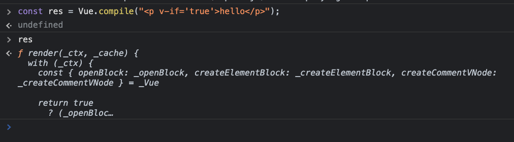

#### I. [mounting the vm instance](#p1)

#### II. [lifecycle hooks](#p2)

#### III. [virtual dom](#p3)

#### IV. [Reactivity with Proxies](#p4)

#### V. [Vue Compiler](#p5)

#### VI. [Components](#p6)

<div id="p1" />

### 1. mounting the vm instance

you can mount async:

```
setTimeout(() => {
  vm.mount("#app");
}, 3000);
```

<div id="p2" />

### 2. lifecycle hooks - [doc](https://vuejs.org/guide/essentials/lifecycle.html)

- Vue.createApp()
- **hook**: `beforeCreate`
- initialize `data()` and `methods`
- **hook**: `created`
- Vue `mount()` the app and **compile the template** code and process it.
- **hook**: `beforeMount`
- Vue replace property with complied template
- **hook**: `Mounted`
- Vue: watch data changes
- **hook**: `beforeUpdated`
- Vue apply changes to the template
- **hook**: `updated`
- Vue can `unmount()` the app
- **hook**: `beforeUnmount`
- Vue instance destroyed, no access to vm instance anymore
- **hook**: `unmounted`

**Note**:

- 1. `$el`: component instance: https://vuejs.org/api/component-instance.html#el

<div id="p3" />

### 3. virtual dom

```html
<h1 class="blue">
  <span> hello world </span>
</h1>
```

Vue compiles to object:

```js
{
    tag: 'h1',
    attributes: {
        class: 'blue',
    },
    content: [
        { // child element
            tag: 'span',
            attributes: {},
            content: 'hello world'
        }
    ]
}
```

> Summary:
> the virtual DOM is a JavaScript object. It is a lightweight copy of the actual DOM. It's faster to perform comparisons and updates on the virtual dom without needing the class or ids to select an element.

<div id="p4" />

### 4. Reactivity with Proxies

- Proxy Object: [doc](https://developer.mozilla.org/en-US/docs/Web/JavaScript/Reference/Global_Objects/Proxy)

```
const data = {
    name: 'Jelly',
}
const handler1 = {
    set(target, key, val) {
        target[key] = val;
    }
};
const observedData = new Proxy(data, handler1);
```

- 复习："[Reflect](https://developer.mozilla.org/en-US/docs/Web/JavaScript/Reference/Global_Objects/Reflect)" object： The Reflect methods provide the reflective semantics for invoking the corresponding object internal methods. For example, we can call Reflect.get if we don't wish to redefine the object's behavior.

```
const handler3 = {
  get(target, prop, receiver) {
    if (prop === "message2") {
      return "world";
    }
    return Reflect.get(...arguments);
  },
};
```

<div id="p5" />

### 5. Vue Compiler

5.1 versions of Vue

- with compiler
- without compiler

  5.2 Code that is responsible for compiling template strings into JavaScript render functions.



Example code:

```
  render() {
    return Vue.h(
      "h1", // tag
      this.message // content
    );
  }
```

5.3 using the CDN without compiler
[CDN link](https://cdnjs.com/libraries/vue), [Vue Builds link](https://github.com/vuejs/core/tree/
main/packages/vue#which-dist-file-to-use)

```
// without compiler
https://cdnjs.cloudflare.com/ajax/libs/vue/3.3.4/vue.runtime.global.min.js
```

then it only process the `render()` function in the **runtime build**.

<div id="p6" />

### 6. Components

!!! **Components should be created before we mount the application.**
Tips:

- it's recommended to namespace your components

```
6.1 create a component
/**
 * @param {string} name - kebab-case or pascal case
 * @param {object} configObject - we can add data, methods, computed props in this config object
 */
vm.component("blog-post", {
  template: `<h1>{{message}}</h1>`,
  data() {
    return {
      message: "hello jelly!"
    };
  }
});
```

6.2 use the component in the Html

```html
<div id="app" v-cloak>
  <blog-post></blog-post>
  <blog-post></blog-post>
</div>
```
