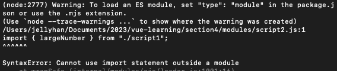

## Section 5 - VUE dev environmnet

### 0. preface

The tools to build VUE applications, to help to optimize bundles, code splitting and manage assets.

- Vite
- Babel
- Webpack
- PostCSS
- SASS
- ESLint

复习：

- node --> `module.export = {}`: commonJS
- es6 module --> `import, export`
- Node: `v12.*` can support es6 modules, but need to use the correct syntax. eg: `script.mjs`.

  

### 1. Vite

a module bundler for applications. currently Webpack is used as industry standard, why use Vite?

- performant: bundle in a few seconds
- immense support for 3rd libraries, from TS to SASS
- extendable: if vite cannot support, vite is easy to extend, easy to config the vite
- vite is easy to integrate with Vue, created by the same team

#### 1.1 create your first vite project: [doc](https://vitejs.dev/guide/#scaffolding-your-first-vite-project)

> Compatibility Note
> Vite requires Node.js version 14.18+, 16+. However, some templates require a higher Node.js version to work, please upgrade if your package manager warns about it.

```
npm create vite@latest
```

```
  cd my-vite-project
  npm install
  npm run dev
```

#### 1.2

- `index.html` : entry point of our application, can import other js files or images to application.
- Vite can import `./style.css` files in `main.js`

```
npm run build
```

the output is the `/dist` folder, which is for production.
use the below command to luanch the server for the build directory to quickly inspect the final build , but it won't watch local file changes:

```
npm run preview
```

### 2. SASS

复习： sass ([blog link](https://jialihan.github.io/blog/#/html_css/sass))
2.1 functions
eg: `darken(colorHex, percentageNumber)`: [doc](https://sass-lang.com/documentation/modules/color/#darken)

2.2 nested selector
eg:

```scss
span {
  color: blue;
}
&:hover {
  color: darken(#cc3244, 15);
}
```

### 3. PostCSS

3.1 compare with scss

```
Sass (pre-processor) --> compiled to --> CSS
```

While postCSS is a post-processor:

```
CSS--> compiled to --> PostCSS(object) --> Compiled to --> CSS
```

3.2 config the postcss
using the config file `postcss.config.cjs`, plugins available provided by the community: [postcss.parts](https://www.postcss.parts/).

A postcss plugin: [autoprefixer](https://github.com/postcss/autoprefixer)

```
npm install autoprefixer --save-dev
```

> Note:
> postcss won't work with Scss, but vite will process scss first. After scss compiled to css files, then css files will be passed to postcss.

3.3 For example:
Add a plugin to the config file:

```js
module.exports = {
  plugins: [require("autoprefixer")]
};
```

eg: this pseudo selector has a prefix for firefox, inorder to avoid forgetting add the prefix, we use a plugin to add it.

```
// automatically added by plugins
::-moz-placeholder {
  color: red;
}

::placeholder {
  color: red;
}
```

### 4. ESlint

Vite doesn't provide support Eslint, then we must manually add ESlint.
Command:
install package: [vite-plugin-eslint](https://www.npmjs.com/package/vite-plugin-eslint)

```
npm install vite-plugin-eslint --save-dev
```

4.2 import eslint
Update the config in the `vite.config.js` file:

```js
import { defineConfig } from "vite";
import eslint from "vite-plugin-eslint";

export default defineConfig({
  plugins: [eslint()]
});
```

4.3 add the eslint config file
A separate file to config eslint: `.eslintrc`

```json
{
  "rules": {
    "quotes": "error" // rule to enforce the double quotes
  },
  "env": {
    "browser": true
  },
  "parserOptions": {
    "ecmaVersion": 2022,
    "sourceType": "module"
  }
}
```

4.4. eslint rules - [link](https://eslint.org/docs/latest/rules/)

### 5. Webpack

复习：https://jialihan.github.io/blog/#/javascript/webpack

- it has a higher learning curve
- it only support js files, no config for css files

Key points:

- `entry` : points to the entry js file: `./index.js`
- `output`: the output dist folder path
  ```js
  output: {
      path: __dirname + '/dist',
      filename: 'bundle.js'
  }
  ```
- `module`: to config the `rules: []` inside of it.
