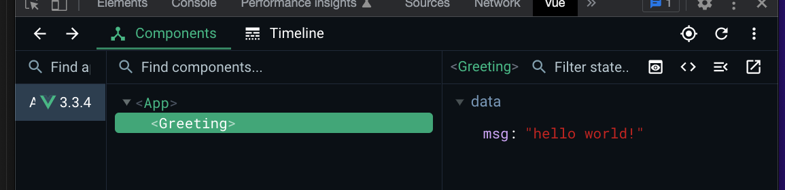
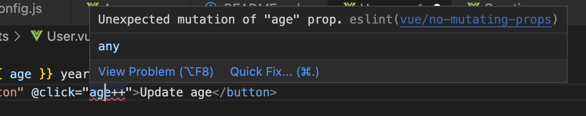

## Section6 vue components

### 1. scaffolding the vue project

using the `create-vue` tool: [doc](https://github.com/vuejs/create-vue)

```
npm init vue@latest
create-vue@latest
```

### 2. understanding the server

`npm run dev` the cli will run the server for our vite application on the localhost, and the `port` number is the cli that searching for a unused port on your local, then reserve it for VUE.

Note: most app will recommend to port 80 when shipping to production.

### 3. Reviwing folder structure and files

- `.gitignore`:
- `index.html`: serves as entry points to our application, importing the script file from `/src/main.js`.
- `package.json`: adding `vite` dependencies because VUE cannot work without vite

  ```
  "devDependencies": {
      "@vitejs/plugin-vue": "^4.3.1",
      "vite": "^4.4.9"
  }
  ```

- `README.md`
- `vite.config.js`: importing the `vue()` function in the "plugins" section
  ```js
  // path alias
  alias: {
      '@': fileURLToPath(new URL('./src', import.meta.url))
  }
  // example
  import Foo from '@/foo';
  import Foo from 'src/foo';
  ```
- `node_modules`
- `public`: this directory contains your **static assets** like images and HTML files. By default, there is an fav icon.
- `src`: most important directory
  - `src/main.js`: import `createApp()` function and `App.vue` component. Note: volar extension in vscode to help parsing vue syntax.
    - `<script>`
    - `<template>`
    - `<style>`

> Note: the default Babel preset used in all Vue CLI projects. [@vue/babel-preset-app](https://github.com/vuejs/vue-cli/tree/dev/packages/@vue/babel-preset-app#readme)

### 3. create components

#### create a single file component

The `<template>` block is the minimum requirement of a simple component.
And we can export the object of setting this component, where we should add the `data()`, `methods`, and `computed` props.

```vue
<template>
  <p>{{ msg }}</p>
</template>

<script>
export default {
  name: "App", // not required, but helpful to debug
  data() {
    return {
      msg: "hello world!"
    };
  }
};
</script>
```

### 4. child component

#### 4.1 common practice:

- put components in the `/components` folder
- use camel case on your component name: eg: `BlogPost.vue`
- use code snippets: start typing `vue`

#### 4.2 load the component

Register Globally:
in `main.js`

```js
import Greeting from "@/components/Greeting.vue";

let vm = createApp(App);
// register components after created the vm instance
vm.component("Greeting", Greeting);
vm.mount("#app");
```

Register locally:
add a property in component config setting object:

```js
<template>
  <Greeting></Greeting>
</template>

<script>
import Greeting from '@/components/Greeting.vue'
export default {
  name: 'App', // not required, but helpful to debug
  components: {
    Greeting
  }
}
</script>
```



### 5. component styles

using the `<style>` tag to add styles.
Vue is able to isolate styles to a component, borrow the idea of `shadow dom`: [scoped css doc](https://vue-loader.vuejs.org/guide/scoped-css.html#scoped-css)

```vue
<style scoped>
p {
  color: red;
}
</style>
```

compiled to:

```html
<p>Hey!</p>
<p data-v-f5a8a03f="">hello world!</p>
```

### 6. using sass in component

working with css: [link](https://cli.vuejs.org/guide/css.html)

install scss:

```
 npm install sass --save-dev
```

write in code:

```vue
<style lang="scss"></style>
```

### 7. communication between components

```text
comp A (root) ----------------------> comp B : age 20
 (age: 20)    send data down using props
              ----------------------> comp C : age 20
```

component name in vue: [vue recommended doc](https://vuejs.org/style-guide/rules-strongly-recommended.html)

```html
<!-- pascal - good -->
<HelloWorld />
<!-- kebab - also good -->
<hello-world />
```

For example: `import`, `register`, `consume` the **component name**:

```vue
<template>
  <Greeting></Greeting>
</template>
<script>
import User from "@/components/User.vue";
export default {
  components: {
    User
  }
};
</script>
```

### 8 Props in component

#### 8.1 How to pass Props?

use attribute bind directive `:`

```vue
<user :age="age"></user>
```

#### 8.2 How to receive props in child component?

use `props: []` field

```vue
<script>
export default {
  props: ["age"]
};
</script>
```

#### 8.3 how to use props in child component?

```vue
<p>this user is {{ age }} years old</p>
```

#### 8.4 limitation of props

If we change the prop in parent component, it will be reflected to all child components.


WRONG!!!: you cannot mutate props in child component, eg:


### 9. Emitting events - [doc](https://vuejs.org/guide/components/events.html#emitting-and-listening-to-events)

#### 9.1 In child component

```
 this.$emit('age-change', 3)
```

> warning
> [Vue warn]: Extraneous non-emits event listeners (ageChange) were passed to component but could not be automatically inherited because component renders fragment or text root nodes. If the listener is intended to be a component custom event listener only, declare it using the "emits" option.

`emits: ['age-change']`: Becuse it helps document what the compoent does.

#### 9.2 In parent component

use `@` as same as listening to other events, eg: `@click, v-on:click` in [section 2.12](https://jialihan.github.io/blog/#/VUE/section2?id=_212-event-listening)

```vue
<!-- listen the age-change event from child -->
<user :age="age" @age-change="updateAge"></user>
```

### 10. Validate props

Prop validation / type check: [link](https://vuejs.org/guide/components/props.html#prop-validation)

#### 10.1 validate the prop

syntax:

```js
  props: {
    age: {
      type: Number,
      required: true
    }
  },
```

Output:

```
main.js:10 [Vue warn]: Missing required prop: "age"
  at <User onAgeChange=fn<bound updateAge> >
  at <App>
```

#### 10.2 validator()

Or you can define the customized validator() function, which must return `true/false`.
Syntax:

```js
age: {
  type: Number,
  validator(value) {
    return value < 100
  }
}
```

Output:

```
App.vue:26 [Vue warn]: Invalid prop: custom validator check failed for prop "age".
  at <User age=101 onAgeChange=fn<bound updateAge> >
  at <App>
```

> Note: you cannot access other parts of the component because the vue instance is not created, in the validator() func. For example:

```js
// WRONG CODE !!!
validator(value) {
  this.onClick()
  return value < 100
}
```

Output:

```text
Uncaught TypeError: Cannot read properties of undefined (reading 'onClick')
    at validator (User.vue:17:14)
```

### 11. callback function

Child component can use `callback function` to update data in parent component.

11.1 In parent component - pass the callback:

```vue
<user :age="age" :onAageUpdateFn="updateAgeCallback"></user>
```

11.2 In child component - receive the callback prop

> Note: All props are **optional** by default, unless required: true is specified.

```js
props: {
  age: Number, // default is optional prop
  onAageUpdateFn: Function // if you only checks the type, you can use this shorthand
},
```

**Summary:**
VUE doc recommends use `$emits()` events than the callback. Benifits are:

- events are easy to debug in VUE dev tools, while CB does not log anything
- performance not that difference, similar performance

### 12. insert content with Slots

Vue video of `Slots`:
https://vueschool.io/lessons/vue-3-component-slots?friend=vuejs

12.1 what is slot?
Slots are a great way to pass down content from a parent component to a child component. the `<slot />` element is created by VUE: [doc](https://vuejs.org/guide/components/slots.html#slot-content-and-outlet).

```vue
// in Child
<!-- slot outlet -->
<slot>
  <!-- default slot content -->
  No content to render
</slot>
// in Parent
<Boo>
  <!-- slot content -->
</Boo>
```

### 12.2 named slots - [doc](https://vuejs.org/guide/components/slots.html#named-slots)

In child element:

```vue
<slot name="help"></slot>
```

In parent element:
use `v-slot:help` or the shorthand hash sign `#help`

```vue
<template #help>contact help text</template>
```

> **Note: WRONG!!!**
> 'v-slot' directive must be owned by a custom element, but 'div' is not.eslintvue/valid-v-slot

wrong example:

```
<!-- WRONG!!! -->
<div v-slot:help> </div>
```

### 13 Dynamic components - [doc](https://vuejs.org/guide/essentials/component-basics.html#dynamic-components)

`<component>` tag provided by vue:

- `is` attribute: the name of the component to load
- the component will unmount if it's not choosed to load.
  ```vue
  <script>
  export default {
    unmounted() {
      console.log("About comp is unmounted");
    }
  };
  </script>
  ```
- Way to `persist` component: `<keep-alive>`: VUE will keep it in memory instead if destroying it and create a new component. the Vue set it to `inactive`.

  

  ```js
  // two more life cycle functions
    activated() {
    console.log("About comp is activated");
  },
  deactivated() {
    console.log("About comp is deactivated");
  }
  ```
