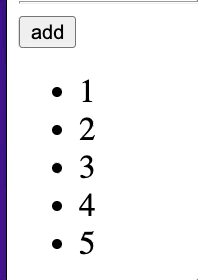

## Section 7 - Transitions and Animations

### 7.1 CSS transitions

The enter or leave can be triggered by one of the following:

- Conditional rendering via `v-if`
- Conditional display via `v-show`
- Dynamic components toggling via the `<component>` special element
- Changing the special key attribute

Vue doc: [link](https://vuejs.org/guide/built-ins/transition.html#css-based-transitions)
vue will take care of adding these 3 classes for you during the animation when element **enter** the DOM:

- `*-enter-from`: the first frame starting the animation
- `*-enter-to`: the last frame ending at the animation
- `*-enter-active`: includes every frame from start to the end

you need to use the component `<transition />`:

```css
.fade-enter-from {
  opacity: 0;
}
.fade-enter-active {
  transition: all 1s linear;
  /* default property: opacity: 1; */
}
```

When the element **leave** the DOM:

- `*-leave-from`: the first frame starting the animation
- `*-leave-to`: the last frame ending at the animation
- `*-leave-active`: includes every frame from start to the end
  For example:

```css
.fade-leave-active {
  transition: all 1s linear;
}
.fade-leave-to {
  opacity: 0;
}
```

### 7.2 Fine-tuning [transitions](https://vuejs.org/guide/built-ins/transition.html)

#### 7.2.1 `duration` attribute and in `milliseconds` as unit, eg:

```vue
<Transition :duration="550">...</Transition>
```

#### 7.1.2 Using `v-show` directive:

```vue
<h2 v-show="flag">hello world!</h2>
```

#### 7.1.3 multiple root element

`mode="in-out"` (link) is the default value, which means **by default**, VUE will animate the 2nd element `in first`, then animate the 1st element `out later`.

If you want to **reverse** the sequence, you can change the `mode="out-in"` value:

```vue
<transition name="fade" mode="out-in">
  <h2 v-if="flag" key="one">hello world!</h2>
  <h2 v-else key="two">Another hello!</h2>
</transition>
```

### 7.3 vue with css animations

[Use transitions and animations together](https://vuejs.org/guide/built-ins/transition.html#css-based-transitions)
you can use either `transitions` or `animations` in vue style classes:

```css
.zoom-enter-active {
  animation: zoom-in 1s linear forwards;
  transition: all 3s linear;
}
```

> Note: the duration if different, **by default** vue will choose the **longest time** duration.

the `type` attribute can let VUE know which duration to use, for example:

```
<transition name="zoom" type="animation">
```

then the max duration is `1s`, so that the opacity transition won't finish at `1s`.

[Transition on Appear](https://vuejs.org/guide/built-ins/transition.html#transition-on-appear)
the `appear` attribute means that the initial load, VUE will also play the animation or transition.

### 7.4 animating with Javascript

3 [JS hooks](https://vuejs.org/guide/built-ins/transition.html#javascript-hooks) for enter / leave animations:

- `before-enter`, `before-leave`
- `enter`, `leave`
- `after-enter`, `after-leave`

> Note only 2 event lisenters will receive the `done()` callback function

```js
/**
    *
    * @param {*} el - dom element
    * @param {*} done - callback func to tell VUE when animation is done, you must call this function otherwise vue cannot do the job correctly
    */
enter(el, done) {
    console.log("enter is fired", el);
    done();
},
leave(el, done) {
    done();
}
```

### 7.5 use Web animations API in VUE

Usually people think JS animations are slower than CSS animations, but it might not be true.

This new [Web animations API](https://developer.mozilla.org/en-US/docs/Web/API/Web_Animations_API/Using_the_Web_Animations_API) allows us to perform animations efficiently and more than CSS animations.

```js
const animation = el.animate(
  [
    {
      // starting keyframe
      transform: "scale3d(0,0,0)"
    },
    {
      // ending keyframe
      // scaled3d will be default to be the original size, so no code needed
    }
  ],
  {
    // 2nd argument: options
    duration: 1000
  }
);
animation.onfinish = () => {
  // this event is emitted when animation is completed
  done();
};
```

When using **JavaScript-only** transitions, it is usually a good idea to add the `:css="false"` prop ([vue doc](https://vuejs.org/guide/built-ins/transition.html#javascript-hooks)). This explicitly tells Vue to skip auto CSS transition detection.

```vue
  <transition
    @before-enter="beforeEnter"
    @enter="enter"
    @after-enter="afterEnter"
    @before-leave="beforeLeave"
    @leave="leave"
    @after-leave="afterLeave"
    :css="false"
  >
```

复习：

- `scale(sx, sy)`: https://developer.mozilla.org/en-US/docs/Web/CSS/transform-function/scale
- `scale3d(sx, sy, sz)`: https://developer.mozilla.org/en-US/docs/Web/CSS/transform-function/scale
- `(x,y,z)` in CSS space: [stackflow link](https://stackoverflow.com/questions/41479953/y-axis-working-opposite-way-for-translate)


### 7.6 CSS animations and JS animations together

Note: if we set `:css="true"`, it's ok to not execute the `done()` function in JS hooks. VUE will default use the `CSS duration` to determine the animation is finished.

```vue
<transition
    @before-enter="beforeEnter"
    @enter="enter"
    @after-enter="afterEnter"
    @before-leave="beforeLeave"
    @leave="leave"
    @after-leave="afterLeave"
    :css="true"
    name="fade"
>
```

```js
leave(el, done) {
    console.log("leave is fired", el);
    // done(); // it's ok to use the CSS duration to determine the animation is finished if CSS animation exists
},
```

### 7.7 Animatate a List

We can NOT use `<transition>` component to animate the List, which only works with **single element**.

use the `<transition-group>`: [vue doc](https://vuejs.org/guide/built-ins/transition-group.html).

One difference when using the attribute:

- ❌cannot use `mode="out-in"`

```vue
<ul>
  <transition-group name="fade">
    <li v-for="(num, index) in nums" :key="num" @click="removeItem(index)">
      {{ num }}
    </li>
  </transition-group>
</ul>
```

To fix the jumping space of moving down/up of the list items:

```css
.fade-move {
  /* to make items in the list move smoothly  */
  transition: all 1s linear;
}
```

**Issue: moving up/down**


When remove the item, the fading animation happens first, then the item is removed, even though the item is fading away, but it still take the space. Then other elements don't have to move, their `transform` property is not changed.

- item is removed, the animaiton is removed
- then the other element has no time to animate

Solution: use aboslute position

```css
.fade-leave-active {
  transition: all 3s linear;
  position: absolute;
}
```

### 7.8 Transition CSS class names

library(with predefined animations): https://animate.style/
CDN link: https://cdnjs.com/libraries/animate.css
Explicitly set the class names:

```
    <transition-group
      name="fade"
      enter-active-class="animate__animated animate__flipInX"
      leave-active-class="animate__animated animate__flipOutX"
    >
```

To make it smoother, fix and override the css:

- to make it smoother when removing a item in the list
- override the duration in the library's class

```css
.animate__flipOutX {
  position: absolute;
}
.animate__animated {
  animation-duration: 1.5s;
}
```
