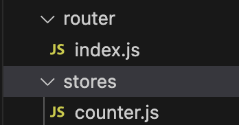
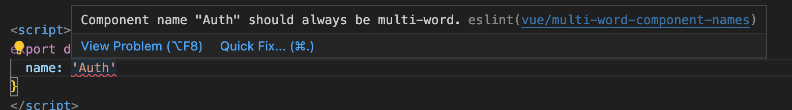

## Section 9 - intro to Pinia

### 9.1 setup Vite project

- add eslint : reference to ["style guide"](https://vuejs.org/style-guide/#priority-a-essential-error-prevention), and understand the eslint config ["overrides"](https://eslint.org/docs/latest/use/configure/configuration-files#how-do-overrides-work).
- add prettier
- add Cypress: `cypress.config.js`, the new test folder created at: `/src/components/__test__`
- add pinia: for state management

Important changes:
we have `/router` and `/stores` folders under our `/src` folder since we added the packages:



Note:

- the `.vscode/extensions.json` may give you warnings from the editor, you can also `delete` it.

### 9.2 foramt use eslint & prettier

Config **Prettier** in vscode settings:

- `format on save`: checkbox
- `default formatter`: set to "Prettier"

Config **ESlint** in vscode `settings.json` file:

```
"editor.codeActionsOnSave": {
    "source.fixAll.eslint": true
}
```

### 9.3 add templates in vite project

create `/template` folder at the root folder, and copy those files.

Import different css librarys in the `<head>`:

- tailwind css
- google roboto fonts
- fountawesome
- vite project's: `main.css`

```css
<head>
    <!-- CSS -->
    <script src="https://cdn.tailwindcss.com"></script>
    <link
      href="https://fonts.googleapis.com/css?family=Roboto:300,400,500,700"
      rel="stylesheet"
    />
    <link
      rel="stylesheet"
      href="https://use.fontawesome.com/releases/v5.3.1/css/all.css"
      integrity="sha384-mzrmE5qonljUremFsqc01SB46JvROS7bZs3IO2EmfFsd15uHvIt+Y8vEf7N7fWAU"
      crossorigin="anonymous"
    />
    <link href="assets/css/main.css" rel="stylesheet" />
</head>
```

### 9.4 what is Tailwind

Similar to []"bootstrap"](https://getbootstrap.com/docs/5.3/getting-started/introduction/), which already built some components, and you can optionally customize the styles.

**Tailwind**: [doc](https://tailwindcss.com/)

- a different way to write the UI elements
- focusing on utility classes: `.m-4 { margin: 1rem; }`
- larger learning curve, but easier to remember

For example: [m-4](https://tailwindcss.com/docs/margin) class to change the margin

Note:
[PurgeCSS](https://purgecss.com/): a helper library to remove unused css library to reduce the package size.

### 9.5 install Tailwind

Install Tailwind CSS with Vite: https://tailwindcss.com/docs/guides/vite

install peer dependencies:

```
npm install -D tailwindcss postcss autoprefixer
```

create `tailwind.config.js` file:

```
npx tailwindcss init -p
// Created Tailwind CSS config file: tailwind.config.js
// Created PostCSS config file: postcss.config.js
```

Adding tailwind css styles into our code:

- `src/assets/base.css`: VUE will create this file for creating base styles, it will be pre-filled by css code.
- add tailwind directives into our project
  ```
  @tailwind base;
  @tailwind components;
  @tailwind utilities;
  ```
- css file must be imported in `main.js`: `import './assets/base.css';`

### 9.6 Using tailwind

9.6.1 change background color: [doc](https://tailwindcss.com/docs/background-color)

9.6.2 change fount-family to `font-sans`: [doc](https://tailwindcss.com/docs/font-family)

复习：

- [font-family](https://jialihan.github.io/blog/#/html_css/fonts?id=_1-generic-families-amp-font-families),
- `font-face`: The [@font-face](https://developer.mozilla.org/en-US/docs/Web/CSS/@font-face) CSS at-rule specifies a custom font with which to display text.

### 9.7 loading assets

loading images in [public folder](https://cli.vuejs.org/guide/html-and-static-assets.html#the-public-folder).
Note: `/public` folder is not completely processed by Vite when we ship our app to the production. `Any file placed in the /public directory are copied over in th final bundle`.

But if you put files under `/src/assets/images/`, vite will process them before they're shipped to production.

- `publicPath`: [vue-doc](https://cli.vuejs.org/config/#publicpath) Default: `'/'`
- `relative path` imports - [doc](https://cli.vuejs.org/guide/html-and-static-assets.html#relative-path-imports): When you reference a static asset using relative path (**must start with `.`**) inside JavaScript, CSS or \*.vue files, the asset will be included into webpack's dependency graph.
- 复习：[import-aliases-in-vite](https://vueschool.io/articles/vuejs-tutorials/import-aliases-in-vite/) or [section 6.3 - blog](https://jialihan.github.io/blog/#/VUE/section6?id=_3-reviwing-folder-structure-and-files):
  ```js
  alias: {
      '@': fileURLToPath(new URL('./src', import.meta.url))
  }
  ```

### 9.8 state management

Example: user management and authenitcation system.
**9.8.1 What is state?**

- state refers to the data for your application
- usually retrieved from a database or API
- other application data:
  - dropdown state
  - showing modal state
  - etc....

**9.8.2 How to share data across multiple components?**
**Old way**: `callback` passed down from parent -> child component. But for example: if you have 10 nested layers of components.

**Centralized state**:

- single location where all your data is stored and managed.
- Pinia is the most popular choice for VUE
- it's optional and components can still store its own data if you don't need to share with other components.

**What is a plugin?**
Plugins can extend the behavior of a VUE application with components, directives, etc. Eg: you may download 3rd party libraries to assit you with developing your application.
Vue provides a way for 3rd party library by a `plugin API`.

### 9.9 install Pinia

**9.9.1 Syntax**

```
npm install pinia
```

Register/install a plugin using `app.use()` ([doc](https://vuejs.org/api/application.html#app-use))
**Note:**

> every plugin must be registered before the VUE instance is created.

```js
app.use(createPinia());
app.mount("#app");
```

**9.9.2** Store

- recommened directory: `/src/stores/` folder: eg: `./counter.js` to define the store for the counter.
- [defineStore](https://pinia.vuejs.org/core-concepts/#Defining-a-Store) method from pinia
  ```js
  export const useCounterStore = defineStore("counter", {
    state: () => ({ count: 0, name: "Eduardo" }),
    getters: {
      doubleCount: (state) => state.count * 2
    },
    actions: {
      increment() {
        this.count++;
      }
    }
  });
  ```
- 复习：[component name style](https://vuejs.org/style-guide/rules-essential.html#use-multi-word-component-names)： `multi-word` names

### 9.10 disable VUE's rules

For example: to disable the `multi-words`([eslint doc](https://eslint.vuejs.org/rules/multi-word-component-names.html)) name rule



**Solution**: in `.eslint.cjs` file

```
rules: {
    'vue/multi-word-component-names': 'off'
 }
```

### 9.11 Eg: toggle state on the Modal

9.11.1 create a modal store js file
in file `src/stores/modal.js`:

```js
import { defineStore } from "pinia";
export default defineStore("modal", {
  state: () => ({
    isOpen: false
  })
});
```

9.11.2 consume the store in component
[doc](https://pinia.vuejs.org/cookbook/options-api.html#giving-access-to-the-whole-store)

```js
import { mapStores } from 'pinia'
//...
computed: {
    // note we are not passing an array, just one store after the other
    ...mapStores(useModalStore, useUserStore)
},
methods: {
    toggleAuthModal() {
        // each store will be accessible as its <id> + 'Store'
        this.modalStore.isOpen = !this.modalStore.isOpen
    }
}
```

#### 9.11.3 alternative Mapping functions

- `mapState` ([doc](https://pinia.vuejs.org/core-concepts/state.html#State)): map the state props to a component
- `mapWritableState`: If you want to be able to write to these state properties (e.g. if you have a form), you can use `mapWritableState()` instead. Note you **cannot** pass a function like with `mapState()`:

```js
computed: {
    // gives access to this.count inside the component and allows setting it
    // this.count++
    // same as reading from store.count
    ...mapWritableState(useCounterStore, ['count']),
    // same as above but registers it as this.myOwnName
    ...mapWritableState(useCounterStore, {
      myOwnName: 'count',
    }),
  },
methods: {
    toggleAuthModal() {
    // access the state
      this.isOpen = !this.isOpen
    }
 }
```

#### 9.11.4 using Getters

A way to access a state property from the store: [doc](https://pinia.vuejs.org/core-concepts/getters.html):

- it can cache the values
- similar like the `computed property` of the store, which will **only change when the state changes**.
- one benifit: accessible in all components
- vs. the old way is the `this.modalStore.isOpen`

Define the getter

```js
export default defineStore("modal", {
  getters: {
    hiddenClass(state) {
      return !state.isOpen ? "hidden" : "";
    }
  }
});
```

Access in component: it's the same with accesing the state, use the same helper func `mapState`, [vue-school link](https://vueschool.io/lessons/access-pinia-getters-in-the-options-api)

```js
import { mapState } from "pinia";
export default {
  name: "Auth",
  computed: {
    ...mapState(useModalStore, ["hiddenClass"])
  }
};
```

**Mutate** the state:

```text
// access the state prop
...mapWritableState(useModalStore, ['isOpen'])
// in html bind the onclick event
@click.prevent="isOpen = false"
```

#### 9.11.5 state alias

Alias can be a great way to rename state props for a component with dozens of props and methods.
Two problems with large components:

- name conflicts
- name from the store is not accurate to describe in the component

pinia doc: [link](https://pinia.vuejs.org/core-concepts/state.html#Usage-with-the-Options-API)

```js
computed: {
    ...mapWritableState(useModalStore, {
        modalVisibility: 'isOpen'
    })
},
```

#### 9.11.6 复习

`v-bind:class="{open: isOpen}"`: you can pass an object to toggle the class true/fase -
https://v2.vuejs.org/v2/guide/class-and-style#Object-Syntax

eg:

```vue
<div
  :class="{
    'hover:text-white text-white bg-blue-600': tab === 'register',
    'hover:bg-blue-600': tab === 'login'
  }"
></div>
```
