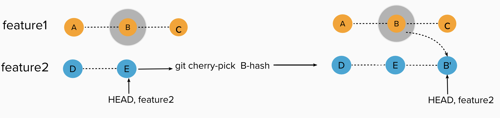
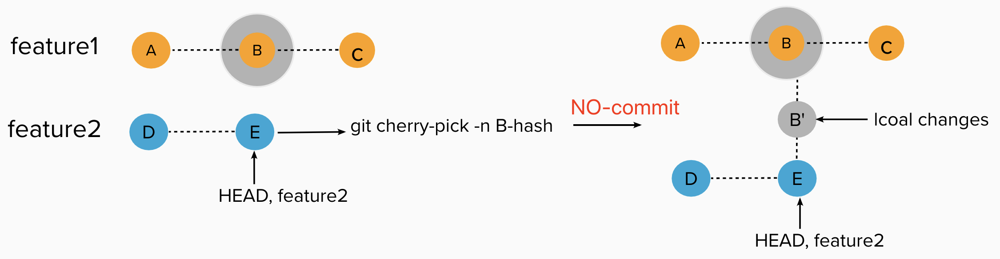

## Understand Git Cherry-Pick

I. [Cherry-Pick](#git-cherry-pick)

### Git Cherry Pick

**Goal:**
When you want to bring in a specific commit located on another branch to your current branch. Here we only discuss **"one commit"**, not multiple.

#### 1. cherry-pick with new commit

**Command:**

```
git checkout feature1
git cherry-pick commit-hash
```

**Result:**

1. it will create a new commit on you current branch to bring that specific commit you want to.



#### 2. cherry-pick wiht NO Commit

**Command2: with no commit**

```
git checkout feature1
git cherry-pick -n commit-hash
```

**Result2:**

1. No new commit added to current branch
2. Only apply the changes to your current branch, no commit created


