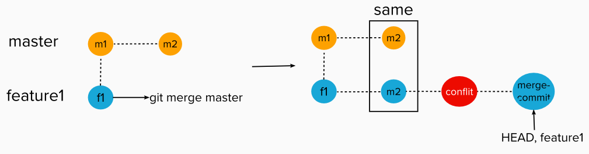
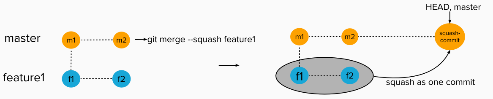
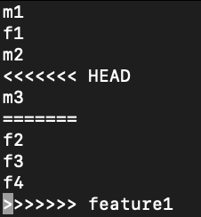
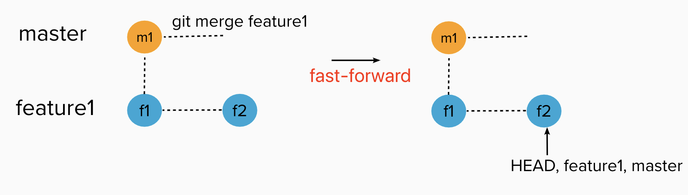
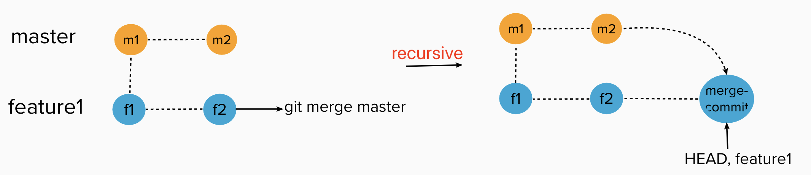

## Deep Understand Git Merge

I. [Git Merge](#merge)

II. [Squash Merge](#squash)

III. [Git Merge Strategy](#strategy)

- [Fast-Forward](#fast-forward)
- [Recursive](#recursive)

<div id="merge"/>

### Git Merge from Master to Feature Branch

When engineers on dev branch, sometimes, we want to keep updates on master latest commits, then we need the methods to help us get those difference and added into feature branch. That's the reason we want merge master to feature branch.

#### **Scenario 1: auto-merge, no conflict**

**Goal:** on feature branch, we want to catch the latest master changes to add to the feature branch.

**Command:**

```
git checkout feature1
git merge master
```

**Workflow:**

- git check both branches, and look at **the last commit that both branches have in common**, here is **"m1"**
- git look into that branch want to rebase (in step1 here is "master"), grab there different commits, here is **"m2"**
- git will bring those different commits from master branch ( the branch you want to merge ) and attach to the current HEAD at feature branch, here is the **"m1->f1->m2"**

**Result:**  


#### **Scenario 2: merge with conflict**

**Goal:** on feature branch, we want to catch the latest master changes to add to the feature branch.

**Command:**

```
git checkout feature1
git merge master
```

**Workflow:**

- git check both branches, and look at **the last commit that both branches have in common**, here is **"m1"**
- git look into that branch want to rebase (in step1 here is "master"), grab there different commits, here is **"m2"**
- git will bring those different commits from master branch ( the branch you want to merge ) and attach to the current HEAD at feature branch, here is the **"m1->f1->m2"**
- git notify you there are conflicts that you need to solve. Solve those conflicts then run `git add or git commit -a`
- git continue to merge, if successful, git will create a new merge commit for resolving those conflicts.

**Result:**  


<div id="squash" />

### Squash Merge

#### Scenario 1: auto-merge, no conflict

**Goal:** on master branch, we want to merge the latest feature branch changes, but only as one single commit.
**Command:**

```
git checkout master
git merge --squash feature1
```

**Workflow:**

- git check the target branch you want to merge, here is the feature1 branch
- git wrap all commit changes into single one commit, and bring it to current branch( here is master branch ).
- If no conflict, squash merge succeeds, and create that new one merge commit on current branch( master branch ).

**Result:**



#### Scenario 2: squash merge with conflict

**Goal:** on master branch, we want to merge the latest feature branch changes, but only as one single commit.
**Command:**

```
git checkout master
git merge --squash feature1
```

**Workflow:**

- git check the target branch you want to merge, here is the feature1 branch
- git wrap all commit changes into single one commit, and bring it to current branch( here is master branch ).
- git detect conflicts, you have to solve conflicts, then use `git add or git commit -a` to finish your solution.

  For example, the following is the conflict:

  

- After resolve conflicts, and squash merge succeeds, git will create a new one merge commit on current branch( master branch ).

**Results:**


<div id="strategy"/>

### Git Merge Strategy

#### Fast Forward

**Goal**
When you have no new commits on current branch, and you want to merge another branch. **Only HEAD pointer moves, no new commits created**, git log history is one straight line.

**Results:**



#### Recursive

- This operates on two heads. Recursive is the default merge strategy when pulling or merging one branch.
- This can only resolve two heads using 3-way merge algorithm. A 3-way merge is when both branches have new progressive commits on each branch.

**Results:**
It will **create a new mrege-commit** !


