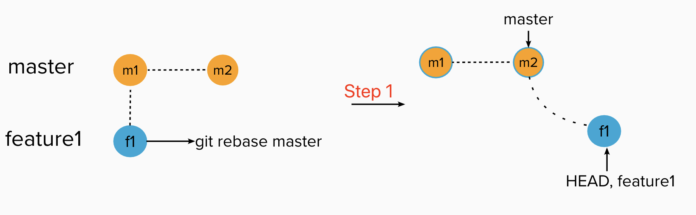

## Deep Understand Git Rebase

I. [Rebase between Master and Feature Branch](#master-feature)

II. [Rebase between Feature Branches](#feature-feature)

<div id="master-feature"/>

### Rebase between Master and Feature Branch

After read official docs , it made me hard to read those words in plain text. Then after watch some youtube videos, it made me a little bit clearer. Finally, DIY, practice it in my local repo!

DOCS: https://git-scm.com/book/en/v2/Git-Branching-Rebasing

Youtube: https://www.youtube.com/watch?v=CRlGDDprdOQ

#### **Step 1**

**Goal:**
on feature branch, we want to catch the latest master changes to add to the feature branch.

**Command:**

```
git checkout feature1
git rebase master
```

**Workflow:**

- git check both branches, and look at **the last commit that both branches have in common**, here is **"m1"**
- git look into that branch want to rebase (in step1 here is "master"), grab there different commits, here is **"m2"**
- git look at current brunch, here in step1 we are in feature branch, see if any differences, it will save internally or temporarily or in draft, here is the **"f1"**
- git will bring those different commits from master branch ( the branch you want to rebase ) and attach to the last common commits, here is the **"m1 -> m2"**
- If there is pre-saved draft or internally saved current branch( feature branch ) commits, git will attach these on top of current branch, here is the **"m1 -> m2 -> f1"**.

**Result:**



#### **Step 2**

**Goal:**
on master branch, we want to sync up with the latest feature branch changes to current master.
**Command:**

```
git checkout master
git rebase feature1
```

**Workflow:**

- git check both branches, and look at **the last commit that both branches have in common**, here is the **"m2"**.
- git look into that branch want to rebase (in step1 here is "feature1"), grab there different commits, here is **"f1 and f2"**
- git look at current brunch, here in step1 we are in master branch, see if any differences, it will save internally or temporarily or in draft, **here is the same, no difference**.
- git will bring those different commits from feature1 branch ( the branch you want to rebase ) and attach to the last common commits, here is to attach **"f1 and f2 "** to the common commit **"m2"**.
- If there is pre-saved draft or internally saved current branch(master branch) commits, git will attach these on top of current branch, here is nothing, then don't need to add more.

**Result:**


<div id="feature-feature" />

### Rebase between Feature Branches

#### **Step 1**

**Goal:**
dev engineers want to catch different feature from another dev's feature branch, to add on his own feature branch. Now we are on feature2, wants to rebase on feature1.
**Command:**

```
git checkout feature2
it rebase feature1
```

**Workflow:**

- git check both branches, and look at **the last commit that both branches have in common**, here is **"m1"**
- git look into that branch want to rebase (in step1 here is "feature1"), grab there different commits, here is **"f1"**
- git look at current brunch, here in step1 we are in feature2 branch, see if any differences, it will save internally or temporarily or in draft, here is the **"f2"**
- git will bring those different commits from feature1 branch ( the branch you want to rebase ) and attach to the last common commits, here is the **"m1 -> f1"**
- If there is pre-saved draft or internally saved current branch( feature2 branch ) commits, git will attach these on top of current branch, here is the attach **"f2"** to the **"m1 -> f1"**.

**Result:**


#### **Step 2**

**Goal:**

Now we are on feature1 branch, we also want to sync up with the latest feature branch changes in feature2 branch.

**Command:**

```
git checkout feature1
git rebase feature2
```

**Workflow:**

- git check both branches, and look at **the last commit that both branches have in common**, here is the **"f1"**.
- git look into that branch want to rebase( in step1 here is "feature2" ), grab there different commits, here is **"f2 and f22"** - git look at current brunch, here in step1 we are in feature1 branch, see if any differences, it will save internally or temporarily or in draft, **here is the same, no difference**.
- git will bring those different commits from feature2 branch ( the branch you want to rebase ) and attach to the last common commits, here is to attach **"f2 and f22 "** to the common commit **"f1"**.
- If there is pre-saved draft or internally saved current branch( feature1 branch) commits, git will attach these on top of current branch, here is nothing, then don't need to add more.

**Result:**


