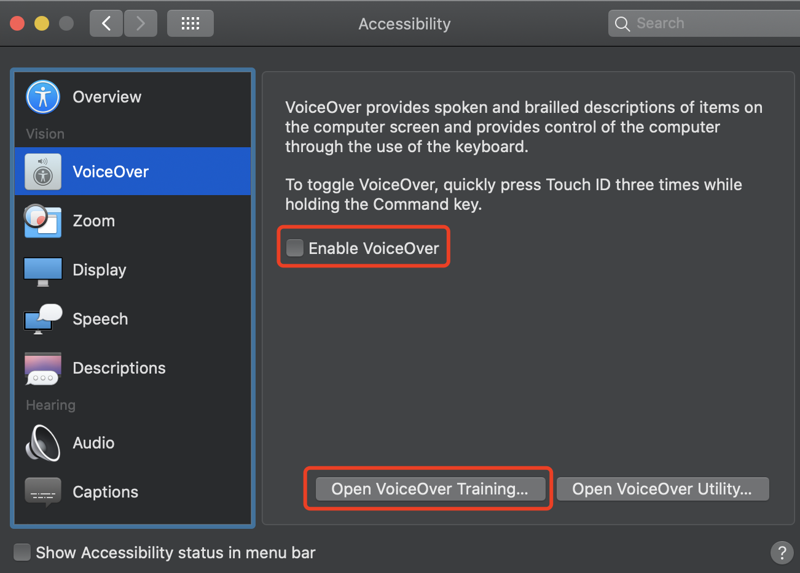
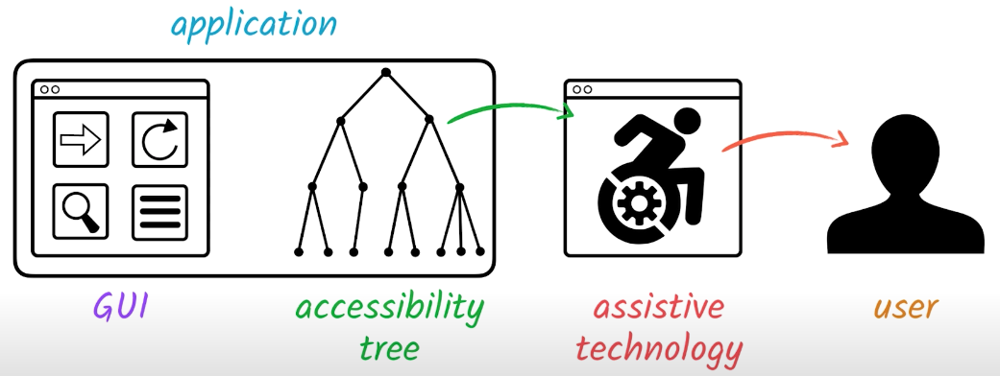

# Web Accessibility 

#### I. [Standards](#question1)

#### II. [WCAG 2.0](#question2)

#### III. [Disability Categories](#question3)

#### IV. [Fix a website to make it more accessible](#question4)

#### V. [Introducing A11ycasts](#question5)
- [what is focus ?](#q5-1)
- [tabindex](#q5-2)
- [use native `<button>`](#q5-3)
- [keyboard support in custom controls](#q5-4)
- [Screen Reader Basics - VoiceOver](#q5-5)
- [Why do semantics matters ?](#q5-6)

<div id="question1" />

### I. Standards

- W3C
- Web Accessibility Initiative(WAI)
- Web Content Accessibility Guidelines (WCAG)
- WCAG 2.0 - 2008 (most widely accepted worldwide standards)

<div id="question2" />

### II. WCAG 2.0

#### 2.1 Four Principles 
- Perceivable: 
	- eg: for deaf people, need to have transcripts to read with video media
- Operable: need to access all the websites
	- eg: any button not only clickable by mouse, also like some keyboard operation
- Understandable: info should be understood by user
- Robust
	- eg: on mobile,   on big screen, ... also should be accessible for everyone

#### 2.2 12 general guidelines

#### 2.3 61 testable criteria

#### 2.4. 3 level of conformance

<div id="question3" />

### III. Disability Categories

- Visual
	- how to use color? 
		- no contrast with text and background
	    - allow screen readers (operated by keyboard):  the `alt` on 	` tag`.
- Audio
	- use transcripts to read
- Motor
	- if people cannot use a mouse, it should support totally for keyboard
- Cognitive
	- for people who have learning disabilities, even including young child, to easily read the content.

<div id="question4" />

### IV. Fix a website to make it more accessible
- separate your html for the CSS & Javascript, to make the html more readable.
- provide alternative, eg: put a link there for disabilities to use other resources

<div id="question5" />

### V. Introducing A11ycasts

<div id="q5-1" />

#### 5.1 what is focus?

- non-interactive content
- [interactive content](https://developer.mozilla.org/en-US/docs/Web/Guide/HTML/Content_categories#interactive_content): eg: `div, img`
	- The content should be semantically described using interactive elements ([`<a>`](https://developer.mozilla.org/en-US/docs/Web/HTML/Element/a), [`<button>`](https://developer.mozilla.org/en-US/docs/Web/HTML/Element/button), [`<details>`](https://developer.mozilla.org/en-US/docs/Web/HTML/Element/details), [`<input>`](https://developer.mozilla.org/en-US/docs/Web/HTML/Element/input), [`<select>`](https://developer.mozilla.org/en-US/docs/Web/HTML/Element/select), [`<textarea>`](https://developer.mozilla.org/en-US/docs/Web/HTML/Element/textarea), etc.) instead.
	- [Focusable element must have focus styling](https://developer.mozilla.org/en-US/docs/Web/Accessibility/Understanding_WCAG/Keyboard#focusable_element_must_have_focus_styling "Permalink to Focusable element must have focus styling"): using `:focus` pseudo selector
	- Note: HTML dictates focus order  - tab order. Also see "[tabindex](https://developer.mozilla.org/en-US/docs/Web/HTML/Global_attributes/tabindex)".

<div id="q5-2" />

#### 5.2 tabIndex
-   A  _negative value_  (usually  `tabindex="-1"`) means that the element is not reachable via sequential keyboard navigation
-   `tabindex="0"`  means that the element should be focusable in **sequential** keyboard navigation
-   A  _positive value_  means the element should be focusable in sequential keyboard navigation, with **its order defined by the value of the number.** The maximum value for  `tabindex`  is 32767. If not specified, it takes the default value 0.

For example:
```html
<div tabindex="0">in tab order</div>
<div tabindex="-1">NOT in tab order</div>
<div>I am a non-interactive element</div>
<a>I am an interactive element</a>
```

Note: tab cannot access, but JS script can select handle it:
```html
<script>
document.querySelector('[tabindex="-1"]').focus();
</script>
```

**Bad pattern / Anti pattern:**
DO NOT making tabindex value larger than 0, since you have so many elements in DOM, all with diff values, hard to control.

Good practice:
**higher in the tab order = earlier in the DOM**

<div id="q5-3" />

#### 5.3 just use the `<button>`
- fake button
	```html
	<div disabled> sign up</div>	// not in tab order
	```
	1 ) When we use VoiceOver screen reader: **"sgin up! group"**, because `div` for browse is a **grouping element type.**
	2 ) click handler **cannot use for keyboard click:** eg: **space / enter** keyboard
	3 ) disabled attribute: not working 
- native button
	```html
	<button disabled>sign up</button>
	```
	 1 ) VoiceOver screen reader: **"sgin up! button"**, see the difference? awesome 
	 2 ) when press 'space/enter' keyboard, click handler works!!!
     3 ) [disabled attribute](https://www.w3schools.com/tags/att_disabled.asp): working, **cannot select, focus and clickable**!!!

<div id="q5-4" />

#### 5.4 keyboard support in custom controls

Example:  Radio Group Using Roving tabindex


- use arrow up / down key to select a single value
- `tabindex` is `0`  on selected radio, others are all `-1`
- give user a better experience to tab to next area (not tab each radio option in the group

WAI-ARIA rules: [radio - using roving tabindex](https://w3c.github.io/aria-practices/examples/radio/radio.html)

<div id="q5-5" />

#### 5.5 Screen Reader Basics - VoiceOver (on mac)



Suggestions:
- go over the VoiceOver training
- enable voiceover to have a try on you mac

Cheat sheet of VO:
- VO key: "control + option" + ....
	- right arrow -> next area
	- space -> click behavior
- stop VO key: "control"
- Increase / Decrease the pitch: "control + opt + cmd + up/down arrow"

<div id="q5-6" />

#### 5.6 Why do semantics matters ?
- Affordances:  offer or afford a person the opportunity to perform an action.
- For each element, it has a few semantic properties for screen reader to read:
	- role
	- name
	- state
	- value 	



For example: in screen reader reads differently!
- `div` button
- native button

Semantic elements in HTML: [docs](https://developer.mozilla.org/en-US/docs/Glossary/Semantics#semantic_elements)
-   [`<article>`](https://developer.mozilla.org/en-US/docs/Web/HTML/Element/article)
-   [`<aside>`](https://developer.mozilla.org/en-US/docs/Web/HTML/Element/aside)
-   [`<details>`](https://developer.mozilla.org/en-US/docs/Web/HTML/Element/details)
-   [`<figcaption>`](https://developer.mozilla.org/en-US/docs/Web/HTML/Element/figcaption)
-   [`<figure>`](https://developer.mozilla.org/en-US/docs/Web/HTML/Element/figure)
-   [`<footer>`](https://developer.mozilla.org/en-US/docs/Web/HTML/Element/footer)
-   [`<header>`](https://developer.mozilla.org/en-US/docs/Web/HTML/Element/header)
-   [`<main>`](https://developer.mozilla.org/en-US/docs/Web/HTML/Element/main)
-   [`<mark>`](https://developer.mozilla.org/en-US/docs/Web/HTML/Element/mark)
-   [`<nav>`](https://developer.mozilla.org/en-US/docs/Web/HTML/Element/nav)
-   [`<section>`](https://developer.mozilla.org/en-US/docs/Web/HTML/Element/section)
-   [`<summary>`](https://developer.mozilla.org/en-US/docs/Web/HTML/Element/summary)
-   [`<time>`](https://developer.mozilla.org/en-US/docs/Web/HTML/Element/time)