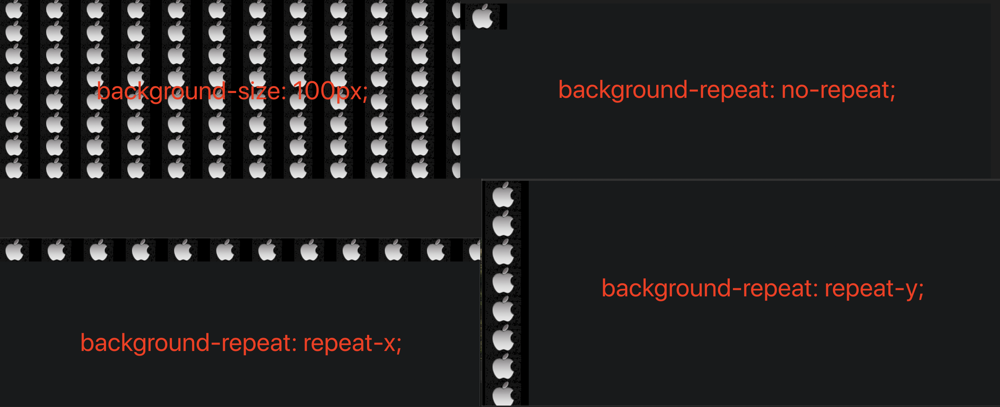
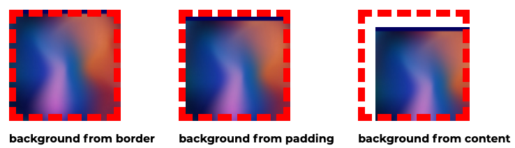
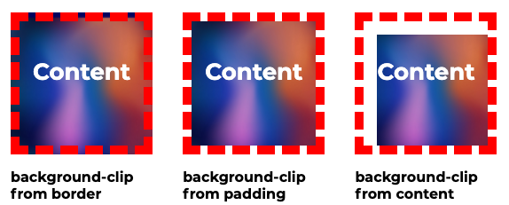
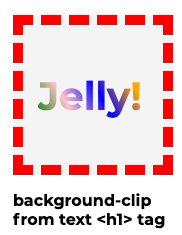
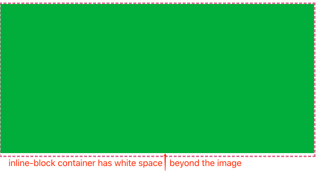
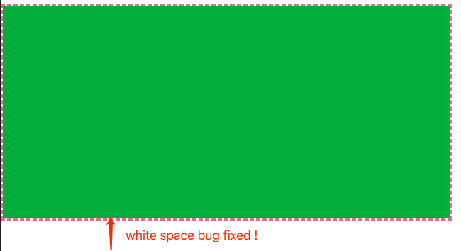

## Backgrounds and Images

I. [Background & Background Images](#background-property)

II. [Images](#images)

III. [Gradients](#gradients)

IV. [Filters](#filters)

<div id="background-property"/>

### Understand the "background" Property

#### 1. shorthand property

they are the same if you want to set it as an image:

- background: url()
- background-image: url()

```css
background: url("apple.jpg");
background-image: url("apple.jpg");
```

#### 2. "background-color" property

If you set the solid color on the background, but the color won't be front of the background image, the image will be on the front.

```css
background-image: url("apple.jpg");
background-color: red; // it won't affect the front image
```

#### 3. size the background image

More on docs: [background-size](https://developer.mozilla.org/en-US/docs/Web/CSS/background-size), [background-repeat](https://developer.mozilla.org/en-US/docs/Web/CSS/background-repeat)

- background-size: 100px; / 50%; / auto; / cover
- background-repeat: no-repeat; / repeat-x; / repeat-y;



Tips:

- Using the keyword values `contain` or `cover` on "**background-size"**.

  - `contain`
    Scales the image as large as possible without cropping or stretching the image.

  - `cover`
    Scales the image as large as possible without stretching the image. But it might be cropped either vertically or horizontally so that no empty space remains.

#### 4. background-position property

More on docs: [background-position](https://developer.mozilla.org/en-US/docs/Web/CSS/background-position)

```
background-postion: 1st-value, 2nd-value, 3rd-value, 4th-value;
```

- 1st-value
  - `top`
  - `left`
  - `bottom`
  - `right`
    These 4 specifies an edge against which to place the item. The other dimension is then set to 50%, so the item is placed in the middle of the edge specified.
  - length/percentage: **100px; / 20%;**
    These numbers set the left-edge-**x-axis**-value
- 2nd-value
  Refer to the **y-axis**
- 2 values pair
  Only **"left or right"** define the x-axis, **"bottom or top"** define the y-axis, the order of these 2 value won't affect the result. For example, the following is the same effect:
  ```css
  background-position: bottom right;
  background-position: right bottom;
  ```
- four values pair
  For example:
  ```css
  background-position: left 25% top 75%;
  ```
  It means the starting point on the image that is 25% from the left and 75% from the top will be placed at the spot of the container that is 25% from the container's left and 75% from the container's top.

#### 5. "background-origin" property

More on docs: [background-origin](https://developer.mozilla.org/en-US/docs/Web/CSS/background-origin), it sets the background's origin: from the border start, inside the border, or inside the padding.

```css
background-origin: border-box;
background-origin: padding-box;
background-origin: content-box;
```

The example box has the following css size properties with left and top padding, and a red-dashed border.

```css
 {
  width: 160px;
  height: 160px;
  padding-left: 15px;
  padding-top: 15px;
  border: 10px dashed red;
}
```

And the three `background-origin` properties have the following effect:



#### 6. "background-clip" property

it overrides the `background-origin` property, and also it defines how the background should be clipped. The **[background-clip](https://developer.mozilla.org/en-US/docs/Web/CSS/background-clip)** property sets whether an element's **background extends underneath** its border box, padding box, or content box.

It has 4 values on this property:

```css
background-clip: border-box;
background-clip: padding-box;
background-clip: content-box;
background-clip: text;
```

Here are some examples for the 3 box types :



Especially for the clip to the front text, there are few things to be careful when using the `background-clip: text` .

- it should be used in text html tags, etc: `<p>`, `<h1>`, `<h2>` .
- the text **color** should be somehow visible, **etc: transparent, rgba(0,0,0,0.2)**.
- Code example:
  ```html
  <div><h1>Jelly!</h1></div>
  ```
  ```css
  h1 {
    color: transparent;
    background: linear-gradient(60deg, green, pink, blue, orange, pink);
    background-clip: text;
    -webkit-background-clip: text;
  }
  ```
- Result is like the following picture:

  

#### 7. "background-attachment" property

This is **not frequently** used. The **`background-attachment`** property sets whether a background image's position is `fixed`, `scroll`, or `local` within the viewport with its containing block.

```css
background-attachment: fixed | local | scroll;
```

- `fixed`: won't scroll with content and element, fixed to the viewport.
- `local` : background is relative to the element's contents, the background scrolls with the element's contents.
- `scroll`: background is relative to the element itself and does not scroll with its contents.

#### 8. shorthand "background" property together

The order at zero or one appearance of these properties are:

- background-attachment
- background-url
- background-position **/** background-size: the slash is important.
- background-repeat
- background-origin
- background-clip: if this is omitted, it will apply the same with background-origin value. if it's provided, it will override the prev value.

For example:

```css
 {
  background: url("apple.jpg") left 10% bottom 20% / cover no-repeat border-box;
}
```

<div id="images"/>

### Images

#### 1. understand image width & height
* 1 ) Important: nested in an inline-level-element

	For example the following html and css code:
	```html
	<a>
		
	</a>
	```
     container element height/width won't affect the image real size.
	```css
	a {
		height: 20px;
	}
	```
   if we set **percentage value** on image element size, even its surrounding container element has a specific number of size, it won't change, has **no effect**.
	```css
	img{
		height: 100%;
	}
	```
   **Correct way**:  When we wrap image inside an inline-level-element, two solutions:
 - set it a specific number values on size property on `` tag. eg: "height: 20px";
 - set container inline element to display as **a block-level element, then the height and width will be respected.**
	```css
	a {
			display: inline-block;
	}
	```
* 2 ) image nested in a block-level element
	all the height and width will be respected.

#### 2. layout the image: tricky bug
When you have a container with `inline-block` style and it contains the `` tag, even when we set the image to be 
```css
{
	height: 100%;
	width: 100%;
}
```
There still has a white space outside the image, and inside of the container border. Here the example is the bottom white space, how to fix it? 



**Solution:** for this **inline-element bug**:
* 1 ) set the image `vertical-align` to be bottom or top
* 2 ) set the image to `display: block;` to take all the spaces of the container.

```css
image {
	width: 100%;
	height: 100%;
	display: block;
}
/* or */
image {
	width: 100%;
	height: 100%;
	vertical-align: top / bottom;
}
```

Here is the correct result after white-space bug fixed:



<div id="gradients"/>

### Gradients
#### 1. linear-gradient
Use the [linear-gradient](https://developer.mozilla.org/en-US/docs/Web/CSS/linear-gradient) css math function to paint the color.
The default is **vertically from top to bottom** with the given order of colors.
```
background-image: linear-gradient(red, blue);
```


#### 2. add direction on the gradients
you can assign `to top/bottom/left/right` or some degrees `30deg`. 0 degrees mean from bottom, and 180 degrees mean from top to bottom, these are **clock-wise**.
```
background-image: linear-gradient(30deg, red, blue);
background-image: linear-gradient(to bottom, red, blue);
```
**For example**:  different direction on angels


#### 3. use multiple color,  hex code and rgba() colors
* use hex code, and `rgba()` colors and multiple colors on image
	```css
	background-image: linear-gradient(pink, lightblue, rgba(238, 238, 0, 0.5), #7befb2);
	```
* Assign percentage space of each color
	```css
	background-image: linear-gradient(red 30%, blue 70%);
	```
	When next color percentage overrides the first one, it will have **no smooth transition**, for example when **"red 70% blue 60%"** .
	```css
	background-image: linear-gradient(red 70%, blue 60%);
	```
	Here is the result comparison of two pictures:
	
	

#### 4. Radial Gradient
Docs: [radial-gradient()](https://developer.mozilla.org/en-US/docs/Web/CSS/radial-gradient)

4.1 Simple and basic color example
```
 background-image: radial-gradient(red, blue);
```
4.2 You can set the shape of the gradient: `circle` or `ellipse`
```css
background-image: radial-gradient(circle, red, blue);
background-image: radial-gradient(ellipse, red, blue);
```
4.3 you can set the positions of the shape, eg: top, top left, bottom, and so on.
```css
background-image: radial-gradient(circle at top left, red, blue);
```
4.4 you can set **percentage or values** of the position
It reads as **"x-axis, y-axis"**, and for example here: `circle at 20% 50%` means move 20% from the left, and move 50% from the top.
```
background-image: radial-gradient(circle at 20% 50%, red, blue);
background-image: radial-gradient(circle at 20px 50px, red, blue);
```
Here are some images to compare the different circle positions:

 of the shape
* circle: 1-value, because it's circle
* ellipse: 2-value, width and height
```
background-image: radial-gradient(circle 50px at 20% 50%, red, blue);
background-image: radial-gradient(ellipse 50px 80px at 20% 50%, red, blue);
```


Or if you do not want to set specific numbers on the size of the shape, you may use some keywords, like:
- `closest-side`
- `closest-corner`
- `farthest-side`
- `farthest-corner`

#### 5. Use Multiple Backgrounds
You can use as many backgrounds as you want, but **only one solid color background-color may be used** ! And it will be always at the bottom most backgrounds.
For example: 
```
{
	background: url(), url(), linear-gradient(),...,red;
}
```
Tip:
the next background won't be seen until the previous background have some visibility.
Here is an example in order comes the backgrounds:
- a little bit transparent linear-gradient color background
- a completely image
- a solid color background on the bottom ( this won't be seen )

```
{
	background: 
		linear-gradient(to top, pink 10%, transparent),
		url("https://lh3.googleusercontent.com/proxy/yIVq4GktPLN6M8wSq4tImkql1MJkiu-RM43mBRbUBTBFSGa2r2gIfvb3V_be_24w4mOJciVo76UddM0qJVIM4JzciO5U-GUr34qcqPI") left 10% bottom 20%/cover no-repeat border-box,
		#ff1b68;
}
```


<div id="filters"/>

### Filters

MDN docs:  [filter](https://developer.mozilla.org/en-US/docs/Web/CSS/filter)

we can add a filter with the filter property and use one of the pre-defined filter functions to change the look of that element and its content, for example the blur filter would take a pixel value and would blur the box.

Some filter functions can use:
```css
filter: blur(5px);
filter: brightness(0.4);
filter: contrast(200%);
filter: drop-shadow(16px 16px 20px blue);
filter: grayscale(50%);
filter: hue-rotate(90deg);
filter: invert(75%);
filter: opacity(25%);
filter: saturate(30%);
filter: sepia(60%);
```

