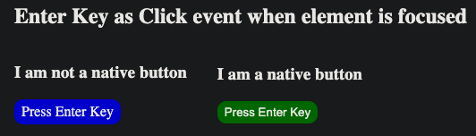
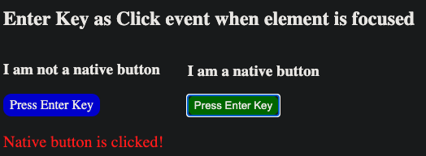
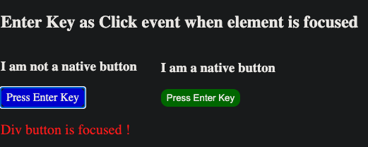

## Enter Key trigger click on Focused Element

#### I. [Use Case](#question1)

#### II. [Use native button](#question2)

#### III. [Use NON-native Div](#question3)

#### IV. [Conclusion ](#question4)

<div id="question1" />

### I. Use Case

When use Keyboard navigation, the do following steps:
- "tab" key to **select & focus** an element
- when element is focused, press ENTER key
- check whether a similar "click" event happens on this event



<div id="question2" />

### II. use native button

HTML code: use `<button>` element
```html
<div  class="btn-box">
	<h3>I am a native button</h3>
	<button  id="test-btn2">Press Enter Key</button>
</div>
```

JS script to add 'click' listener:
```js
nativeBtnEL.addEventListener('click', function (e) {
	resultEL.textContent = "Native button is clicked!";
});
```

**Result:**
**Success** ! Press enter key can trigger the click event when `<button>` is focused !



<div id="question3" />

### III. use NON-native div

HTML code: use `<div role="button">` element
```html
<div  class="btn-box">
	<h3>I am not a native button</h3>
	<div  id="test-btn"  tabindex="0"  role="button">Press Enter Key</div>
</div>
```

JS script to add 'click' listener:
```js
testBtnEL.addEventListener('click', function (e) {
	resultEL.textContent = "Div button is clicked!";
});
```

**Result:**
**Fail** ! Press enter key can **NOT** click the element  when `<div>` is focused ! it can only be focused due to the extra effort with `'tabindex'` attribute.



<div id="question4" />

### IV. Conclusion

Reference: [stackoverflow-ans](https://stackoverflow.com/questions/42034359/trigger-click-event-on-keypress-for-any-focused-element)

- The `<button>` keypress `enter` triggers the **click event** as expected.
- `<div>` keypress `enter` does nothing, even with a aria attribute `role="button"`
