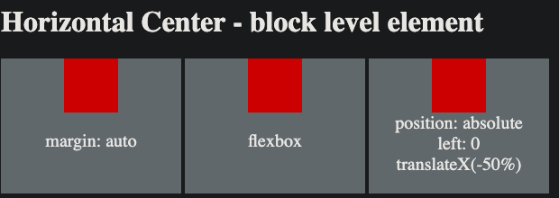

## How to center an element in CSS ?

#### I. [Horizontal Center - inline level element](#chapter1)

#### II. [Horizontal Center - block level element ](#chapter2)

#### III. [Vertical Center - inline level element](#chapter3)

#### IV. [Vertical Center - block level element](#chapter4)

#### V. [Source Code ](#chapter5)

<div id="chapter1" />

### I. Horizontal Center - inline level element
`text-align: center`
- for text: 
- for other inline elements: eg :`<a> tag`


<div id="chapter2" />

### II. Horizontal Center - block level element 

2.1 `margin: auto`
2.2 flexbox
```css
{
	display: flex;
	justify-content: center;
}
```

2.3 position absolute & transfrom
```css
.use-absolute{
	position: absolute;
	left: 50%;
	transform: translateX(-50%);
}
```



<div id="chapter3" />

### III. Vertical Center - inline level element

3.1 equal padding top & bottom
- on text 
- on inline elements - eg: `<a> tag`

3.2 use `line-height` on text 
Note: cannot apply on inline element !!!

`line-height`:
- it cannot apply on ["non-replaced inline element"](https://stackoverflow.com/questions/12468176/what-is-a-non-replaced-inline-element)
	Because non-replaced box start at the top and bottom of the content area, and has nothing to do with the ['line-height'](https://www.w3.org/TR/CSS2/visudet.html#propdef-line-height). For example: the `<a>` tag.
- number value: eg: 200px;
- percentage value: computed value  is **multiplied** by the element's **font size**

3.3 A smart pseudo content to use `vertical-align & inline-block`

- `::before selector` : [docs](https://developer.mozilla.org/en-US/docs/Web/CSS/::before) - insert element **as the first child element.**
- `virtical-align` can only make effect when multiple (more than one) elements are displaying `inline-block`. So we need an pseudo empty content element.

    ```css
    .ghost-center {
        position: relative;
    }
    .ghost-center::before {
        content: " ";
        display: inline-block;
        height: 100%;
        width: 1%;
        vertical-align: middle;
    }
    .ghost-center  p{
        display: inline-block;
        vertical-align: middle;
        width: 150px;
        margin: 0;
    }
    ```


<div id="chapter4" />

### IV. Vertical Center - block level element

4.1 margin:auto NOT work !!!

`margin: autp 0px`
- It doesn't center the element vertically because it is a block-level element in the normal flow.
because the  [**W3C spec**](http://www.w3.org/TR/CSS21/visudet.html#inline-replaced-height)  says so:
	> If 'margin-top', or 'margin-bottom' are 'auto', their used value is 0.

4.2 use flexbox
```css
.use-flex-vertical {
	display: flex;
	justify-content: start;
	align-items: center;
	height: 100%;
}
```

4.3 position absolute & transform
```css
.use-absoluteVertical{
	position: absolute;
	top: 50%;
	transform: translateY(-50%);
}
```


<div id="chapter5" />

### V. Source Code
[github link](https://github.com/jialihan/CSS-onboarding/tree/master/center-element)