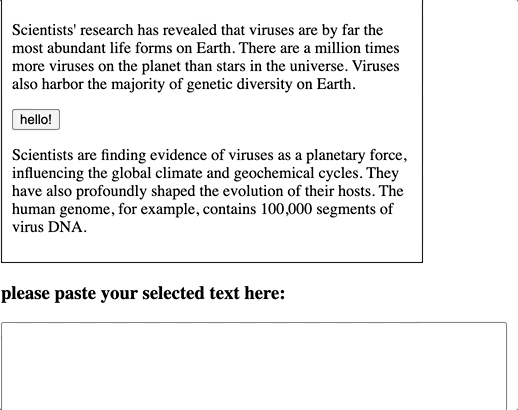
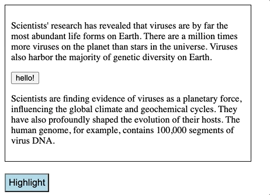

## Copy and Highlight Selected Text in HTML

#### I. [How to detect selected Text in HTML?](#question1)

#### II. [CSS trick - Not selectable](#question2)

#### III. [Copy & Paste Text in html Demo](#question3)

#### IV. [How to highlight text in html Demo](#question4)

#### V. [Source Code](#question5)

<div id="question1" />

### I. How to detect selected Text in HTML?

#### 1.1 `getSelection()`

- `window.getSelection()`
- [`document.getSelection()`](https://developer.mozilla.org/en-US/docs/Web/API/Document/getSelection)
  The **`getSelection()`** property of the [`Document`](https://developer.mozilla.org/en-US/docs/Web/API/Document) interface returns a [`Selection`](https://developer.mozilla.org/en-US/docs/Web/API/Selection) object representing the range of text selected by the user, or the current position of the caret.

#### 1.2 `Selection.getRangeAt()`

Docs: https://developer.mozilla.org/en-US/docs/Web/API/Selection/getRangeAt

Code Example:

```js
let ranges = [];
sel = window.getSelection();
for (let i = 0; i < sel.rangeCount; i++) {
  ranges[i] = sel.getRangeAt(i);
}
/* Each item in the ranges array is now
 * a range object representing one of the
 * ranges in the current selection */
```

<div id="question2" />

### II. CSS trick - Not selectable

**Doc:**
https://css-tricks.com/almanac/properties/u/user-select/

Syntax: `all` or `none`

```css
 {
  user-select: none;
}
```

<div id="question3" />

### III. Copy & Paste Text in html Demo

Important JS code:

```js
document.addEventListener("copy", (event) => {
  event.preventDefault();
  const pagelink = `\nRead more at: ${document.location.href}`;
  event.clipboardData.setData("text", document.getSelection() + pagelink);
});
```

**UI result:**



<div id="question4" />

### IV. How to highlight text in html Demo

**Docs:** -https://stackoverflow.com/questions/304837/javascript-user-selection-highlighting/69070082

- highlight text in html: [`<mark>`](https://developer.mozilla.org/en-US/docs/Web/HTML/Element/mark)

**JS code:**
helpful method in "Range" object: [`range.surroundContents()`](https://developer.mozilla.org/en-US/docs/Web/API/Range/surroundContents)

```js
var highlightEL = document.getElementById("highlight");

highlightEL.onclick = function (e) {
  var userSelection = window.getSelection();
  for (var i = 0; i < userSelection.rangeCount; i++) {
    highlightRange(userSelection.getRangeAt(i));
  }
};

function highlightRange(range) {
  var newNode = document.createElement("mark");
  range.surroundContents(newNode);
}
```

**UI result:**



<div id="question5" />

### V. Source Code

codepen source code: [link](https://codepen.io/jellyhan27/pen/zYzoYBW)
