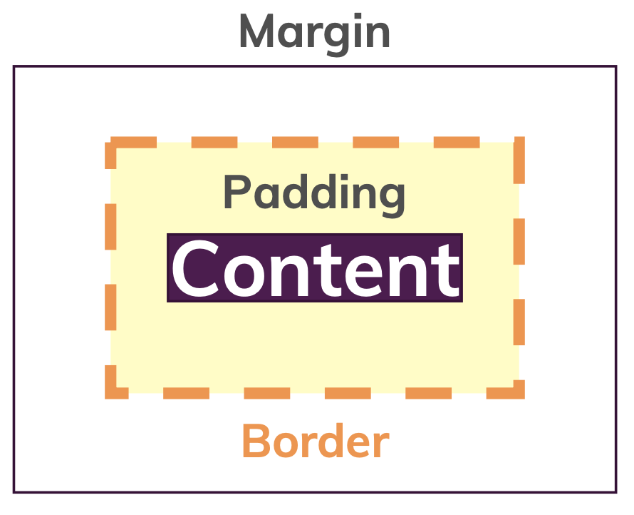
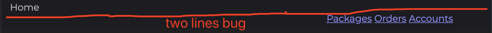

## CSS Basics 02

I. [The Box Model](#the-box-model)

II. [Height & Width](#height-and-width)

III. [The Display Property](#the-display-property)

IV. [Other CSS Properties](#other-css-properties)

### The Box Model

1. box model



2.  browser default body margin
    Remember to override and reset margin to "0", to wipe out browser default settings.

3.  **Margin Collapsing**

- Bigger margin wins
- use **either** `margin`-top or `margin-bottom`
- Three Scenario of collapsing: [Reference MDN docs](https://developer.mozilla.org/en-US/docs/Web/CSS/CSS_Box_Model/Mastering_margin_collapsing)
  - Adjacent siblings
  - No content separating parent and children
  - Empty blocks

4. Shorthand Property
   **For example 1: border**
   ```
   {
   	border: border-width border-style border corlor;
   }
   ```
   **For example 2: margin**
   ```
   {
   	margin: top right bottom left;
   }
   {
   	margin: top&bottom left&right;
   }
   {
   	margin: all;
   }
   ```
   **For example 3: padding**
   similar like margin
   **For example 4: background**: [reference docs](https://www.w3schools.com/css/css_background_shorthand.asp)
   ```
   body {
   	background-color:  #ffffff;
   	background-image:  url("img_tree.png");
   	background-repeat:  no-repeat;
   	background-position:  right top;
   }
   body
   {
   	background:  #ffffff url("img_tree.png") no-repeat right top;
   }
   ```
5. Universal Selector to set all to **"border-box"**

```
* {
	box-sizing: border-box;
}
```

### Height And Width

A trick to set element 100%. If you set an element 100%, it might **not working** because all its parent should be set a specific height.
**~~Wrong Example:~~** it won't work!

```
main {
	height:100%;
}
```

**Correct:**
Need to create such a chain where you pass the page height down.

```
html { height: 100%; }
body { height: 100%; }
main { height: 100%; }
```

### The Display Property

1. hidden vs none

- hidden: still a part of the DOM
- none: removes the element in the DOM, other elements can take this place

2. **Block level vs. Inline level**

| Property                     | Block                                                      | Inline                 |
| ---------------------------- | ---------------------------------------------------------- | ---------------------- |
| position                     | whole horizontal space                                     | in same line           |
| tags                         | `<div>`,`<section>`,`article`, `<nav>`,`<h1>`,`<h2>`,`<p>` | `<a>`,`<span>`,`` |
| margin-top / margin-bottom   | respected                                                  | not respected          |
| padding-top / padding-bottom | respected                                                  | not respected          |
| width / height               | respected                                                  | not respected          |

Solution: use `inline-block` to get those properties back.

3. unexpected "inline-block" behavior
   Problem: when two different `inline-block` elements in one line, there are extra white-space content-node in html, it will take spaces too.



**Solution:**
1 ) remove more px spaces, for example: use `calc()`

```
.nav {
	display: inline-block;
	text-align: right;
	width: calc(100% - 49px);
}
```

2 ) construct your html without spaces:

```
// previous
<div>Home</div>
<nav></nav>
// new solution
<div>Home</div><nav></nav>
```

### Other CSS Properties

1. clear browser default settings on **"text-decoration"**

```
{
	text-decoration : none;
}
```

2. use "**vertical-align**" in same line on every elements

```
// on all elements in same line
{
	vertical-align: middle
}
```

3. [Pseudo classes](https://developer.mozilla.org/en-US/docs/Web/CSS/Pseudo-classes) vs [Pseudo elements](https://developer.mozilla.org/en-US/docs/Web/CSS/Pseudo-elements)

- pseudo class: defines the styles of **a special state** of the element: `:class name`
  For example:
  ```
  :hover
  :active
  :focus
  ```
- pseudo element: define the style of **a specific part** of the element: `::element name`
  For example:
  `::after ::before ::first-letter // helpful in building blogs`

4. Grouping multiple rules
   For example:
   `{ div:hover, div:active{ // share the same css styles }`

5. **[font-weight](https://developer.mozilla.org/en-US/docs/Web/CSS/font-weight)** property

   ```
   {
   	font-weight: bold;
   }
   ```

6. border & padding between borders

7. background & background image

- set the **background color**:
  for example:
  ```
  {
  	background: #ffffff;
  }
  // or
  {
  	background-color: #ffffff;
  }
  ```
- set the background image
  ```
  background: ur("path");
  // examples
  background: url("apple.jpg"); // current folder
  background: url("subfolder/apple.jpg"); // sub folder
  ```
