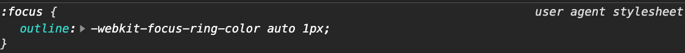
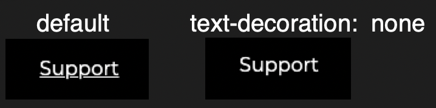
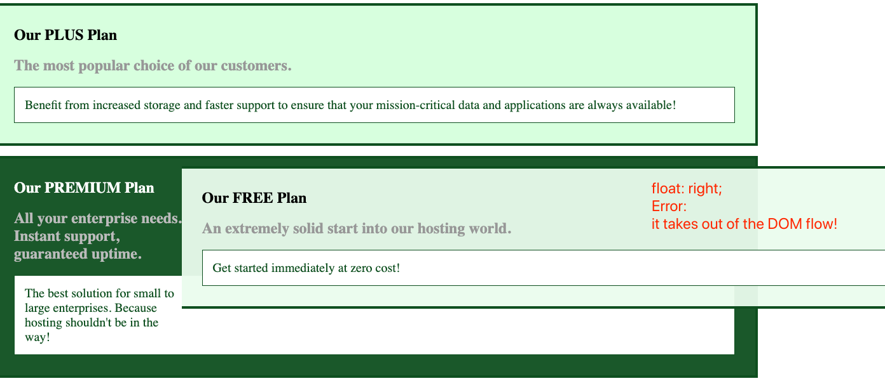

1. [vertical-align](http://developer.mozilla.org/en-US/docs/Web/CSS/vertical-align#:~:text=Note%20that%20vertical-align%20only,vertically%20align%20block-level%20elements.): sets vertical alignment of an inline, inline-block or table-cell box.

2. The [text-align](https://developer.mozilla.org/en-US/docs/Web/CSS/text-align)` sets the horizontal alignment of a block element or table-cell box. This means it works like [vertical-align](https://developer.mozilla.org/en-US/docs/Web/CSS/vertical-align "The vertical-align CSS property sets vertical alignment of an inline, inline-block or table-cell box.") but in the horizontal direction.
3. [box-shadow](https://developer.mozilla.org/en-US/docs/Web/CSS/box-shadow): **x-offset | y-offset | blur | spread | color**
   Parameters:

- x-offset: positive value -> right, negative value -> left;
- y-offset: positive value -> right, negative value -> left;
- blur
- spread
- color: rgb(x,x,x, opacity); // opacity is from 0 - 1

4.  font
    we can set our font-family as the same for whole page, for exmaple, we can set font in `<body>`, then other child elements just need to `inherit` it, to override some browser agent default weird and different font.
    `body { font-family: "Montserrat", sans-serif; } .feature__button { font: inherit; }`
    Reference docs: [CSS/font](https://developer.mozilla.org/en-US/docs/Web/CSS/font), [CSS/inherit](https://developer.mozilla.org/en-US/docs/Web/CSS/inherit)

5.  outline

`focus` state have this `outline` property, the outline is comparable to a border but it's not part of the box model.




Solution:
In our code to disable this outline in browser default property.

```
.plan__button:focus {
   outline: none;
}
```

6.  `<a>` tag
    By default there an underline of the text, to remove that underline, we need to use the css property: `text-decoration: none;`
    `a { text-decoration: none; }`
    

7.  [float](https://developer.mozilla.org/en-US/docs/Web/CSS/float)

Due to MDN docs:

The **`float`** CSS property places an element on the left or right side of its container, allowing text and inline elements to wrap around it. The element is removed from the normal flow of the page, though still remaining a part of the flow (in contrast to [absolute positioning](https://developer.mozilla.org/en-US/docs/Web/CSS/position#Absolute_positioning)).

For example: the error in the picture.



How to fix? -- clearfix

```
// after the float element
<div class="clearfix"></div>

// css
.clearfix {
        	content: "";
        	clear: both;
        	display: table; */
}
```

8.  `!important` - **a bad practice**

Because it will override the CSS specificity, so only in rare situation, we use it.
For example:

```
.package:hover,
.package:active {
      border-color: #ff5454 !important;
}
```
