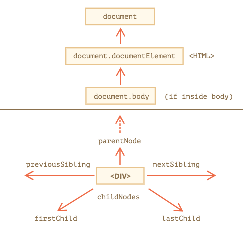
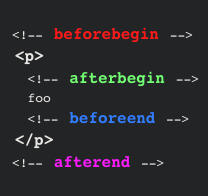

## DOM & DOM Manipulation
#### I. [Nodes & Elements](#question1)
#### II. [Walk through the DOM](#question2)
#### III. [Changing the DOM](#question3)
#### IV. [select multiple elements](#question4)
#### V. [Change Styles of DOM Elements](#question5)
#### VI. [Create and Add Elements in DOM](#question6)
#### VII. [clone DOM elements](#question7)
#### VIII. [remove DOM elements](#question8)
#### IX. [static nodeList vs. live nodeList](#question9)
 
<div id="question1" />

### I. query Nodes & Elements

#### 1.1 What is node & element in dom?

*  **Nodes**: everything in the DOM is a node, eg: **textNode, elementNode, attributeNode**

*  **Elements**: html tags are **Element Node**, not the text in there, have special methods to interact with the element, can be created and removed.

#### 1.2 Query Methods

* document.**querySelector(<CSS selector>)**

	Takes any **CSS selector** (e.g. `'#some-id'`, `'.some-class'` or `'div p.some-class'`) and returns the **first (!) matching element** in the DOM. Returns **null** if no matching element could be found.

* document.**getElementById(<ID>)**
	Takes an ID (without `#`, just the id name) and returns the element that has this id. Returns `null` if no element with the specified ID could be found.

* document.**querySelectorAll(<CSS selector>)**
	returns **all matching elements** in the DOM as a static (non-live) **NodeList**. Returns and empty **NodeList** if no matching element could be found.

* document.**getElementsByClassName(<CSS CLASS>)**
	Takes a CSS class g (e.g. `'some-class'`) and returns a live **HTMLCollection** of matched elements in your DOM. Returns an empty **HTMLCollection** if not matching elements were found. More information: [Document/getElementsByClassName](https://developer.mozilla.org/en-US/docs/Web/API/Document/getElementsByClassName)

* document.**getElementsByTagName(<HTML TAG>)**
	Takes an HTML tag (e.g. `'p'`) and returns a live **HTMLCollection** of matched elements in your DOM. Returns an empty **HTMLCollection** if not matching elements were found.

<div id="question2" />

### II. Walk through the DOM


  
#### 2.1  object that you can directly get from the dom

- `document.body` => Selects the `<body>` element node.
- `document.head` => Selects the `<head>` element node.

- `document.documentElement` => Selects the `<html>` element node
- `document.html` =>  Selects the `<html>` element node

#### 2.2 children
The direct child nodes or elements, two ways to select child nodes:
- childNodes: returns a **live**  [`NodeList`](https://developer.mozilla.org/en-US/docs/Web/API/NodeList) of child [`nodes`](https://developer.mozilla.org/en-US/docs/Web/API/Node)

- children: a read-only property that returns a live [`HTMLCollection`](https://developer.mozilla.org/en-US/docs/Web/API/HTMLCollection) which contains all of the child [`elements`](https://developer.mozilla.org/en-US/docs/Web/API/Element "elements") of the node 

**Comparison of this two collections:**


#### 2.3 child
The direct child nodes or elements, usually we can get 1st or last child of the parent node/element:
 - `.firstChild`: return an node
- `.firstElementChild`: return an element node
- `.lastChild`: node
- `.lastElementChild`: element


#### 2.4 Descendant: 
Direct or **indirect** child node or element


#### 2.5 Parent: 
The **direct parent** node or element.
Ways to select parent:
- `.parentNode`: node
- `.parentElement`: only element can have a element child node, because we **cannot wrap textNode inside of a parent textNode**

Comparison of this two types on parent: pretty the same, but one exception
```
// exception case
document.documentElement.parentElement // = null
document.documentElement.parentNode // = document object

// normal case
element.parentElement === element.parentNode
```
#### 2.6 Ancestor
Direct or indirect parent node / element
- closest(): return the **closest ancestor**: [API/Element/closest](https://developer.mozilla.org/en-US/docs/Web/API/Element/closest)

#### 2.7  sibling

- `.previousSibling`: node
- `.previousElementSibling`: element
- `.nextSibling`: node
- `.nextElementSibling`: element


<div id="question3" />

### III. Changing the DOM

1. get **textContent**: element.textContent = "text";

behind the scenes: remove old textNode, create a new textNode, and replace the old one.

3. get **className**: element.className

4. get **style** peroperties:

* element.**color** = 'white'

* '-' character to camel case: element.**backgroundColor** = 'white';

* ....more properties to explore: console.dir(element.style)

<div id="question3" />

### III. Attributes vs. Properties

* Attribute: is added in html element tag, in your html text, html code.

* Property: is a value stored in the object that's created base on html code, automatically added on created DOM Objects.

Mapping relationship:

* 1-to-1 mapping and live-sync: eg: `id`

* different names and live-sync: eg: `'class' attribute` maps to `'className' property`

* 1-to-1 mapping but **one way live-sync**:

example in detail: `input.value`:

- when user type something, reflect that the **property**: input.value, **changed**

- but the original html code the **attribute**  `<input value="">`  **not changed**

* force to change the value of the attribute:

use method **setAttribute('attr_name', 'your new value')**

<div id="question4" />

### IV. select multiple elements

1. querySelectorAll() -> return NodeList

how to loop:

- use `for( const el of nodeList )`

- use index: `nodeList[0]`

but this won't reflect the **live-sync** when we add/remove/changeContents of the elements, because **querySelector** is just the **snapshot** of the html document.

2. getElementsByTagName() -> return a **live**  [`HTMLCollection`](https://developer.mozilla.org/en-US/docs/Web/API/HTMLCollection) of elements

because an `HTMLCollection` in the HTML DOM is live; it is **automatically updated when the underlying document is changed**.

<div id="question5" />

### V. Change Styles of DOM Elements

* by **style** property
```js
el.style.backgroundColor = 'green';
```
* by **className**
```js
el.className = "your-class-name";
```
* by **classList**
```js
el.classList.add('')
el.classList.remove('')
el.classList.replace('old-class', 'new-class')
el.classList.toggle('')
```

<div id="question6" />

### VI. Create and Add Elements in DOM

#### 1. Use HTML string: `innerHTML, insertAdjacentHTML()`

#### 2. document.**createElement('tagName')**:

```js
const newLi = document.createElement('li');
newLi.textContent = 'new item';
ulElement.appendChild(newLi);
```

#### 3. add/insert element by methods:

- `appendChild()`: accepts only Node objects

- `append()`: accepts **Node objects** and **DOMStrings**, but **IE not support**
	```js
	element.append('some text'); // correct
	```
- `parentNode.prepend()`: 
[API/ParentNode/prepend](https://developer.mozilla.org/en-US/docs/Web/API/ParentNode/prepend), inserts a set of Node objects or DOMString objects before the first child of the ParentNode.
- `childNode.before()`: [ChildNode/before](https://developer.mozilla.org/en-US/docs/Web/API/ChildNode/before), **not support on IE and safari**
	inserts a set of Node or DOMString objects in the children list of this ChildNode's parent, just before this ChildNode.
- `childNode.after()`: [ChildNode/after](https://developer.mozilla.org/en-US/docs/Web/API/ChildNode/after), **not support on IE and safari**

- `parentNode.insertBefore(newNode, referenceNode)`: [Node/insertBefore](https://developer.mozilla.org/en-US/docs/Web/API/Node/insertBefore)

- `parentNode.replaceChild(_newChild_, _oldChild_)`: [Node/replaceChild](https://developer.mozilla.org/en-US/docs/Web/API/Node/replaceChild)

- `childNode.replaceWith()`x: [ChildNode/replaceWith](https://developer.mozilla.org/en-US/docs/Web/API/ChildNode/replaceWith)

#### 4. .textContent
return any nested text

#### 5. .innerHTML

replace everything inside this node, it will re-render, downside is: **user input might lose after the re-render the whole innerHTML**

#### 6. insertAdjacentHTML('position', html_string): [insertAdjacentHTML](https://developer.mozilla.org/en-US/docs/Web/API/Element/insertAdjacentHTML)

-  `'beforebegin'`: Before the `element` itself
-  `'afterbegin'`: Just inside the `element`, before its first child
-  `'beforeend'`: Just inside the `element`, after its last child
-  `'afterend'`: After the `element` itself


  
<div id="question7" />

### VII. clone DOM elements

element.**cloneNode(false/true)**: deep clone or not as argument

<div id="question8" />

### VIII. remove DOM elements
Two ways:
- remove from parent: [.removeChild()](https://developer.mozilla.org/en-US/docs/Web/API/Node/removeChild)
	```js
	el.parentElement.removeChild(el);
	```
- remove from child: [.remove()](https://developer.mozilla.org/en-US/docs/Web/API/ChildNode/remove)
	```js
	childNode.remove();
	```
  
<div id="question9" />

### IX. static nodeList vs. live nodeList

* NodeList = querySelectorAll() : **static**: it take a **snapshot of DOM**

* HTMLCollection = el.getElementsByTagName(): **live**: includes most recent edition on elements

eg: all of those api start with: document.**getElementsBySomething**, but **downside** is **memory consumption** if you manage a lot of collection.