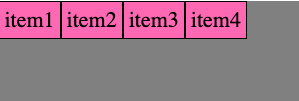
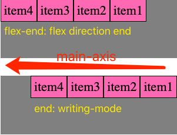
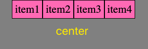
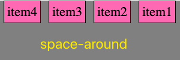
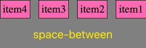
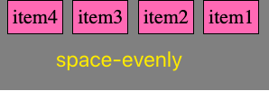
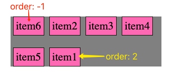
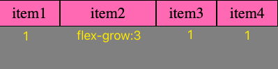
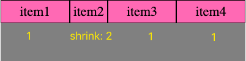

## Flexbox Layout Introduction

### Flexbox includes two parts
*  Flexbox Container 
* Flexbox Item
### I.  flexbox container property
* flex-direction: `row`, `column`, `row-reverse`, `column-reverse`
	reference link: [flex-direction](https://developer.mozilla.org/en-US/docs/Web/CSS/flex-direction)
	
* justify-content: align items on **main axis**
    * **flex-start**: this is the **default**, items are packed toward the start of the flex-direction.
    * **start**: items are packed toward the start of the `writing-mode` direction.
	    
    *  **flex-end**: items are packed toward the end of the flex-direction.
    * **end**: items are packed toward the end of the `writing-mode` direction.
      **!!!Compare flex-end vs. end**
      When we have other flex layout properties, `flex-end` will respect apply on flex items, but `end` will not respect the flex properties.
        ```
        flexbox  {
		    display:  flex;
		    flex-direction:  row-reverse;
		}
        ```
		We have the following difference between `writing mode` or `flex layout direction`:
        
        
   
    * **center**
    
    
     
    * **space-around**: css distribute items evenly. Items have a half-size space on either end.
    
    
    
    * **space-between**: items are evenly distributed in the line; first item is on the start line, last item on the end line.
    
    
     
    * **space-evenly**
	
    
 
 * align-items:  align items on **cross axis**
     - stretch: default
     - flex-start
     - flex-end
     - center
     - baseline
 


### II. Flex Item property
* order: default is 0
* larger order means later position, smaller order means early position. 
For example, we move `item6` to front, and move `item1` to the last:
	```
	.container.order  :nth-child(1){
		order:  2;
	}
	.container.order  :nth-child(6){
		order:  -1;
	}
	```
   

* **align-self**: overrides a grid or flex item's [`align-items`](https://developer.mozilla.org/en-US/docs/Web/CSS/align-items "The CSS align-items property sets the align-self value on all direct children as a group.") value.
* **flex-grow**: let items to take up all remaining spaces !!!
Then how much spaces each item can grow?
    - **default value: 0**, not grow
	- flex-grow = 1:  all items take up equally the remaining spaces
	- 2nd item`flex-grow=3`, other other item `flex-grow=1`. Then spaces are splitted into (1+3+1+1) = 6 units, 2nd item takes up `3 unit`, while other takes up `1 unit`.
		```
		.container.grow  :nth-child(1){
			flex-grow:  1;
		}

		.container.grow  :nth-child(2){
			flex-grow:  3;
		}

		.container.grow  :nth-child(3){
			flex-grow:  1;
		}
		.container.grow  :nth-child(4){
			flex-grow:  1;
		}
		```
		

* **flex-shrink**
   - **default value: 1**: allow item to shrink, if the size of all flex items is larger than the flex container.
   - when 2nd item shrink = 2, make item smaller, but due to the content text inside of the item, it might not shrink as much as you expected!

	 

* **flex-basis**
it sets the base size. In row-direction, it means `width`, in column-direction, it means `height`.
auto

   - **auto**: Default value. The length is equal to the length of the flexible item. If the item has no length specified, the length will be according to its content
   - **number:**  flex-basis:  100px; or percent value 25%
    - **flex:** grow_val, shrink_val, flex-basis_val
	    eg: `flex: 1 1 20%;`
 
How it works?
  1. according to the **flex-basis**value: eg: 100px
  2. **container has remaining space** to grow or shrink
  3. according to the grow/shrink property, **calculate** each item's **adjusted** length.
  4. **add that adjusted value** to the **flex-basis** on each item

