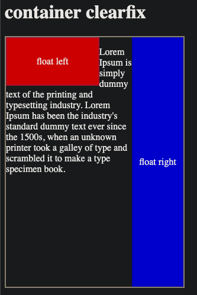

## Float and Clearfix in CSS

#### 1. [what is the float issue?](#p1)  

#### 2. [ float property ](#p2)  

#### 3. [Solution: container clearfix](#p3)

#### 4. [Solution: clear sibling inside container](#p4)
- [clear CSS property](#p4-1)
- [clear: left](#p4-2)
- [clear: right](#p4-3)
- [clear: both](#p4-4)

#### 5. [Source Code](#p5)

<div id="p1" />

### 1. what is the float issue?


HTML structure:
```html
<div class="container">
	<div  class="item1 left">float left</div>
	<div  class="item2 right">float right</div>
	<p>...</p>
</div>
<h1>outside text is affected</h1>
```

Issue about float style:
- Issue1: internal content overflow due to it's large size
- Issue2:  internal text is affected by other floating elements inside the container.
- Issue3: outside text is affected by the floating element, **text blocked and starts in next line.**

<div id="p2" />

### 2. float property

Docs: [float-css](https://developer.mozilla.org/en-US/docs/Web/CSS/float)

#### 2.1 what is float property
 The  **`float`**  CSS property places an element on the left or right side of its container, allowing text and inline elements to wrap around it. 

#### 2.2 taken out of the normal flow (still part of the flow)
The element is removed from the normal flow of the page, though still remaining a part of the flow (in contrast to [absolute positioning](https://developer.mozilla.org/en-US/docs/Web/CSS/position#absolute_positioning)).

#### 2.3 values
- left
- right 
- none 
- inline-start 
- inline-end

<div id="p3" />

### 3. Solution: container clearfix

**Docs:** [clearfix-hack](https://www.w3schools.com/css/css_float_clear.asp)

It makes the larger content element still inside of the container, keeping it managed by container's padding and border.

Add this css to the **container element**:
```html
<div class="container clearfix">
...
</div>
```
```css
.clearfix::after {
	content: "";
	display: block; 
	/* or display: table */
	clear: both;
}
```

**Fixed result:**



<div id="p4" />

### 4. Solution: clear sibling inside container

<div id="p4-1" />

#### 4.1 clear CSS property
Docs: [clear-css](https://developer.mozilla.org/en-US/docs/Web/CSS/clear)

The **`clear`**  CSS property sets whether an element must be moved below (cleared) [floating](https://developer.mozilla.org/en-US/docs/Web/CSS/float) elements that precede it. The `clear` property applies to floating and non-floating elements.

**values:**
- none
- left
- right
- both
- inline-start
- inline-end

<div id="p4-2" />

#### 4.2 clear: left
Text is positioned below the left floating element.


<div id="p4-3" />

#### 4.3 clear: right
Text is positioned below the right floating element.


<div id="p4-4" />

#### 4.4 clear: both
Ensure the text is positioned below the both floating element.


<div id="p5" />

### 5. source code

[github link](https://github.com/jialihan/CSS-onboarding/tree/master/css-float-clear)


