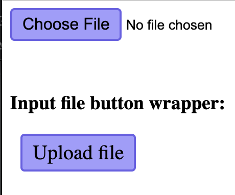
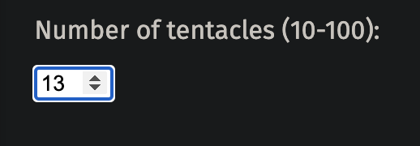
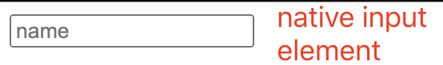
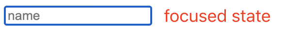
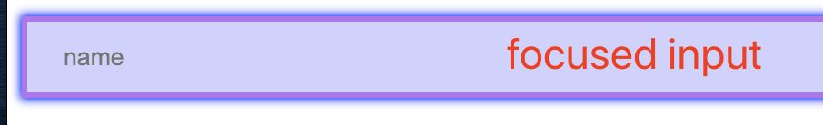

## HTML - Form Elements

#### 1. [radio groups](#question1)

#### 2. [Upload File button](#question2)

#### 3. [Number Input Element](#question3)

#### 4. [Native Text Input Element](#question4)

#### 5. [](#question5)

<div id="question1" />

### 1. radio groups

Docs: [input/radio](https://developer.mozilla.org/en-US/docs/Web/HTML/Element/input/radio)

Syntax:

```html
<input type="radio" id="tea" name="drink" value="tea" checked />
<label for="tea">Tea</label>
<input type="radio" id="coffeee" name="drink" value="coffee" />
<label for="coffee">Coffee</label>
```

**Input Attributes:**

- `type`: "radio"
- each also have a unique [`id`](https://developer.mozilla.org/en-US/docs/Web/API/Element/id "id")
- Only same `name` attribute will be a group, here is `name="drink"`
- `checked`: [docs](https://developer.mozilla.org/en-US/docs/Web/HTML/Element/input/radio#checked) - default selected in the same group
- `value`: [docs](https://developer.mozilla.org/en-US/docs/Web/HTML/Element/input/radio#value) - the **value of the radio when submitting the form**

**Label Attribute:**

- `for` - value is the `id of the input element` bounded to.
- two ways to use the Label - wrap the input element inside
  `html <label>username: <input name="name" id="name" placeholder="Username" /></label> ` - be a sibling of the input element using `for` label.
  `html <label for="name">username:<label> <input name="name" id="name" placeholder="Username" /> `
  **Source code:** [codepen link](https://codepen.io/jellyhan27/pen/zYoXwRa)

<div id="question2" />

### 2. Upload File button

**HTML Code:**

```html
<label for="myfile">Select a file:</label>
<input type="file" id="myfile" name="myfile" />
<label for="myfiles">Select your files:</label>
<input type="file" id="myfiles" name="myfiles" multiple />
```

**How to style the input button?**

use `::file-selector-button` selector: [docs](https://developer.mozilla.org/en-US/docs/Web/CSS/::file-selector-button)

```css
input[type="file"]::file-selector-button {
}
input[type="file"]::file-selector-button:hover {
}
input[type="file"]::-webkit-file-selector-button {
}
input[type="file"]::-webkit-file-upload-button:hover {
}
```



**Source Code:**
[codepen-link](https://codepen.io/jellyhan27/pen/GRrbeJW)

<div id="question3" />

### III. Number Input Element

**Docs:** [`<input type="number">` - mdn](https://developer.mozilla.org/en-US/docs/Web/HTML/Element/input/number)

**Syntax:**

```html
<label for="tentacles">Number of tentacles (10-100):</label>
<input type="number" name="tentacles" min="10" max="100" />
```

**UI result:**



**Additional Attributes:**
| Attribute | Description |
|--|--|
| list | The id of the `<datalist>` element that contains the optional pre-defined autocomplete options |
| **max** | The maximum value to accept for this input |
| **min** | The minimum value to accept for this input |
| placeholder | An example value to display inside the field when it's empty |
| readonly | A Boolean attribute indicating whether the value is read-only |
| **step** | A stepping interval to use when using up and down arrows to adjust the value, as well as for validation|

<div id="question4" />

### IV. Native [Text Input Element](https://www.w3schools.com/css/css_form.asp)

#### 4.1 native text input UI

Regular CSS & UI:



Focused state UI:



#### 4.2 Custom Style on text input

1 ) change size:

```css
input[type="text"] {
  width: 100%;
  padding: 12px 20px;
  margin: 8px 0;
  box-sizing: border-box;
}
```

2 ) change border:

```css
input[type="text"] {
  border: none;
  border-bottom: 2px solid gray;
}
```

3 ) Focused state
By default, some browsers will add a blue outline around the input when it gets focus (clicked on). You can remove this behavior by adding `outline: none;` to the input.

- add background
- add new whole border
- add ["box-shadow"](https://developer.mozilla.org/en-US/docs/Web/CSS/box-shadow) if needed
  `css /* offset-x | offset-y | blur-radius | spread-radius | color */ box-shadow: 0 0 2px 1px blue; `
  **focused input:**

```css
input[type="text"]:focus {
  outline: none;
  background-color: #d1d1ff;
  border: 3px solid #b373f2;
  box-shadow: 0 0 5px 1px blue;
}
```

**UI result when focused:**



<div id="question5" />

### V.
