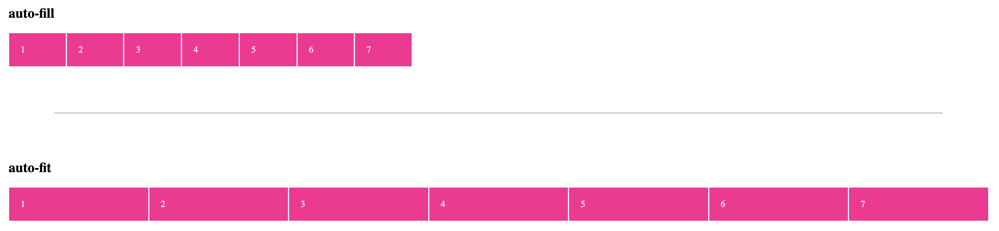

## Deep Understand CSS Grid Layout

I. [Create a Simple Grid](#basic)   
- [1. create a simple grid](#p1-1)
- [2. put child elements in a grid](#p1-2)
- [3. sizing functions: repeat(), minmax()](#p1-3)
- [4. advanced position child elements](#p1-4)
- [5. named lines](#p1-5)
- [6. demo: Holy Grail Layout - Grid](#p1-6)

II. [Advanced Grid Properties](#props)

- [7. shorthand: rows & cols](#p2-7)
- [8. working with "Gaps"](#p2-8)
- [9. named "grid-template-areas" ](#p2-9)
- [10. automatically generated "grid-areas" ](#p2-10)
- [11. fit-content() ](#p2-11)
- [12. Position the Grid ](#p2-12)
- [13. media query in Grid ](#p2-13)
- [14. AutoFlow property](#p2-14)
- [15. explicit & implicit grid ](#p2-15)
- [16. "auto-fill" vs. "auto-fit"](#p2-16)
- [17. dense grid](#p2-17)

III. [Grid vs Flexbox](#grid-flex)

IV. [Summary - Grid](#summary)

- [1. create a  grid](#p4-1)
- [2. define the grid structure](#p4-2)
- [3. placing elements](#p4-3)


<div id="basic" />

### I.Create a Simple Grid

DOCS: [CSS Grid Layout - mdn](https://developer.mozilla.org/en-US/docs/Web/CSS/CSS_Grid_Layout)

<div id="p1-1" />

#### 1. create a simple grid
* turn a container `<div>` to a grid
	```html
	<div class="container"></div>
	```
	```css
	.container{
		display: grid;
	}
	```
* Define columns: 
Use property: [grid-template-columns](https://developer.mozilla.org/en-US/docs/Web/CSS/grid-template-columns)
	For example: define 4 columns with different width
	```css
	grid-template-columns: 200px 2fr 20% 1fr;
	```
	A special fraction unit: `fr`
	`fr` specifying the track’s flex factor. Each `<flex>`-sized track takes a share of the remaining space in proportion to its flex factor.
* Define rows: [grid-template-rows](https://developer.mozilla.org/en-US/docs/Web/CSS/grid-template-rows)
	For example: define 2 rows
	```css
	grid-template-rows: 5rem  2.5rem;
	```
* Tip: use "**auto**" to fill empty spaces

<div id="p1-2" />

#### 2. Put Child Elements in a Grid

Properties:
 - [grid-column-start](https://developer.mozilla.org/en-US/docs/Web/CSS/grid-column-start)
 - [grid-column-end](https://developer.mozilla.org/en-US/docs/Web/CSS/grid-column-end)
 - [grid-row-start](https://developer.mozilla.org/en-US/docs/Web/CSS/grid-row-start)
 - [grid-row-end](https://developer.mozilla.org/en-US/docs/Web/CSS/grid-row-end)

Grid line indexes:
|  |  | |
|--|--|--|
|  |   element 1| element 1 |
| element 2 |  | element 3|
In the above example grid, for element 1: 
- grid-column-start: 2
- grid-column-end: 3
- grid-row-start: 1
- grid-row-end: 2

 <div id="p1-3" />
 
#### 3. sizing functions: repeat(), minmax()

**Problem 1**: when we want to define equal size but multiple cells in a grid.

**Old code:**
```css
grid-template-columns: 25%  25%  25%  25%;
```
**New code:** with "[repeat](https://developer.mozilla.org/en-US/docs/Web/CSS/repeat%28%29)" css function
```css
grid-template-columns: repeat(4, 25%);
```

**Problem 2**: when we want the second row with min and max height if there is enough or limited spaces constrained by "height".

**Old code:**
```css
.container {
	grid-template-rows: 5rem auto;
}
```
**New code:** with [minmax](https://developer.mozilla.org/en-US/docs/Web/CSS/minmax%28%29): ensure a certain cell with min-height or max-height
```css
.container {
	height: 500px;
	grid-template-rows: 5rem minmax(10px, auto) 100px;
}
```
<div id="p1-4" />

#### 4. advanced position child elements
* **span** keyword 
	```css
	/* span two columns */
	grid-column-end: span 2;
	```
	If you want to take the **whole row** :
	```css
	grid-column-start: 1;
	grid-column-end: -1; // from the right
	```
* elements can **overlap**, and DOM order decides who's on the top. Multiple elements can take the same place on the gird.

<div id="p1-5" />

#### 5. work with Named Lines
docs: [Layout_using_Named_Grid_Lines](https://developer.mozilla.org/en-US/docs/Web/CSS/CSS_Grid_Layout/Layout_using_Named_Grid_Lines)

**Syntax:**
 `[your name] length [your name] length [your name]`
```css
grid-template-rows: [row-1-start] 5rem [row-1-end row-2-start] minmax(10px, auto) [row-2-end row-3-start] 100px [row-3-end];
```
**Usage:**
```css
grid-row-start: row-2-start;
```

<div id="p1-6" />

#### 6. demo - CSS Grid: Holy Grail Layout

**UI result:**


**Source code**:  [CSS-holy-grail-layout](https://github.com/jialihan/CSS-onboarding/tree/master/CSS-Grid/grid-col-row)

<div id="props" />

### II. Advanced Grid Properties

<div id="p2-7" />

#### 7. shorthand: rows & cols

1 ) combine `-start` and `-end` property into one property.
Syntax:
```
grid-row:  start-line / end-line;
grid-column:  start-line / end-line;
```

2 ) `grid-area` property: [docs](https://developer.mozilla.org/en-US/docs/Web/CSS/grid-area)

Syntax:
```
grid-area: row-start / col-start / row-end / col-end;
```
For example:
```css
grid-area: row-1-start / 2 / row-2-end / span 3;
```

<div id="p2-8" />

#### 8. working with "Gaps"
Gaps: gutters between rows and columns
* [grid-column-gap](https://developer.mozilla.org/en-US/docs/Web/CSS/column-gap)
	```css
	grid-column-gap: 20px;
	```
* [grid-row-gap](https://developer.mozilla.org/en-US/docs/Web/CSS/row-gap)
	```css
	grid-row-gap: 10px;
	```
* shorthand to combine gaps in row and column:
	```
	/* grid-gap: row-gap | col-gap; */
	grid-gap: 10px 20px;
	
	/* one value for both */
	grid-gap: 10px;
	```

<div id="p2-9" />

#### 9. Named Template Areas
Property: [grid-template-areas](https://developer.mozilla.org/en-US/docs/Web/CSS/grid-template-areas)
Syntax:
```css
grid-template-areas: "a a a" 
					 "b c c" 
					 "b c c";
```

**Source Code example**: [grid-area-css-example](https://github.com/jialihan/CSS-onboarding/tree/master/CSS-Grid/grid-area)

<div id="p2-10" />

#### 10. automatically generated Grid Areas
**Problem 1**: we want to use `repeat()` but still want to add a line name, how can we do it?

**Code**: 
- define line name in `repeat()`
	```css
	.container {
		grid-template-columns: 
			repeat(3, [col-start]  10rem  [col-end]);
	}
	```
- define specific **index** occurrences in child element
	```css
	.child {
		grid-column: col-start 2 / col-end 2;
	}
	```

**Problem 2:** we want to automatically create a area in a different way.
**Code:**
- ~~Old way:  `grid-template-areas`~~
- New way: use our own customized tags: **[name-start], [name-end]** in rows and columns, then finally just use the "name" as our area in child element.
	- **Container side**: add `[hd-start], [hd-end]` tags in row and col.
		```css
		grid-template-columns: [hd-start] repeat(4, [col-start]  25%  [col-end]) [hd-end];
		grid-template-rows: [hd-start] 4.5rem [hd-end] auto  4.5rem;
		```
	- **Child element**: use this area name
		```css
		.child {
			grid-area: hd;
		}
	```
	
<div id="p2-11" />

#### 11. "fit-content()" function
Docs: [fit-content](https://developer.mozilla.org/en-US/docs/Web/CSS/fit-content), it takes a param as default length, In practice this means that the box will use the available space, but never more than [`max-content`](https://developer.mozilla.org/en-US/docs/Web/CSS/max-content "The max-content sizing keyword represents the intrinsic maximum width of the content. For text content this means that the content will not wrap at all even if it causes overflows.").

**Syntax:**  

fit-content(stretch)

**Code Example:**

```css
grid-template-rows: 3.5rem  auto  fit-content(8rem);
```

<div id="p2-12" />

#### 12. Position the Grid
##### 12.1 Position the child Element inside the Grid

- [justify-items](https://developer.mozilla.org/en-US/docs/Web/CSS/justify-items): horizontal
- [align-items](https://developer.mozilla.org/en-US/docs/Web/CSS/align-items): vertical

##### 12.2 Position the entire Grid Content
If positioning the content if there is specific height & width, we can use another property:
- justify-content: X-axis, along rows
- [align-content](https://developer.mozilla.org/en-US/docs/Web/CSS/align-content): Y-axis, along the columns 

##### 12.3 position elements individually
in that child element selector, use `justify-self` and `align-self`property:
- [justify-self](https://developer.mozilla.org/en-US/docs/Web/CSS/justify-self): X-axis
- [align-self:](https://developer.mozilla.org/en-US/docs/Web/CSS/align-self) Y-axis

Code Examples:
```css
.child {
	align-self: center;
	justify-self: cneter
}
```

<div id="p2-13" />

#### 13. media query in Grid
Override and create a new `grid-template-areas`, by using the same Named-area for each area.
For example:
```css
.container {
	grid-template-areas: 
		"a a a a"
		"b b c c"
		"d d d d";
}

@media (max-width: 40rem) {
.container {
/* also increase a row in code */
	grid-template-areas: 
		"a a a a"
		"b b b b"
		"c c c c"
		"d d d d";
}
```

<div id="p2-14" />

#### 14. "AutoFlow" property
For some future generated by javascript or later added rows and columns, we can set their grid styles:

- [grid-auto-rows](https://developer.mozilla.org/en-US/docs/Web/CSS/grid-auto-rows): 
	- ensure each row equally height
	- or we can have a `minmax(8rem, auto)` this is not equal size
- [grid-auto-flow](https://developer.mozilla.org/en-US/docs/Web/CSS/grid-auto-flow): where new element should be added
	- row
	- column
	- row dense: might be out of order
- [grid-auto-columns](https://developer.mozilla.org/en-US/docs/Web/CSS/grid-auto-columns)
	specifies the size of an implicitly-created grid column [track](https://developer.mozilla.org/en-US/docs/Glossary/grid_tracks) or pattern of tracks.

<div id="p2-15" />

#### 15. explicit grid & implicit grid
- we manually already defined: **explicit grid**
- there might be extra and more contents coming in, those will be automatically added, which are **implicit grid.** we need to use `grid-auto-flow, grid-auto-rows, grid-auto-columns` to style them.	


<div id="p2-16" />

#### 16. "auto-fill" & "auto-fit"
Docs:  [Auto-Sizing Columns in CSS Grid](https://css-tricks.com/auto-sizing-columns-css-grid-auto-fill-vs-auto-fit/)
- auto-fill: place as much as possible column on one row, if it exceeds the max width, it will wrap on a new row.
	```css
	repeat(auto-fill, minmax(100px, 1fr));
	```
- auto-fit: behaves the same as `auto-fill`, except that after placing the grid items any empty repeated **tracks are collapsed**, then the **content will expand**. Use this if we have less content in one row. 
	```css
	repeat(auto-fit, minmax(100px, 1fr));
	```

Comparison:



<div id="p2-17" />

#### 17. create a Dense Grid

[dense](https://developer.mozilla.org/en-US/docs/Web/CSS/grid-auto-flow)

"dense" packing algorithm attempts to fill in holes earlier in the grid, if smaller items come up later. This may cause items to appear out-of-order, when doing so would fill in holes left by larger items.

Code example: [source-code](https://github.com/jialihan/CSS-onboarding/tree/master/CSS-Grid/dense-grid)
```css
grid-auto-flow: column dense; 
/* or 'row', 'row dense', 'column' */
```

UI results:


<div id="grid-flex" />

### III. Flex Item properties

|CSS Grid| CSS Flexbox |
|--|--|
|  Two-dimensional Positioning| One-dimentional Positioning |
| rows & columns| flex-direction: row or column|

<div id="summary" />

### IV. Summary - Grid

<div id="p4-1" />

#### 1. create a grid
- display: grid
- set default flow: `grid-auto-flow` or `grid-auto-rows` or `grid-auto-columns`
- use `grip-gap`

<div id="p4-2" />

#### 2. define the grid structure
- define rows & cols: `grid-template-rows` or `grid-template-columns`
- use `repeat()`
- use `auto-fill` or `auto-fit`  to get number of rows/columns automatically
- use `minmax()` on dynamic sizes

<div id="p4-3" />

#### 3.  placing the elements

- position elements in grid: `grid-row` or `grid-column`
- use `span x` over multi-rows/cols
- use line numbers as indexs (**based on 1** as 1st line)


