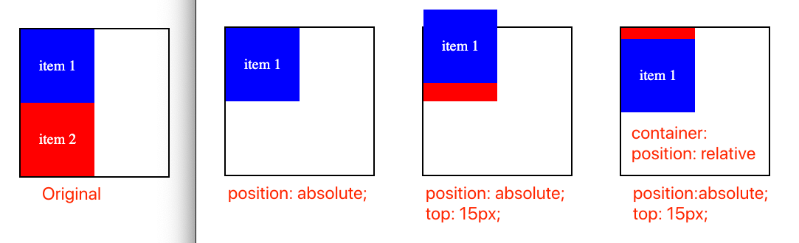
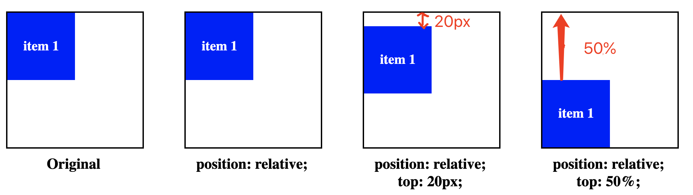

## Deep Understand CSS Position
 
I. [static](#static)  

II. [Change Positions](#change)  

III. [absolute](#absolute)  

IV. [relative](#relative)  

V. [sticky](#sticky)
 

<div id="static" />  

### I. display: static;
- The element is positioned according to the **normal flow** of the DOM.
- The **default** property value applies to be the "static"
- respect and include the block-level and inline-level position

For example: nothing happens
```css
.item {
	display: static;
}
```


<div id="change" />  

### II. Change Positions

- document flow
	- top
	- left
	- bottom
	- right
- positioning context
	- viewport
	- body
	- html
	- ...

<div id="fix" />  

### II. display: fix;

- positioning context is always the **viewport**
- remove it from normal Document flow, so it won't take any space in normal document
- it always stays in the same place even if the page is scrolled.

For example:
```css
.header {
  position: fixed;
  top: 0;
}
```

**Source Code** : [github link](https://github.com/jialihan/CSS-onboarding/tree/master/Position/fixed)

<div id="absolute" />  

### III. display: absolute;
- remove it from normal Document work flow
- it moves up to a higher level than the normal work flow 
- place it with position values: `top, left, right, bottom`
- Decide positioning context:
	- the closest ancestor element with "**position**" value
	- otherwise, it refers to the  "**viewport**"

Use Cases:
#### 1. only with  `position: absolute;`
it will be removed from normal document flow, then the following content will move up to fill its original spaces.
```css
.item {
	position: absolute;
}
```
#### 2. position context is **viewport**

When we add some direction changes, we will see the impact of the positioning context. If parent elements don't have a `position` property, the default positioning context will be the **viewport**.
```css
.item {
	position: absolute;
	top: 15px;
}
```

#### 3. position context is parent element 
When its parent element has a `position` property, it will be the new position context for that child element rather than viewport.
```css
.container {
	position: relative;
}
.item {
	position: absolute;
	top: 15px;
}
```

**UI Result:**



**Source Code**: [github link](https://github.com/jialihan/CSS-onboarding/tree/master/Position/absolute)


<div id="relative" />  

### IV. display: relative;

- still in normal current Document work flow, not removed up
- it means: **relative to itself**
- positioning context is its **own original position** in DOM

**Use Cases**
#### 1. Only with  `position: relative;`

**Nothing changed** ! It's still the same with original Document position. It has no effect on anything !
```css
.item {
	display: relative;
}
```

#### 2. `position: relative;` with **percentage** value
When the value is provided as a **percentage**, it is **relative to the height of the containing block**.
For example: 
A parent container element has height "200px", then the child item with `top: 50%;` means:  200 * 50% = 100px.
```css
.container {
	height: 200px;
}
.item {
	display: relative;
	top: 50%; 
}
```

#### 3. `position: relative;` with number value
It will move the length due to its **original position** to `left, right, bottom, top`.
For example:
`.item` element will move down 20px on y-axis than it's original position.
```css
.item {
	display: relative;
	top: 20px; 
}
```

**UI Result:**



**Source Code**: [github link](https://github.com/jialihan/CSS-onboarding/tree/master/Position/relative)

<div id="sticky" />  

### IV. display: sticky;

- it toggles between `relative` and `fixed` behavior
- depending on the scroll position
- Once it is scrolled to **a given offset position in the viewport** , then it "sticks" in place (like position:fixed).

For example:
```css
.header {
	position: sticky;
	top: 0;
}
```

**Source Code**: [github link](https://github.com/jialihan/CSS-onboarding/tree/master/Position/sticky)

