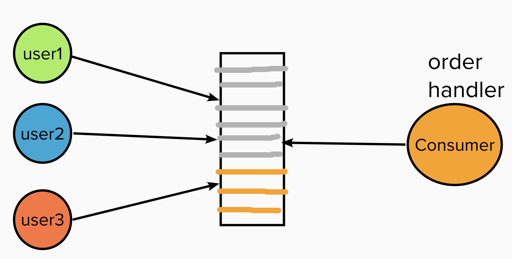

## Web Network Protocol Comparison

#### I. [Five layer Model in network (OSI model)](#question-1)

#### II. [How does TLS works?](#question-2)

#### III. [network performance: http1.0 vs http2](#question-3)

#### IV. [network choices for Loading new Feeds](#question-4)

- [Long Polling](#q4-1)
- [Web Socket](#q4-2)
- [SSE](#q4-3)

#### V. [How CDN helps performance?](#question-5)

### VI. [What is the Reverse Proxy?](#question-6)

#### VII. [What is Message Queue](#question-7)

#### VIII. [What is REST?](#question-8)

#### IX. [Streaming Protocols](#question-9)

### I. Five layer Model in network (OSI model)

- Application Layer: HTTP
- Transport Layer: SSL(secure socket layer)/TSL，TCP, UDP
- Network Layer: break the `Packet` data into network fragments
- Data-Link Layer: `Frame` data
- [Physical Layer](https://www.simplilearn.com/tutorials/cyber-security-tutorial/physical-layer-in-the-osi-model): raw `Bit` data

which layer APR protocal working on?
`Address Resolution Protocol (ARP)` is a layer 2(data link layer) protocol for **mapping an Internet Protocol address (IP address) to a physical machine address (Mac address)** that is recognized in the local network.

The Address Resolution Protocol is a layer 2 protocol used to map MAC addresses to IP addresses. All hosts on a network are located by their IP address, but `NICs`(eg: ethernet adapter, **Network interface controller**,，网络适配器，网卡，或局域网接收器) do not have IP addresses, they have MAC addresses. ARP is the protocol used to associate the IP address to a MAC address.

When a host wants to send a packet to another host, say IP address 10.5.5.1, on its local area network (`LAN`), it first sends out (broadcasts) an ARP packet. The ARP packet contains a simple question: What is the MAC address corresponding to IP address 10.5.5.1? The host that has been configured to use the IP address responds with an ARP packet containing its MAC address.

### II. how TLS works?

Transport layer security, while SSL is the old technology.

#### 2.1 TSL tasks

- authentication
- data encryption
- data integrity

#### 2.2 how does TLS work?

Refer to youtube: https://www.youtube.com/watch?v=THxIyHz191A

TLS session has 2 phase:

- Handshake phase: for authentication
  - how to obtain the certificate? - Authority(CA) give to server/domain, and the cert is `digitally signed` with its own `private key`.
  - Server sends ---> Cert & public key ---> client
- Encrpytion phase：
  - Client verify the Cert is valid, use public key to encrpyt the secrete string.
  - Server receive the encrpyted string, use its own private key to decode.
  - Both client & server use: `screte string + other_info --> master key --> session KEY`

#### 2.3 how fast is TLS performance? encrpty & decrpty

TLS Auth phase: `public-private` key use ASymmetric algorithm, slow.
TLS Encrpytion: `secrete key` use Symmetric algorithm, fast.

#### 2.4 over TCP + TLS1.3

it saves the handshake phase time to re-use for TCP handshake:

- handshake time
- send data time

#### 2.5 how to implement TLS on a website?

- obtain a security certificate from CA(cert authority)
- config the cert on your server
- update website's URL to "http + s"
- tes tthe website
- automate crtificate renewal (it has expires date)

### III. Network Performance: http1.0 vs http2

HTTP1 Disadvantages:

- HTTP/1.1 practically allows only one outstanding request per TCP connection
  even though browser implements multiple parallel TCP connections to every domain.
- **Duplication of data across requests (cookies and other headers).**
  Too many requests means too much redundant data, which would impact performance.

**HTTP2 Advantages:**
reference article: [link](https://imagekit.io/blog/http2-vs-http1-performance/)

- **Multiplexed, instead of ordered**
  Allows using same TCP connection for multiple parallel requests. **Eg: images, js files starts to download in parallel, very quick.**
- \***\*Header compression using HPACK\*\***
  Compressed headers, reduced data redundancy
- \***\*Server Push\*\***
  Instead of waiting for the client to request for assets like JS and CSS, the server can “push” the resources it believes would be required by the client. Avoids the round trip.

### IV. network choices for Loading new Feeds

- traditional Polling: with time interval
- Long Polling
- WebSockets
- SSE: Server Send Event

#### 4.1 Long polling

This is a variation of the traditional polling technique that allows the server to push information to a client whenever the data is available.

- 1 ) The client makes an initial request using regular HTTP and then waits for a response.
- 2 ) The server delays its response until an update is available or a timeout has occurred.
- 3 ) When an update is available, the server sends a full response to the client.
- 4 ) The client typically sends a new long-poll request, either immediately upon receiving a response or after a pause to allow an acceptable latency period.
- 5 ) Each Long-Poll request has a timeout. The client has to reconnect periodically after the connection is closed due to timeouts.

**Advantages:**

- With long polling, the client may be configured to allow for a longer timeout period (via a Keep-Alive header) when listening for a response.
- a longer persisted connection on server side
- wait data response or **timeout**([304 Not Modified](https://developer.mozilla.org/en-US/docs/Web/HTTP/Status/304))

**Flow chart:**

#### 4.2 Websocket

- 1 ) provides [Full duplex](<https://en.wikipedia.org/wiki/Duplex_(telecommunications)#Full_duplex>) communication channels over a single TCP connection.
- 2 ) It provides a persistent connection between a client and a server that both parties can use to start sending data at any time.

#### 4.3 Server Send Event

- 1 ) Client requests data from a server using regular HTTP.
- 2 ) The requested webpage opens a connection to the server.
- 3 ) The server sends the data to the client whenever there’s new information available.

**Advantage:**
SSEs are best when we need **real-time traffic** from the server to the client or if the server is generating data in a loop and will be sending multiple events to the client.

**Disadvantage:**
BUT: If the **~~client wants to send data to the server,~~** it would require the use of **another technology/protocol** to do so.

### V. How CDN helps performance?

- CDN has a quick time to fetch static resources
- cache `images, css, js` files on CDN is a great improvement on performance on front end

### VI. What is the Reverse Proxy?

What is proxy?

- Selectively Block / Send request between client & server
- log / monitor requests
- cache responses

1 ) Reverse Proxy: from client to server - Ngnix - Apache - ...
2 ) Forward Proxy: from server to client

### VII. What is Message Queue?

#### 7.1 Definition

**Asynchronous** **service-to-service communication** used in serverless and microservices architectures.

A message queue provides an **asynchronous communications protocol,** which is a system that puts a message onto a message queue and does not require an immediate response to continuing processing.

- Producer - server node
- Consumer - server node

#### 7.2 How MQ works?

Rules:

- Each message is processed only once, by a single consumer
- Queues also have **fault tolerance,** they can **retry** the requests.

Use case:

- email
- food order
  

#### 7.3 Advantages

- Decouple
- Scaling

A decoupled system is achieved when two or more systems are able to communicate without being connected. The systems can remain completely autonomous and unaware of other functions.

#### 7.4 Examples of MQ

- Apache Kafka
- RabbitMQ
- .....

### 8. What is REST?

[A REST API](https://www.redhat.com/en/topics/api/what-is-a-rest-api) (also known as RESTful API) is an application programming interface (API or web API) that conforms to the constraints of REST architectural style and allows for interaction between servers and clients.
REST stands for `representational state transfer`.

REST is a set of architectural constraints, not a protocol or a standard. API developers can implement REST in a variety of ways.

In order for an API to be considered RESTful, it has to conform to these criteria:

- A `client-server architecture` made up of clients, servers, and resources, with requests managed through HTTP.
- **Stateless client-server communication**, meaning no client information is stored between get requests and each request is separate and unconnected.
- Cacheable data that streamlines client-server interactions.

** Making Requests**
REST requires that a client make a request to the server in order to retrieve or modify data on the server. A request generally consists of:

- an HTTP verb, which defines what kind of operation to perform
- a header, which allows the client to pass along information about the request
- a path to a resource
- an optional message body containing data

**HTTP Verbs**
There are 4 basic HTTP verbs we use in requests to interact with resources in a REST system:

- GET — retrieve a specific resource (by id) or a collection of resources
- POST — create a new resource
- PUT — update a specific resource (by id)
- DELETE — remove a specific resource by id

### 9. Streaming Protocols

#### 9.1 HTTP Live Streaming (HLS)

- built on TCP (http)
- The Segmentation Principle: HLS breaks video streams **into smaller chunks (segments)** usually a few seconds long.
- Manifest Files: HLS uses manifest files (e.g., .m3u8) to list available segments and their corresponding bitrates.
- Client-Side Logic: The video player on the client device is responsible for **downloading segments**, selecting appropriate bitrates, and ensuring smooth playback.

#### 9.2 RTSP (built on RTP - real-time-protocol)

RTSP leverages TCP to maintain an end-to-end and stable connection without requiring local download or caching.

However, the protocol **does NOT support content encryption or retransmission of lost media packets** and **cannot stream directly to a browser over HTTP**. This is because RTSP is connected to a dedicated server for streaming and relies on RTP to transmit real media.
