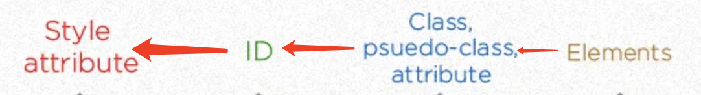

## Understand CSS Specificity 

### O.Preface

**What is Specificity?**

**Specificity** is the means by which **browsers decide which CSS property values are the most relevant to an element** and, therefore, **will be applied**. Specificity is based on the matching rules which are composed of different sorts of [CSS selectors](https://developer.mozilla.org/en-US/docs/Web/CSS/Reference#selectors).

**Docs:** [Specifics on CSS Specificity](https://css-tricks.com/specifics-on-css-specificity/)

**Online Specificity Calculator**: [test your css-selector here](https://polypane.app/css-specificity-calculator/#selector=)

### 1. type of css selectors
* universal selector: **(no specificity)**
	```css
	* {
		box-sizing: border-box;
	}
	```
* Element/ type selector:
	For example:
	```css
	h1 {}
	head {}
	section {}
	p{}
	body{}
	```
* Classes Selector: use **". className"** syntax
	 ```css
	 .className {
	 }
	 ``` 
* Attribute Selector: use **[attr_name]** syntax
	```css
	[disable]{
	}
	[id="yourID"] {
	}
	[name="targetName"] {
	}
	```
* ID selector: use **#** syntax
	```css
	#yourID {
	}
	```

### 2. Selector selector Order: from high to low

How to calculate specificity? [link](https://www.w3.org/TR/selectors/#specificity)
- count the number of ID selectors in the selector (= A)
- count the number of class selectors, attributes selectors, and pseudo-classes in the selector (= B)
- count the number of type selectors and pseudo-elements in the selector (= C)
- **ignore the universal selector**

<font size="5"> Inline-style >>
   ID selector >>
    .classes/:pseudo-class/[attribute] >>
    Tag or ::pseudo-element selector
 </font>
 
 
 ### 3. Examples
 * highest 
	 ```
	 <h1 style="background: red;"></h1>
	 ```
 * Medium
	 ```
	<h1 id="myh1"><h1>
	#myh1 {
	}
	```
* Lower
```
	<h1 id="myh1" class="headline1"></h1>
	.headline1 {
	} 
	// same with 
	[id="myh1"] {
	}
```
 * Smallest
    ```
    h1 {
    }
    ```

 ### 4. Reference
[CSS/Specificity](https://developer.mozilla.org/en-US/docs/Web/CSS/Specificity)

[Calculate Specificity](https://polypane.app/css-specificity-calculator/#selector=%5Bid%3D%22test%22%5D)