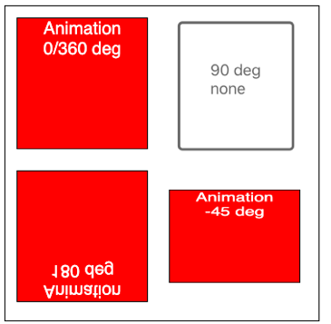
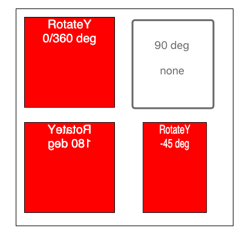
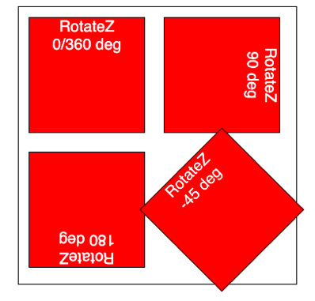

## Deep Understanding Transform in CSS

### 2. Rotate in 3d
#### 2.1 understand the axis in 3 directions


**Explanation**:
* rotateX(): element move forward or go away from you
* rotateY(): element spins around y-axis
* rotateZ(): element spins around z-axis

**Degrees**: 
* positive deg: clock-wise
* negative deg: anti-clock-wise

#### 2.2 Visual Example of 3 directions
We rotate the box element at: **0 deg, 90 deg, 180 deg, -45 deg**.
* rotateX



* rotateY



* rotateZ



### 3. understand the "perspective"

3.1 perspective function:
  each element where you apply it has its own perspective, for example:
  ```
  transform:perspective(1000px)  rotateX(30deg)  rotateY(80deg);
  ```

3.2 perspective property:
  perspective property actually has to **be applied to the parent element**, the advantage then is that **you get the same perspective on all child elements**.
  
3.3 value: smaller means closer to the element, larger means far from the element
For example: **perspective(100px)** vs. **perspective(1000px)**


3.4 perspective-origin
it van be a `value or left, right, bottom, top` , represents the **angle** you look at it. Reference at: [CSS/perspective-origin](https://developer.mozilla.org/en-US/docs/Web/CSS/perspective-origin).
For example: when perspective = 100px, we look at different angles at center, top, right, bottom, left, 0px, 100px and 500px.


### 4. rotate container and "transform-style"
Reference: [CSS/transform-style](https://developer.mozilla.org/en-US/docs/Web/CSS/transform-style)
* `flat`: default

 When container rotate, for example at 90deg, it disappear all including its children.
* `preserve-3d`
 children of the element should be positioned in the 3D-space, still can be seen.
 ### 5. backface-visibility
 Default is showing, if you want to hide it, you can set it to "hidden";
 Reference: [CSS/backface-visibility](https://developer.mozilla.org/en-US/docs/Web/CSS/backface-visibility)
*  `visible`
* `hidden`

### 6. Helpful links:

-   CSS Transforms: [https://developer.mozilla.org/en-US/docs/Web/CSS/CSS_Transforms/Using_CSS_transforms](https://developer.mozilla.org/en-US/docs/Web/CSS/CSS_Transforms/Using_CSS_transforms)
-   3D Transforms: [https://desandro.github.io/3dtransforms/](https://desandro.github.io/3dtransforms/)


 


