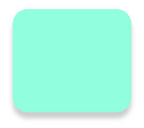

## How to round imageView with shadow? - swift tip
### Feature
Today i received a small feature to make the image looks like:
* border-radius: 25px;
And shadow requirements:
* shadow-opacity: 20%
* shadow-color: #000; // balck
* shadow-offset: {offsetX, offsetY} => { 0, 10px}
* blur: 4px;

Pretty easy? right?
After translate into swift: 
```
// set radius
imgView.layer.cornerRadius = 10
imgView.clipsToBounds = true

// set shadow
imgView.layer.shadowColor = UIColor.black.cgColor
imgView.layer.shadowOpacity = 0.2
imgView.layer.shadowOffset = CGSize(width: 0, height: 10)
imgView.layer.shadowRadius = 4
imgView.layer.masksToBounds = false
```
<font size="6">If it didn't work as expected, please refer this article.</font>

Blog: [use additional container layer to wrap imageView](https://medium.com/bytes-of-bits/swift-tips-adding-rounded-corners-and-shadows-to-a-uiview-691f67b83e4a)

=====================================================================================================

<font size="6">Magic is when i try it again on another laptop, it work! :joy:</font>



I don't know why when i was working it cannot, but when i did my personal project with another xcode, it works. I will list my environment and settings here, still don't know the reason why it sometimes works for me. Also I list my workable version in github, if you guys want to refer.

**Env:**

* **Xcode:**  Version 11.5 (11E608c)

**View source code on github:**   [github link](https://github.com/jialihan/UIImageView-Radius-Shadow/blob/master/README.md)


   