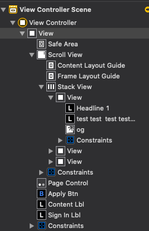

## Build ScrollView with AutoLayout - Swift
### Problem
We try to add multiple subviews with similar layout and use the same customized UIView class as subviews, so we want to keep the auto layout for each uiview as subview in scrollView. Let's declare our subviews first.
```
// already created customized UIView class with layout
let view1 = MyUIView()  
let view2 = MyUIView()  
let view3 = MyUIView()  
}
```
Then we can configure our scrollView, then add all those subviews into our scrollView. Also
set the contraints for our scrollView to bound to the main screen.
```
override func viewDidLoad() {

    view.addSubview(scrollView)
    scrollView.addSubview(view1)
    scrollView.addSubview(view2)
    scrollView.addSubview(view3)
```
If we only did this, when we run our project, we will see that each subview is messede up losing it's original layout in our customized UIViw class. Each subview's original layout is ineffective and lose it's power to show in our scroll view, like the following picture.


## Solution 1: programmatically
We need to add constraints for each subview after we added them to our scroll view. Let's first look at the following picture, then we add our code step by step to configure the layout constriants for every subview.


##### code implementation:
```
// first
first.topAnchor.constraint(equalTo: self.scrollView.topAnchor, constant: 0).isActive = true
first.leadingAnchor.constraint(equalTo: self.scrollView.leadingAnchor, constant: 0).isActive = true
first.bottomAnchor.constraint(equalTo:self.scrollView.bottomAnchor, constant: 0).isActive = true

// second
second.topAnchor.constraint(equalTo: self.scrollView.topAnchor, constant: 0).isActive = true
second.leadingAnchor.constraint(equalTo: first.trailingAnchor, constant: 0).isActive = true
second.bottomAnchor.constraint(equalTo:self.scrollView.bottomAnchor, constant: 0).isActive = true

// last
last.topAnchor.constraint(equalTo: self.scrollView.topAnchor, constant: 0).isActive = true
last.leadingAnchor.constraint(equalTo: second.trailingAnchor, constant: 0).isActive = true
last.bottomAnchor.constraint(equalTo:self.scrollView.bottomAnchor, constant: 0).isActive = true
last.trailingAnchor.constraint(equalTo: self.scrollView.trailingAnchor, constant: 0).isActive = true
```
To optimize our connecting each slide contraints method, we can have a for loop to process multiple(when subview count > 3) in a cleaner code style.
* step1: create var pre = scrollView
* step2: for each subview(`pseudo code`):
    ```
    var cur = subview
    connect cur.leadingAnchor to pre.leadingAnchor
    connect cur.topAnchor to scrollView.topAnchor
    connect cur.bottomAnchor to scrollView.bottomAnchor
    if(index == last subview) {
        connect cur. trailingAnchor to scrollView.trailingAnchor
    }
    pre = cur
    ```
Then after adding the contraints, the final correct layout is the following picture:


## Solution 2: Storyboard, easy to use manually


#### Add ScrollView to StoryBoard
set 4 anchor constraints to scrollView related to our main view
Here use whole screen as example, you can adjust distance on your own.
```
scrollView.top = self.view.top
scrollView.leading = self.view.leading
scrollView.trailing = self.view.trailing
scrollView.bottom = self.view.bottom
```
#### Add StackView inside ScrollView
1. pay attention to the layer: `stack view is inside scroll view`
2. set stack view 4 anchor to scrollview: take `100% whole `of scroll view's `contentLayout Guide`. here is the content layout because we have multiple stack view to expand to taken the content layout space.
    ```
    stackView.top = contentLayout.top
    stackView.leading = contentLayout.leading
    stackView.trailing = contentLayout.trailing
    stackView.bottom = contentLayout.bottom
    ```
3. Important!!!!!!
   if you want to set height/width because we usually want to use `vertical or horizontal` scrollview. Then we could to `bound`  stack view's `width/height constraints` equal to scrow view's `Frame Layout`.
    ```
    // horizontal scrollview: height is the same
    stackView.height = frame layout.height
    // vertical scrollview: width is the same
    stackView.width = frame layout.width
    ```
    
4. Add subview inside the stackview
4.1) add multiple `UIView inside the  Stack view`.
4.2) for each page/slide view, we can set its own layout. cool?! really.
    here element's constraints only need to set with this uiview is enought. upper layer won't be affected.
For example: add button, label to subview(UIView in stack view)
    ```
    // use subview to represent the UIView: more clear
    button.top = subview.top + 100
    label.leading = subview.leading + 20
    ...
    ```
  #### Add Page Control
  page control is the same level of scroll view, it's a element in our root view. Page control's contraints should also set to our root view.
  
  1. you can create a reference outlet for page control:
      ```
        `@IBOutlet weak var pageControl: UIPageControl!
      ```
  2. sometimes we might need to bring page control to top level in our root view.
      ```
      view.bringSubviewToFront(pageControl)
      ```
#### Final folder structure in Storyboard 



## Source code  Reference
To learn more about the whole project source code, please refer the git repo here: [GitHub Link](https://github.com/jialihan/ScrollView-IOS)