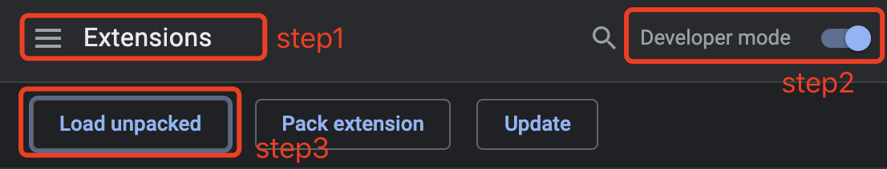
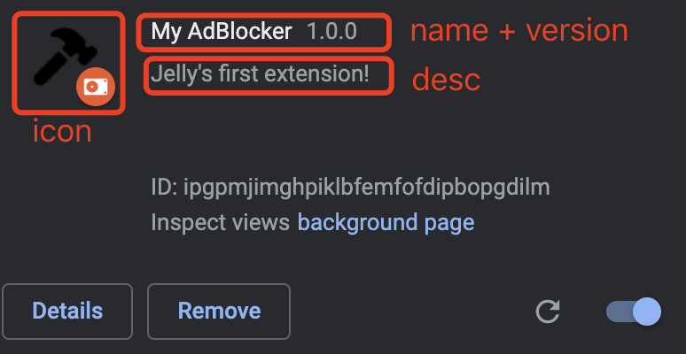
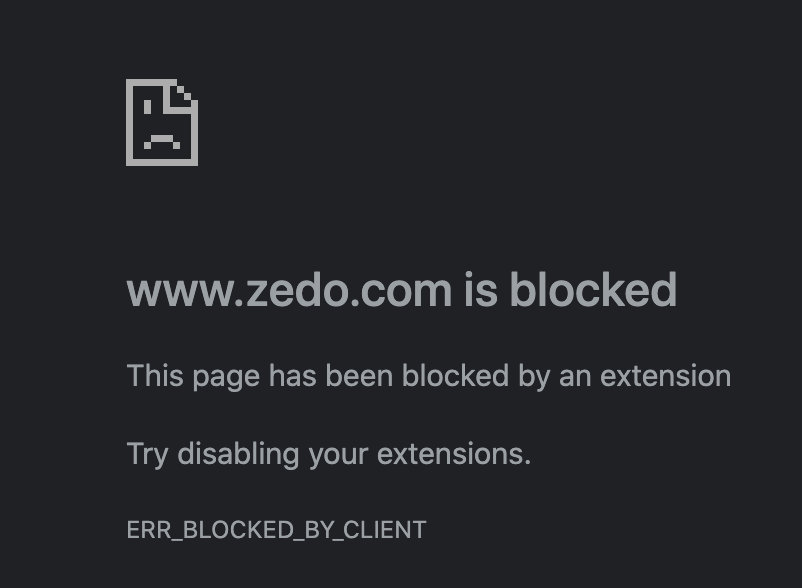

## How to create an Adblocker Chrome Extension?

#### I. [Create a manifest file](#question1)

- [1.1 manifest file Syntax ](#q1-1)
- [1.2 Add the permissions](#q1-2)
- [1.3 Add the icons](#q1-3)
- [1.4 Permission for blocking Ads](#q1-4)
- [1.5 Manifest Version](#q1-5)

#### II. [Background Scripts](#question2)

- [2.1 Register background scripts](#q2-1)
- [2.2 Registering event listeners](#q2-2)
- [2.3 URL Patterns](#q2-3)

#### III. [Upload your own extension](#question3)

#### IV. [Reference and Useful Links](#question4)

<div id="question1" />

### I. Create a manifest file

<div id="q1-1" />

#### 1.1 manifest file Syntax

**Docs:** [official link](https://developer.chrome.com/docs/extensions/mv2/getstarted/#manifest)

```json
{
  "name": "My AdBlocker",
  "version": "1.0",
  "description": "Jelly's first extension!",
  "permissions": [],
  "background": {
    "scripts": ["background.js"]
  },
  "icons": [],
  "manifest_version": 2
}
```

<div id="q1-2" />

#### 1.2 Add the permissions

Most APIs, including the [storage](https://developer.chrome.com/storage/) API, must be registered under the `"permissions"` field in the manifest for the extension to use them.

For example:

```json
{
  // ...
  "permissions": ["storage"]
}
```

<div id="q1-3" />

#### 1.3 Add the icons

Extensions also display images on the extension management page, the permissions warning, and favicon. These images are designated in the manifest under [`icons`](https://developer.chrome.com/user_interface#icons).

Extensions require at least one icon to represent it. Provide icons in PNG format form the best visual results, although any format supported by WebKit including BMP, GIF, ICO, and JPEG is accepted.
| Icon Size | Icon Use |
|--|--|
| 16x16 | favicon on the extension's pages |
| 32x32 | Windows computers often require this size. Providing this option will prevent size distortion from shrinking the 48x48 option.|
| 48x48 | displays on the extensions management page |
| 128x128 | displays on installation and in the Chrome Webstore |

**Code example:**

```json
{
  ...
  "icons": {
	"16": "extension_icon16.png",
	"32": "extension_icon32.png",
	"48": "extension_icon48.png",
	"128": "extension_icon128.png"
  }
}
```

<div id="q1-4" />

#### 1.4 Permission for blocking Ads

- [chrome.webRequest](https://developer.chrome.com/docs/extensions/reference/webRequest/)
- [webRequestBlocking](https://developer.chrome.com/docs/extensions/reference/webRequest/)
- `"<all_urls>"` : Grants the extension access to all hosts. ([Doc link](https://developer.chrome.com/docs/extensions/mv2/permission_warnings/#permissions_with_warnings))

**Code Example:**

```json
{
	...
	"permissions": ["webRequest", "webRequestBlocking", "<all_urls>"]
}
```

<div id="q1-5" />

#### 1.5 [Manifest Version](https://developer.chrome.com/docs/extensions/mv2/manifest/manifest_version/)

One integer specifying the version of the manifest file format your package requires. As of Chrome 18, developers _should_ specify `2` (without quotes) to use the format as described by this document:

```json
"manifest_version": 2
```

Consider manifest version 1 _deprecated_ as of Chrome 18. Version 2 is not yet _required_, but we will, at some point in the not-too-distant future, stop supporting packages using deprecated manifest versions.

<div id="question2" />

### II. [Background Scripts](https://developer.chrome.com/docs/extensions/mv2/background_pages/)

<div id="q2-1" />

#### 2.1 [Register background scripts](https://developer.chrome.com/docs/extensions/mv2/background_pages/#manifest)

Background scripts are registered in the [manifest](https://developer.chrome.com/docs/extensions/reference/tabs/) under the `"background"` field. They are listed in an array after the `"scripts"` key, and `"persistent"` should be specified as false.

```json
{
	"background": {
		"scripts": ["background.js"],
		"persistent": false
	},
	...
}
```

<div id="q2-2" />

#### 2.2 [Registering event listeners](https://developer.chrome.com/docs/extensions/reference/webRequest/#registering-event-listeners)

To register an event listener for a web request, you use a variation on the [usual `addListener()` function](https://developer.chrome.com/docs/extensions/events/)

**Three Params:**

```js
var callback = function(details) {...};
var filter = {...};
var opt_extraInfoSpec = [...];
```

**Code Syntax:**

```js
chrome.webRequest.onBeforeRequest.addListener(
  callback,
  filter,
  opt_extraInfoSpec
);
```

**How to "block" ?**
If the optional `opt_extraInfoSpec` array contains the string `'blocking'` (only allowed for specific events), the callback function is handled synchronously. That means that the request is blocked until the callback function returns. In this case, the callback can return a [`webRequest.BlockingResponse`](https://developer.chrome.com/docs/extensions/reference/webRequest/#type-BlockingResponse) that determines the further life cycle of the request.

`onBeforeRequest` (optionally synchronous)
This event is sent before any TCP connection is made and can be used to **cancel or redirect** requests.

**Code Example:** the Adblocker

```js
chrome.webRequest.onBeforeRequest.addListener(
  function (details) {
    return { cancel: true };
  }, // 1st param: the callback with request info
  {
    urls: defaultFilters
  }, // 2nd param: filter object
  ["blocking"] // 3rd param
);
```

<div id="q2-3" />

#### 2.3 URL Patterns

[URL patterns](https://developer.chrome.com/docs/extensions/mv2/match_patterns/) such as `*://www.google.com/foo*bar`.

For example:

```text
"*://*.zedo.com/*",
"*://*.doubleclick.net/*",
"*://*.adbrite.com/*"
```

<div id="question3" />

### III. Upload your own extension

**Steps:**

1.  Open the Extension Management page by navigating to `chrome://extensions`.
2.  Enable Developer Mode by clicking the toggle switch next to **Developer mode**.
3.  Click the **LOAD UNPACKED** button and select the extension directory.

Image Guide:



**Fix a bug:**
if you have error failed to upload your local folder:

```
cannot use "webRequest" on Event Page.....
```

Solution reference: https://stackoverflow.com/questions/13326105/using-webrequest-api-with-event-page

**My Uploaded Plugin result:**



**Test on chrome:**
input a bad domain URL in chrome, and check my adblocker extension works.



<div id="question4" />

### IV. Reference and Useful Links

- youtube: https://www.youtube.com/watch?v=f0Fw9yskETs
- chrome ext - getting started: https://developer.chrome.com/docs/extensions/mv2/getstarted/
- chrome.webRequest: https://developer.chrome.com/docs/extensions/reference/webRequest/
- Source Code: [github link](https://github.com/jialihan/chrome-extenstion-examples/tree/main/ad-blocker)
