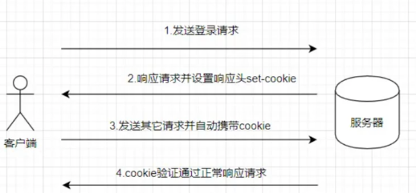

## Cookie and Session Management

### 1. what are cookies?

Cookies are produced and shared between the browser and the server using the HTTP Header.

- the browser will **always** send COOKIES with every request
- the server will send back the cookie with "**sessionID**"

Cookie is gradually deprecated and we don't use it to store data, reason(**disadvantage**) is:

- cookie has storage limitation: around **4KB**.
- each http request in browser, it will include the cookie in request header.
- data can be easily accessed and read, less security.

### 2. Session

Features of session:

- session is more safe than cookie, since it's **stored/managed on server side** while cookie is stored on client side.
- cookie can only store string data, but session can store any format data.
- cookie can persist longer, session's expiration time is short.
  Eg: A session ends when the user closes the browser or after leaving the site, the server will terminate the session after a predetermined period of time, commonly 30 minutes duration.
- session storage is larger than cookie.

### 3. HTTP is a stateless protool

So that cookie makes it more stateful between client and server. Traditional session and cookie based authentication:

### 4. Token

Token is generated on server side then send to client side, then you can store choose to store the token in anywhere in client side, eg: localstorage or cookie.

What is token?

How the token based auth process?

### 5. Compare Cookie, Session & Token

### 6. Additional Resources

- MDN docs: [Using HTTP cookies](https://developer.mozilla.org/en-US/docs/Web/HTTP/Cookies)
