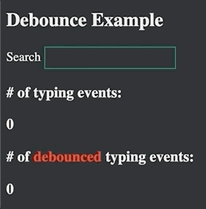
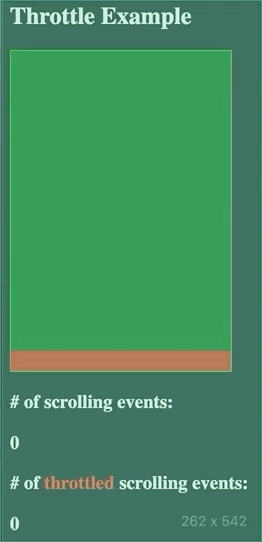

## Debounce and Throttle in JavaScript

#### I. [Debounce](#p1)  

#### II. [Throttle](#p2)  

#### III. [source code](#p3)

<div id="p1" />

### I. Debounce

#### 1.1 What is debounce?
Debouncing techniques is used to limit the number of times a function can execute. 
Debouncing makes that a function can’t be invoked again until a specific set of time has given without it being called.

Example: Execute a function only if 1000 milliseconds have passed without it being called.

Use cases:
-   Debouncing a  `resize`  event handler
-   Debouncing a  `scroll`  event handler
-   Debouncing a save function in an autosave feature 

#### 1.2 debounce function 

**Code:**
```js
function  debounce(fn, time) {
var  timer;
return  function (...args) {
clearTimeout(timer);
timer = setTimeout(() => {
fn(...args);
}, time);
}
}
```
**Usage example:**
```js
inputEL.addEventListener(
	'input', 
	debounce(onInputChangeHandler, 500)
);
```
#### 1.3 Debounce on input Demo



<div id="p2" />

### II. Throttle

#### 2.1 What is throttle?
Throttling techniques is used to limit the number of times a function can execute. 

Throttling will change the function in such a way that it can be fired at most once in a time interval.

For instance, throttling will execute the function only one time in 1000 milliseconds, no matter how many times the user clicks the button.

**Use cases:**
-   Throttling a  `scroll`  event handler
-   Throttling a button click so we can’t spam click
-   Throttling an API call
-   Throttling a  `mousemove`/`touchmove`  event handler

#### 2.2 throttle function 
**Code 1: simple throttle**
```js
function  throttle(fn, time) {
	var  isThrottle;
	return  function () {
		if (!isThrottle) {
			fn();
			isThrottle = true;
			setTimeout(() => {
				isThrottle = false;
			}, time);
		}	
	}
}
```
**Optimized: remember last call**
Because window.setTimeout and window.clearTimeout are not accurate in browser environment, they are replaced to other implementation when judging your code.
Reference: [bfe 4. discussion](https://bigfrontend.dev/problem/implement-basic-throttle/discuss)
```js
function throttle(fn, time) {
  var isThrottle;
  var lastArgs;
	return  function (...args) {
		if (!isThrottle) {
			fn(...args);
			isThrottle = true;
			setTimeout(() => {
				// check any trailing edge last call
				if(lastArgs)
				{
				fn(...lastArgs);
				}
				isThrottle = null; // reset to initial condition
				lastArgs = null; // reset to initial condition
			}, time);
		}
    	else{
      		lastArgs = [...args];
    	}
	}
}
```

**Code 2: include leading & trailing edge triggering**

**Link:** [bfe 5.](https://bigfrontend.dev/problem/implement-throttle-with-leading-and-trailing-option)
In this problem, you are asked to implement a enhanced throttle() which accepts third parameter, option: {leading: boolean, trailing: boolean}
- leading: whether to invoke right away
- trailing: whether to invoke after the delay.
```js
function throttle(fn, wait, option = {leading: true, trailing: true}) {
  if(!option.leading && !option.trailing) {
    // never get triggered
    return ()=>{};
  }
  var isThrottle;
  var lastArgs;

  function setTimer(){
	  isThrottle = true;
		setTimeout(() => {
      isThrottle = false; 
      // check any trailing edge last call
      if(option.trailing && lastArgs)
      {
           fn(...lastArgs);
           lastArgs = null;
           setTimer(); // setTimer() again at trailing edge call
      }
		}, wait);
  }
	return  function (...args) {
		if (!isThrottle) {
      if(option.leading) {
        fn(...args); // invoke at the leading edge
      }
		  setTimer();
		}
    else{
      lastArgs = [...args];
    }
	}
}
```

**Usage example:**
```js
containerEL.addEventListener(
	'scroll',
	throttle2(onScrollHandler, 500);
);
```

#### 2.3 Debounce on input Demo



<div id="p3" />

### III. Source Code

[github link](https://github.com/jialihan/JavaScript-Onboarding/tree/master/debounce_throttle)