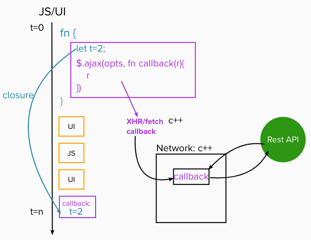
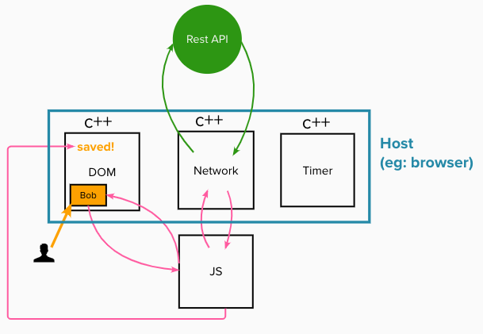

## Javascript Engine
  
#### I. [Background](#question-1)

#### II. [inside the engine](#question-2)

#### III. [More about Interpreter & Compiler ](#question-3)

#### IV. [ECMAScript](#question-4)

#### V. [Write Optimized Code](#question-5)

#### VI.  [Web Assembly](#question-6)

#### VII. [Call stack and Memory heap](#question-7)

#### VIII. [Stack Overflow](#question-8)

#### IX. [Garbage Collection](#question-9)

#### X. [Memory Leak](#question-10)

#### XI. [Single Threaded - JavaScript](#question-11)

#### XII. [Javascript Runtime](#question-12)

#### XIII. [How Javascript work with browser?](#question-13)

<div id="question-1"/>

### 1. Background

#### What is JS engine?
A JavaScript engine is a program or an interpreter which executes JavaScript code. A JavaScript engine can be implemented as a standard interpreter, or just-in-time compiler that compiles JavaScript to bytecode in some form.

- javascript is an interpreted language? partial true, also have compilers to optimize it.
- ECMAScript engines: [wiki/List_of_ECMAScript_engines](https://en.wikipedia.org/wiki/List_of_ECMAScript_engines)
- we give a javascript file to the engine, then the engine tell the computer what to do.
- they read and run our javascript code, for example: V8 engine ....
-  the first javascript engine: [SpiderMonkey](https://en.wikipedia.org/wiki/SpiderMonkey) by [Brendan Eich](https://en.wikipedia.org/wiki/Brendan_Eich "Brendan Eich") - for **Firefox**
- V8 — open source, developed by Google, written in C++
- JavaScriptCore — open source, marketed as Nitro and developed by Apple for **Safari**

<div id="question-2"/>

### 2. inside the engine
- **Parser**
- **AST:** abstract syntax tree
   online helper tools to understand the AST built on our code: [https://astexplorer.net/](https://astexplorer.net/)
   for example: 
   ```
   var a = 1;
  ```
  built into the tree structure like the following json:
	```js
	{
	  "type": "Program",
	  "start": 0,
	  "end": 12,
	  "body": [
	    {
	      "type": "VariableDeclaration",
	      "start": 1,
	      "end": 11,
	      "declarations": [
	        {
	          "type": "VariableDeclarator",
	          "start": 5,
	          "end": 10,
	          "id": {
	            "type": "Identifier",
	            "start": 5,
	            "end": 6,
	            "name": "a"
	          },
	          "init": {
	            "type": "Literal",
	            "start": 9,
	            "end": 10,
	            "value": 1,
	            "raw": "1"
	          }
	        }
	      ],
	      "kind": "var"
	    }
	  ],
	  "sourceType": "module"
	}
	```

* Interpreter -> ByteCode
	the source code will be read and directly executed, line by line.
* Compiler -> Optimized Code
	the source file typically will be “compiled” to machine code (or byte code) before being executed.

<div id="question-3"/>

### 3. More about Interpreter & Compiler 

<div id="q3-1"/>

#### 3.1 Interpreter:

translate and read the files **line by line** on the fly.

<div id="q3-2" />

#### 3.2 compiler

it works ahead of time to create a translation of what code we've just written and it compiles down to usually a language that can be understood by our machines.

Compiler examples: most popular:
- [Babel](https://babeljs.io/) is a Javascript compiler that takes your modern JS code and returns browser compatible JS (older JS code).
- [Typescript](https://www.typescriptlang.org/) is a superset of Javascript that compiles down to Javascript.

<div id="q3-3"/>
  
#### 3.3 compare interpreter vs. compiler

| Interpreter | Compiler |
|--|--|
| natural fit, don't need compile | |
| slow for repeated code, eg: loops| don't need to repeat the translation for each loop |

**How to combine these two things?**

started doing browsers started mixing compilers specifically these JIT Compilers to make engine faster.

For exmaple:
 **V8 engine** how to create this: JIT Compiler

->Interpreter -> Byte code -> 01101101....

->Interpreter -> Profiler: work as a monitor to detect duplicated loop code -> Compiler -> Optimized code
 
result will be byte code and optimized code for repeated part.
 
these git compilers for just in time compilation to make the engines faster.

<div id="question-4"/>

### 4. ECMAScript 
It tells people  the standard and how you should do things in JavaScript and how it should work. ECMAScript is the governing body of javascript that essentially decides how the language should be standardized so it tells engine creators.

JS engine goals: it can be implemented any way we want and it constantly changes to find the fastest way possible to have javascript work in our browsers.

<div id="question-5"/>

### 5. Write Optimized Code
Things might cause JS problematic sometimes and slow:
- eval()
-  arguments
- for in
- with
- delete
Eg: eval and arguments: [Reference: managing-arguments](https://github.com/petkaantonov/bluebird/wiki/Optimization-killers#3-managing-arguments)
1 ) the names `eval` and `arguments` can't be bound or assigned in language syntax
Error example:
```js
'use strict';
eval = 17;
arguments++;
++eval;
```	
2 ) Second, strict mode code doesn't alias properties of `arguments` objects created within it.
```js
function f(a) {
	'use strict';
	a = 42; // error
	return [a, arguments[0]]; // arguments[i]: error
}
```
// TODO: what is this?
3 ) Issue in inline-caching && hidden classes:
[hidden-classes.html](https://richardartoul.github.io/jekyll/update/2015/04/26/hidden-classes.html)

<div id="question-6"/>

### 6.  [WebAssembly](https://webassembly.org/)
The standard binary executable format called Web assembly and this is what we didn't have in 1995, we didn't have the competing browsers agreeing on this format where we can compiler way down to web assembly.
**This executable format so that it runs really fast on the browser instead of having to go through that entire JavaScript engine process.**

<div id="question-7"/>

### 7. Call stack and Memory heap

* call stack
a place to store and right information that is to store our variables our objects, data of our apps and a place to actually run and keep track of where your code is and its execution.
* memory heap
 for that we need the memory heap as a place to store and write information: **allocate, use, and release memory.**

For example: call stack

1 ) first in last out region: nested function being executed on call stack top:


2 ) after we returned from inner function, it popped out of the call stack


<div id="question-8"/>

### 8. Stack Overflow
* recursion calls

<div id="question-9"/>

### 9. Garbage Collection
* JavaScript is a garbage collected language:
we finish calling the function and we don't need that object anymore. it will clean up for us automatically to freeze that memory when the data is not useful for us.
* mark and sweep algorithm
mark what we need, and sweep what we don't need

<div id="question-10"/>

### 10. Memory Leak

For example: create a loop to store in memory:
```js
// create memory leak
let array = [];
for(let i=1; i>0; i++)
{
	array.push(i-1);
}
```

Common memory leaks scenario:
* global variables:  memory becomes used more and more and more
* event listeners
	```
	//  keep adding, but never remove them
	element.addEventListener('click', onClick); 
	```
* [setInterval()](https://developer.mozilla.org/en-US/docs/Web/API/WindowOrWorkerGlobalScope/setInterval)
	```js
	setInterval(()  =>  {
		// object here not get garbage-collected
		// because interval never ends
	}, interval);
	```

One more article to explain an example of memory leak:
[garbage-collection-in-redux-applications](https://developers.soundcloud.com/blog/garbage-collection-in-redux-applications)

<div id="question-11"/>

### 11. Single Threaded - JavaScript
javascript only have one call stack, it's single threaded, never executed in parallel.

**How does JS execute tasks** in a single thread? 
the working flow process like the following image:



<div id="question-12"/>

### 12. Javascript Runtime
* Web API	
	- dom
	- fetch()
	- setTimeout()
	- setInterval()

	A simple example to explain the async codes:
	```
	console.log('1');
	setTimeout(()=>console.log('2'),  1000);
	console.log('3');
	// result: 1,3,2
	```
	An edge case to pay attention: **zero time**
	```
	console.log('1');
	setTimeout(()=>console.log('2'),  0);
	console.log('3');
	// result: 1,3,2
	```
	**No matter how fast is the time**, it still will be sent to web api and call back queue, the event loop will still check the empty of the call stack -> wait until "3" finished, it will execute "2".

* Event loop
monitor once the call stack is empty, it will put the to be executed function back to the call stack.

<div id="question-13"/>

### 13. How Javascript work with browser?

Architecture flow:


