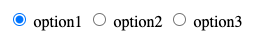

## Handling Form in Pure JavaScript

### 1. select

- can set initial `selected` option item
- addEventListener on `"change"`
- How to get selected value?
  By access **select.options**=> return an array to loop
  `select.addEventListener('change',  function(){
	let selectValue = select.options[select.selectedIndex].text;
	console.log(selectValue);
})`

### 2. input: type="text"

Be careful with different events we can listen to:

- `change`: whenever hit "enter" keyboard or mouse clicked outside of this input, it will trigger a change event
- `keyup`, `keydown`: when user stay in this input field, but typing each letters. Especially sometime user type and stop, but never leave this input.
- `enter` key event: **event.keyCode = 13**

How to get input value?
Simple:

```
var inputValue = inputElement.value;
```

### 3. input: type="email/password"

feature are the same with regular text input

### 4. checkbox: multi-select

For each element, we need add event listener on it.

- listen to `'change'` event
- **element.checked**: true / false
- get checkbox value: **element.value**

### 5. radios

- usually get all radio inputs and process as an collection
  ```
  var radios = document.getElementsByName("input-radio");
  ```
- Listen to `'click'` event on each radio input
- **element.checked**: true / false
- get radio input value: **element.value**

Complete code example:

```
var radios = document.getElementsByName("inputr");
for( let el of radios)
{
	el.addEventListener('click',  function(){
	if(el.checked)
	{
	console.log(el.value+  ': checked');
	}
})
}
```

#### 5.2 CSS style on Radio input

1 ) Tricky part is the default style of [radio, text] will display block vertically
2 ) how to align radio and input horizontally in the same line? we need to add some css tricks.



- wrap the input and text in one `<Label>`
- set the css style of the `<Label class="lbl-radio">` to be **{ display: inline }**

  ```
  // html
  <label class="lbl-radio">
  	<input  type="radio" name="inputr" id="input1" value="radio1"/> option1
  </label>

  // css
  #lbl-radio  {
  	display:  inline;
  }
  ```

### 6. FormData object

- how to get from data from html `<from>`
  ```js
  var form = document.querySelector("form");
  var formData = new FormData(form);
  ```
- we can append data manually to the form object:
  ```js
  formData.append("inputName", "your-value");
  ```
- how to read value from the `formData object`
  Use **formdata.entries**, then loop the results.
  ```js
  for (var pair of formData.entries()) {
    console.log(pair[0], pair[1]);
  }
  ```

### 7. Form Submit

- **event.preventDefault()** important! don't forget to add it!
- listen to `'submit'` event on the form

#### 8. Source code Example

[Github Repo Link](https://github.com/jialihan/JavaScript-Onboarding/tree/master/forms/JS-form)
