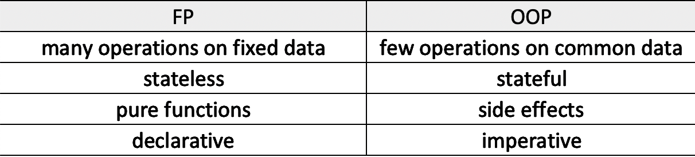

## Functional Programming - Javascript
### 1. 	Pure Functions
* A function given the same input should return the same output
* Function cannot modify anything outside of itself. **No side effects**.
	For example: Side effect example, calling the `del()` function changed the object `const arr`  outside.
	```
	const arr = [ 1,  2,  3 ]; // shared variable
	function  deleteArray (array)  {
	array.pop();
	}
	deleteArray(arr);  // [1,2]: arr changed
	```
	Solution: not touch the original shared state, always return a new object.
	```
	function  removeLastElement(arr)  {
		const newArray = [ ...arr ];
		newArray.pop();
		return newArray;
	}
	```
Goal: organize your code in a way that isolate these side effect( eg: database call, network call, input/output, etc.) to a certain location of your code, make the code easy to predict and debug.
Expect our functions to be:
- do one single task
- return statement
- pure
- no shared state
- immutable state: never change our global state
- composable
- predictable 
### 2. Idempotent
### 3. Imperative vs. Declerative
* Imperative: what to do? how to do it?
	For eample: machine code, Jquery
* Declerative: what to do? what should happend?


## OOP vs. FP
### 1. inheritance and composition
* inheritance: class extedns super class
* composition: smaller pieces to create bigger things, we compose functions to act upon data differently.

### 2. Drawbacks
* inheritance: what it is
	problem:
	- tight coupling
	- fragile base class problem
	- hierarchy problem

For example: 
1. child just want a simple method, but it inherits everything that might be huge but unnecessary.
2. if we want to change something while the inheritance is huge, it becomes more difficult.

* composition: what ability it has/ what it can does on data
For example: if we use compoistion
```
function getName(person){
	return Object.assign(
		{},
		person,
		{attackFn: ()=>{ ... }}
	);
}
function Person(name, age){
	let person = {
		name,
		age
	};
	return getName(person);
}
```
Here we give capabilities like `getName(), getAge` later using functions.

### 3. comparision


