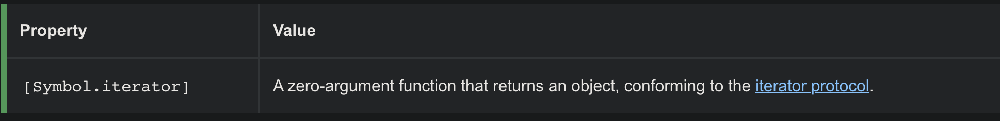

## Generator Functions in ES6 - JavaScript

#### 1. [What is a generator function?](#question1)

#### 2. [The iterator protocol](#question2)

#### 3. [The iterable protocol](#question3)

#### 4. [Reference and Links](#question4)

<div id="question1" />

### I. What is a [generator function](https://developer.mozilla.org/en-US/docs/Web/JavaScript/Reference/Statements/function*)?

The `function*` declaration (`function` keyword followed by an asterisk) defines a _generator function_, which returns a [`Generator`](https://developer.mozilla.org/en-US/docs/Web/JavaScript/Reference/Global_Objects/Generator) object.

#### 1.1 Syntax:

```js
function* generator(i) {
  yield i;
  yield i + 10;
}
```

#### 1.2 How to consume it? - [Generator Object](https://developer.mozilla.org/en-US/docs/Web/JavaScript/Reference/Global_Objects/Generator)

method:

- [`next()`](https://developer.mozilla.org/en-US/docs/Web/JavaScript/Reference/Global_Objects/Generator/next) : Returns a value yielded by the [`yield`](https://developer.mozilla.org/en-US/docs/Web/JavaScript/Reference/Operators/yield) expression.
- [`return()`](https://developer.mozilla.org/en-US/docs/Web/JavaScript/Reference/Global_Objects/Generator/return) : Returns the given value and finishes the generator.
- [`throw()`](https://developer.mozilla.org/en-US/docs/Web/JavaScript/Reference/Global_Objects/Generator/throw)

Usage Example:

```js
const gen = generator(10);
console.log(gen.next().value);
// expected output: 10
```

#### 1.3 BFE 39 - implement range()

[#39. link](https://bigfrontend.dev/problem/implement-range)

```js
// Solution1: function generator
function range(from, to) {
  return (function* gen() {
    while (from <= to) {
      yield from++;
    }
  })(from, to);
}
```

<div id="question2" />

### II. [The iterator protocol](https://developer.mozilla.org/en-US/docs/Web/JavaScript/Reference/Iteration_protocols#the_iterator_protocol "Permalink to The iterator protocol")

An object is an iterator when it implements a `next()` method with the following semantics:


**Syntax Example:**

```js
// Satisfies both the Iterator Protocol and Iterable
const myIterator = {
	// ...
    next: function() {
        return {
			done: ...,
			value: ...,
		}
    }
};
```

**Iterator Code Example:**
https://developer.mozilla.org/en-US/docs/Web/JavaScript/Reference/Iteration_protocols#iterator_examples

<div id="question3" />

### III. [The iterable protocol](https://developer.mozilla.org/en-US/docs/Web/JavaScript/Reference/Iteration_protocols#the_iterable_protocol "Permalink to The iterable protocol")

**Docs:**
https://developer.mozilla.org/en-US/docs/Web/JavaScript/Reference/Iteration_protocols#the_iterable_protocol

#### 3.1 Protocal Syntax



> Note:
> ONLY **The iterable protocol** allows JavaScript objects to define or customize their iteration behavior, such as what values are looped over in a [`for...of`](https://developer.mozilla.org/en-US/docs/Web/JavaScript/Reference/Statements/for...of) construct.

So if you want to call it in a `for...of` loop, you **MUST implement the iterable protocol**, only the "iterator protocol" is **NOT** enough.

A suggestion Syntax for both protocol:

```js
// Satisfies both the Iterator Protocol and Iterable
const myIterator = {
  next: function () {
    // ...
  },
  [Symbol.iterator]: function () {
    return this;
  }
};
```

#### 3.2 bfe #39. solution use iteration protocol

```js
function range(from, to) {
  var i = from;
  return {
    next: function () {
      return i <= to
        ? {
            value: i++,
            done: false
          }
        : {
            done: true
          };
    },
    [Symbol.iterator]: function () {
      return this;
    }
  };
}
```

<div id="question4" />

### IV. Reference and Links

- **Iterators and generators** : https://developer.mozilla.org/en-US/docs/Web/JavaScript/Guide/Iterators_and_Generators
- **Iteration protocols** : https://developer.mozilla.org/en-US/docs/Web/JavaScript/Reference/Iteration_protocols#the_iterable_protocol
- **Understanding JS Generators** : https://codeburst.io/understanding-generators-in-es6-javascript-with-examples-6728834016d5
