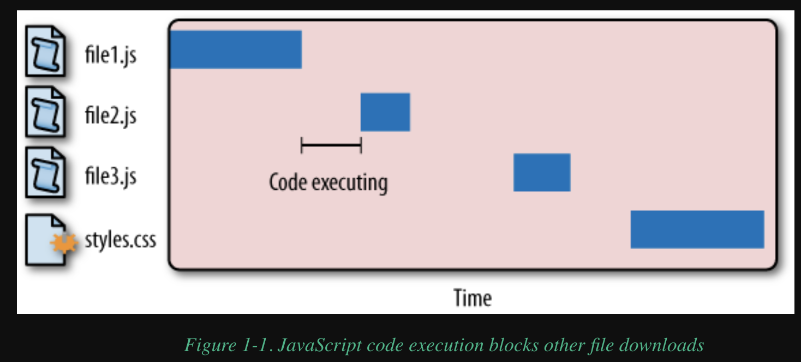

### Chapter 1 Loading and Exec

1.1 `<script>` tag will block the browser to render the page until the `<script>` tag closed and finished execution. Since there is no way of knowing whether JS will insert content into the HTML & DOM.

```js
<body>
  <p>
    <script type="text/javascript">
      document.write("The date is " + (new Date()).toDateString());
    </script>
  </p>
</body>
```

**1.2 Script Positioning**

When put the script the `<script>` in the `<head>` section in HTML, a severe performance issue is that browser will **download & exec** the scripts, while the browser show a **blank page** until start the `<body>` tag.

```html
<html>
  <head>
    <title>Script Example</title>
    <-- Example of inefficient script positioning -->
    <script type="text/javascript" src="file1.js"></script>
    <script type="text/javascript" src="file2.js"></script>
    <script type="text/javascript" src="file3.js"></script>
    <link rel="stylesheet" type="text/css" href="styles.css" />
  </head>
  <body>
    <p>Hello world!</p>
  </body>
</html>
```

Stupid Waterfall diagram:



- JS code execution will block other resources to download
- Some modern browser allows **JS to download in parallel**, but still blocks other type of resources, eg: image download.

**Improvement:**
suggest to put the `<script>` tag near the bottom of the `</body>` tag:

```html
<html>
  <head>
    <title>Script Example</title>
    <link rel="stylesheet" type="text/css" href="styles.css" />
  </head>
  <body>
    <p>Hello world!</p>

    <-- Example of recommended script positioning -->
    <script type="text/javascript" src="file1.js"></script>
    <script type="text/javascript" src="file2.js"></script>
    <script type="text/javascript" src="file3.js"></script>
  </body>
</html>
```

**1.3 Grouping Scripts**

Each HTTP request brings with it additional performance overhead, so downloading one single 100 KB file will be faster than downloading four 25 KB files. Try to minimize your JS file, eg: you will see many `.min.js` files.

**1.4 non-blocking Scripts**

The secret to nonblocking scripts is to load the JavaScript source code after the page has finished loading. In technical terms, this means downloading the code after the window’s `load event` has been fired. There are a few techniques for achieving this result.

**1.5 Deferred Scripts**

- `defer` the execution time of the script until a later point
- the code will not be exec until the DOM has been completely loaded (before the `onload` event handler is called).
- But it does NOT block other resources to download

For example:

```html
<body>
  <script defer>
    alert("defer");
  </script>
  <script>
    alert("script");
  </script>
  <script>
    window.onload = function () {
      alert("load");
    };
  </script>
</body>
```

In browsers that support defer, the order of the alerts is:

```text
 “script” -->  “defer” -->  “load”.
```

Note that the deferred `<script>` element isn’t executed until after the second but is executed before the `onload` event handler is called.

> Note: in HTML5, inline-defer script will be ignored. [doc](https://developer.mozilla.org/en-US/docs/Web/HTML/Element/script#attr-defer)
> This attribute must not be used if the `src` attribute is absent (i.e. for inline scripts), in this case it would have no effect.

**1.6 Dynamic Script Elements**
The important thing about this technique is that the file is downloaded and executed without blocking other page processes, regardless of where the download is initiated.

```js
var script = document.createElement("script");
script.type = "text/javascript";

//Firefox, Opera, Chrome, Safari 3+
script.onload = function () {
  alert("Script loaded!");
};

script.src = "file1.js";
document.getElementsByTagName("head")[0].appendChild(script);
```

**1.7 XMLHttpRequest Script Injection**
This technique involves creating an XHR object, downloading the JavaScript file, then injecting the JavaScript code into the page using a dynamic `<script>` element.

```js
var xhr = new XMLHttpRequest();
xhr.open("get", "file1.js", true);
xhr.onreadystatechange = function () {
  if (xhr.readyState == 4) {
    if ((xhr.status >= 200 && xhr.status < 300) || xhr.status == 304) {
      var script = document.createElement("script");
      script.type = "text/javascript";
      script.text = xhr.responseText;
      document.body.appendChild(script);
    }
  }
};
xhr.send(null);
```

1.8 The LazyLoad library

LazyLoad is also capable of downloading multiple JavaScript files and ensuring that they are executed in the correct order in all browsers. To load multiple JavaScript files, just pass an array of URLs to the `LazyLoad.js()` method:

```js
<script type="text/javascript" src="lazyload-min.js"></script>
<script type="text/javascript">
    LazyLoad.js(["first-file.js", "the-rest.js"], function(){
        Application.init();
    });
</script>
```

**1.9 Summary**

Every time a `<script>` tag is encountered, the page must stop and wait for the code to download (if external) and execute before continuing to process the rest of the page. There are, however, several ways to minimize the performance impact of JavaScript:

- Put all `<script>` tags at the bottom of the page, just inside of the closing `</body>` tag. This ensures that the page can be almost completely rendered before script execution begins.
- Group scripts together. The fewer `<script>` tags on the page, the faster the page can be loaded and become interactive. This holds true both for `<script>` tags loading external JavaScript files and those with inline code.
- There are several ways to download JavaScript in a nonblocking fashion:

  - Use the `defer` attribute of the `<script>` tag (Internet Explorer and Firefox 3.5+ only)
  - Dynamically create `<script>` elements to download and execute the code
  - Download the JavaScript code using an XHR object, and then inject the code into the page
