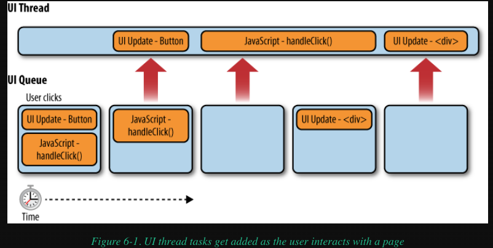

## Chapter 6 - Responsive Interfaces in Browser

### 0. Preface

Most browsers have a single process that is shared between JavaScript execution and user interface updates. Only one of these operations can be performed at a time, meaning that the user interface cannot respond to input while JavaScript code is executed and vice versa.
Reference article link: [Single Threaded - JavaScript](https://jialihan.github.io/blog/#/javascript/engine?id=_11-single-threaded-javascript)


### 1. The Browser UI thread

The process shared by JavaScript and user interface updates is frequently referred to as the browser UI thread (though the term “thread” is not necessarily accurate for all browsers).
For example: a button click results in a message being displayed on screen

```
<button onclick="handleClick()">Click Me</button>
<script type="text/javascript">
    function handleClick(){
        var div = document.createElement("div");
        div.innerHTML = "Clicked!";
        document.body.appendChild(div);
    }
</script>
```

When the button in this example is clicked, it triggers the UI thread to create and add two tasks to the queue:

- task1: a UI update for the button, which needs to change appearance to indicate it was clicked.
- task2: a JavaScript execution task containing the code for `handleClick()`.

During the JavaScript execution, a new UI update task is added to the queue :

- task3: `handleClick()` creates a new `<div>` element and appends it to the `<body>` element.



### 2. Browser Limits

Browsers place limits on the amount of time that JavaScript takes to execute. This is a necessary limitation to ensure that malicious coders can’t lock up a user’s browser or computer by performing intensive operations that will never end.

There are two ways of measuring how long a script is executing:

- 1. to keep track of how many statements have been executed since the script began.
- 2. to track the total amount of time that the script has been executing.

**Different browser's limit:**

- Internet Explorer, as of version 4, sets a default limit of 5 million statements;
- Firefox has a default limit of 10 seconds; this limit is stored in the browser’s configuration settings (accessible by typing about:config in the address box)
- Safari has a default limit of 5 seconds; this setting cannot be altered, but you can disable the timer by enabling the Develop menu and selecting Disable Runaway JavaScript Timer.
- Chrome has no separate long-running script limit and instead relies on its `generic crash detection system` to handle such instances.

### 3. How Long Is Too Long for user interaction experience?

The total amount of time that a single JavaScript operation should take (at a maximum) is **100 milliseconds**. This number comes from research conducted by Robert Miller in 1968.[9] Interestingly, usability expert **Jakob Nielsen** noted[10] in his book Usability Engineering (Morgan Kaufmann, 1994) that this number hasn’t changed over time and, in fact, was reaffirmed in 1991 by research at Xerox-PARC.[11]

### 4. Timers in Browser

Timers are created in JavaScript using either :

- `setTimeout()`
- `setInterval()`

JavaScript timer delays are often **imprecise**, with slips of a few milliseconds in either direction.For this reason, timers are unreliable for measuring actual time passed.

Timer resolution on Windows systems is 15 milliseconds, meaning that it will interpret a timer delay of 15 as either 0 or 15, depending on when the system time was last updated.

### 5. Web Workers

code can be executed without taking time on the browser UI thread. Originally part of HTML 5, the web workers API has been split out into its own **specification** (http://www.w3.org/TR/workers/); web workers have already been implemented natively in Firefox 3.5, Chrome 3, and Safari 4.

#### 5.1 Worker Environment

Since web workers aren’t bound to the UI thread, it also means that they cannot access a lot of browser resources.The worker environment is made up of the following:

- A `navigator` object, which contains only four properties: `appName`, `appVersion`, `userAgent`, and `platform`
- A `location` object (same as on `window`, except all properties are read-only)
- A `self` object that points to the global worker object
- An `importScripts()` method that is used to load external JavaScript for use in the worker
- All ECMAScript objects, such as `Object`, `Array`, `Date`, etc.
- The `XMLHttpRequest` constructor
- The `setTimeout()` and `setInterval()` methods
- A `close()` method that stops the worker immediately

To create a web worker, you must pass in the URL for the JavaScript file:

```
var worker = new Worker("code.js");
```

#### 5.2 Worker Communication

Communication between a worker and the web page code is established through an event interface.

- Web page ---> Worker:`.postMessage('Jelly')`
  Only certain **types** of data can be passed using postMessage(). You can pass primitive values (strings, numbers, Booleans, null, and undefined) as well as instances of Object and Array; you cannot pass any other data types.
- Worker's event handler: `.onmessage()`

#### 5.3 Loading External Files

Loading extra JavaScript files into a worker is done via the `importScripts()` method, which accepts one or more URLs for JavaScript files to load.

```
//inside code.js
importScripts("file1.js", "file2.js");

self.onmessage = function(event){
    self.postMessage("Hello, " + event.data + "!");
};
```

#### 5.4 Use case

Web workers are suitable for any long-running scripts that work on pure data and that have no ties to the browser UI.

- **parsing a large JSON string** (major use case)
- Encoding/decoding a large string
- Complex mathematical calculations (including image or video processing)
- Sorting a large array

### 6. Summary

- No JavaScript task should take longer than **100 milliseconds** to execute. Longer execution times cause a noticeable delay in updates to the UI and negatively impact the overall user experience.
- Browsers behave differently in response to user interaction during JavaScript execution. Regardless of the behavior, the user experience becomes confusing and disjointed when JavaScript takes a long time to execute.
- Timers can be used to schedule code for later execution, which allows you to split up long-running scripts into a series of smaller tasks.
- Web workers are a feature in newer browsers that allow you to execute JavaScript code outside of the UI thread, thus preventing UI locking.

The more complex the web application, the more critical it is to manage the UI thread in a proactive manner. No JavaScript code is so important that it should adversely affect the user’s experience.
