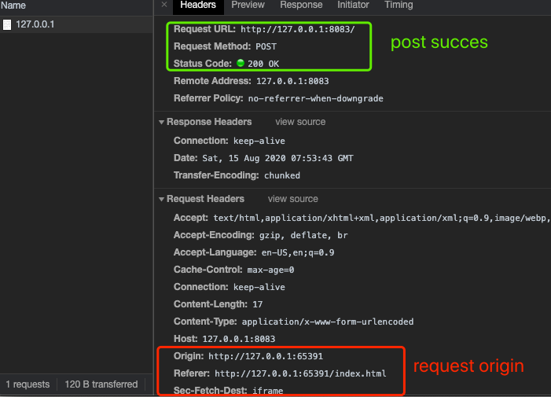

# Use iframe to achieve CORS solution

Deep understanding how to use `Iframe` to achieve CORS. Since jsonp can only send **Get** CORS request, then we usually use Iframe if we want to send **Post** CORS request to another domain. This article will introduce both **Get** and **Post** request to another domain using **Iframe**. 

Even using iframe, there are multiple ways to deal transfer and share data method.
Reference: [前端常见跨域解决方案(全): Multiple CORS solutions Front-end](https://segmentfault.com/a/1190000011145364) 

This article will talk about my code example of Iframe, including two part:
1) **Get request**:  using **Iframe + window . name**
2) **Post request**: using **Iframe + form**, very useful and important


## GET: Iframe + window . name

### 1. Concept
We have three html pages:
* Domain_A(same port): index.html: contains the iframe source page
* Domain_A(same port): proxy.html **(empty, null content)**, this don't need to have anything, just a proxy.html on the same Origin, then we can parse the content inside of iframe.
* Domain_B: index.html (this is the resources we want to request on a different origin)
### 2. Iframe side code ( index.html in domain_A )
Just create a simple Iframe, and set it to `display: 'none'`.
```
// html
 <iframe id="myiframe"  src=""></iframe>
// js
var iframe = document.getElementById("myiframe");
iframe.style.display = "none";
 ```
**Important!** When will trigger the iframe `onload` event?(here  we  consider in Chrome, safari, Opera)
* insert elements into IFRAME 
* **add 'src'** property or update **update 'src'** property

Then here, we first add the **src** to be same Origin, which means our **proxy.html**, then we can parse or get content inside the iframe from our parent html page **index.html in Domain A** (same domain).
```
var isloaded=false; // avoid repeated onload of iframe
iframe.onload=function (e)
{
     if(!isloaded){
        isloaded=true;
        // any empty proxy page from same Origin 
        e.target.src='http://127.0.0.1:65391/proxy.html';
    }else{
      // get data from CORS domain
       respTextArea.value = iframe.contentWindow.name;
    }
}
```

### 3. proxy html from same Origin ( proxy.html in domain_A )
we just need to create a html string assigning to the `src attribute` last step 2.
Remember also host this **proxy.html** on the `same Origin`: `localhost and same port` with our original client side **index.html**.
For example:
* http+domain+port/index.html
* http+domain+port/proxy.html

In my code example: 
* http://127.0.0.1:65391/index.html
* http://127.0.0.1:65391/proxy.html

### 4.  another destination Origin  ( index.html in domain_B)
Here when we received the request, we just set our data as response in **window.name** property. Because it won't change if we don't close the window from outside domain to our source domain.
Host in another origin, for example: on a different host on local host.
```
<body>
	<script>
		window.name =  `hello from domain B, ${data}`;
	</script>
</body>
```
### 5. result and source code


**Githublink**: [iframe-cors](https://github.com/jialihan/JavaScript-Onboarding/tree/master/iframe-cors) 


## Post: Iframe + form 
### 1. Concept
Code reference: [iframe跨域POST提交: Iframe cross domain Post request](https://segmentfault.com/a/1190000007997430)
use **iframe. name** attribute to match/relate **form. target** attribute.
Then `form.submit()` will send in iframe, and cors is allowed in iframe, then we can post our data through iframe to another domain.

### 2. create HTML for iframe and form
here in my code, destination url is local host on another port:
action = http://127.0.0.1:8083
```
<iframe id="myiframe2" name="form-target" src=""></iframe>
<form id="form2" action="your dest URL" target="form-target" method="post">
```
And remember to set iframe: `display: 'none';`

### 3. then trigger the submit
since we have a button `type="submit"` , then our form submit is easy to directly triggered on UI.
```
<form>
	<button type="submit" class="btn">Submit</button>
</form>
```

### 4. Sorry, i cannot actually track the async response in iframe
1 ) create a fake response whenever the post() submit in form is triggered
```
iframe2.onload=function ()
{
    // But cannot async track response !!! 
    respTextArea2.value = "post sent";
}
```
2 ) check our post request sent success or failure in browse's **network tab**


3 ) if you have a magic solution to await to get async response inside iframe, please let me know.

4 ) **Githublink**:  [iframe-cors](https://github.com/jialihan/JavaScript-Onboarding/tree/master/iframe-cors) 

