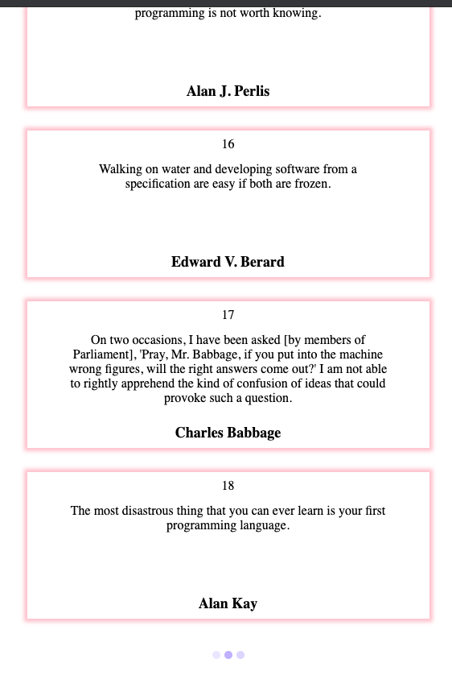

## Infinite Scroll on Window in JavaScript

#### I. [HTML layout basic setup](#p1)

#### II. [Create Scroll Event](#p2)

#### III. [ Important JS functions](#p3)

#### IV. [Improve: add loading dots on UI](#p4)

- [4.1 loading dots HTML](#p4-1)
- [4.2 CSS control for loading dots](#p4-2)
- [4.3 Reserve a padding bottom space when scroll at the bottom
  ](#p4-3)
- [4.4 When trigger the showing of loading dots?](#p4-4)

#### V. [Source Code](#p5)

<div id="p1" />

### I. HTML layout basic setup

#### 1.1 HTML layout

```html
<div class="container">
  <h2>Posts:</h2>
  <div id="posts"></div>
</div>
```

#### 1.2 important css

For `posts` div :

- fixed width
- 100% height to take up the whole body

<div id="p2" />

### II. Create Scroll Event

**Notes:**

- use passive listener: [Improving scrolling performance with passive listeners](https://developer.mozilla.org/en-US/docs/Web/API/EventTarget/addEventListener#improving_scrolling_performance_with_passive_listeners "Permalink to Improving scrolling
performance with passive listeners")
- [scrollTop](https://developer.mozilla.org/en-US/docs/Web/API/Element/scrollTop): the distance from the element's top to its topmost _visible_ content, might be **decimal value**
- [clientHeight](https://developer.mozilla.org/en-US/docs/Web/API/Element/clientHeight): ` CSS height + CSS padding + margin + horizontal scrollbar (if present).`
  - ❌[Window.innerHeight](https://developer.mozilla.org/en-US/docs/Web/API/Window/innerHeight): not recommended, it's **only** a prop of `window`. it includes: `css height + padding + scroll bar`, NO `margins & borders`。
- [Element.scrollHeight](https://developer.mozilla.org/en-US/docs/Web/API/Element/scrollHeight): the whole **content height** that can be scrolled, including the **invisible height** due to the overflow. Same as `clientHeight` including: `css height + padding + margin + scrollbar`.
  - ❌HTMLElement.offsetHeight](https://developer.mozilla.org/en-US/docs/Web/API/HTMLElement/offsetHeight): `css heigth + padding + border + scroll bar`, returns as an **integer**. Diff: with `border` but NO `margin`.
- Helpful doc to understand height props: [link](https://usefulangle.com/post/40/javascript-client-height-vs-offset-height-vs-scroll-height)

```js
window.addEventListener(
  "scroll",
  function () {
    var { scrollTop, scrollHeight, clientHeight } = document.documentElement;
    if (scrollTop + clientHeight + 10 >= scrollHeight) {
      // TODO: data loader
    }
  },
  {
    passive: true, // improve scrolling
  },
);
```

<div id="p3" />

### III. Important JS functions

- Data fetch: `getPosts()` - make API call
- Render Data on HTML: `renderPosts()` - dom manipulation
  - use **[fragment](https://developer.mozilla.org/en-US/docs/Web/API/DocumentFragment)** to reduce dom reflow

<div id="p4" />

### IV. Improve: add loading dots on UI

<div id="p4-1" />

#### 4.1 loading dots HTML

```html
<div class="loading">
  <div class="dot-flashing"></div>
</div>
```

<div id="p4-2" />

#### 4.2 CSS control for loading dots

- use `fixed` position at the bottom of the body
- use `opacity` to control show / hide
- improve: add **transition** to animate it

```css
.loading {
  position: fixed;
  bottom: 40px;
  left: 50%;
  transform: translateX(-50%);
  opacity: 0;
  transition: opacity 0.3s ease-in;
}
.loading.show {
  opacity: 1;
}
```

<div id="p4-3" />

#### 4.3 Reserve a padding bottom space when scroll at the bottom

Since we use fixed position at the body, so when we scroll to the bottom of window, we need to show the loading dots, then use a `padding-bottom` to keep the space for loading, while content still take the 100% of the body.

```css
body {
  /* reserve blank space for the loading when scroll down */
  padding-bottom: 60px;
}
```

<div id="p4-4" />

#### 4.4 When trigger the showing of loading dots?

- mock the async waiting time
- ensure at least it shows up for some time
- use `setTimeout()`
- show the loading dots first, then fetch data

```js
// pseduo code
var showLoading = () => {
  loadingEL.classList.add("show");
  setTimeout(() => {
    loadPosts();
  }, 1000);
};
```

<div id="p5" />

### V. Source Code



#### [window-infinite-scroll_github](https://github.com/jialihan/JavaScript-Onboarding/tree/master/window-infinite-scroll)
