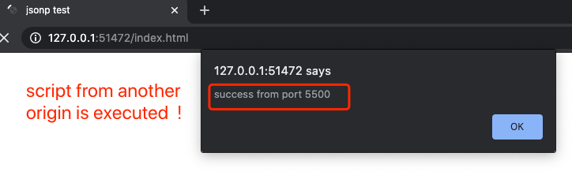
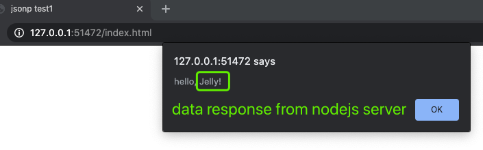

## Deep understanding of JSONP 

### 1. what is JSONP?
Due to wikipedia's description: [wiki-link: JSONP](https://en.wikipedia.org/wiki/JSONP)
**JSON-P** (JSON with Padding), is a historic [JavaScript](https://en.wikipedia.org/wiki/JavaScript "JavaScript") technique for requesting data by loading a `<script>` tag;[[1]](https://en.wikipedia.org/wiki/JSONP#cite_note-JSON-P-1) these are the tags intended to load ordinary JavaScript. JSONP enables sharing of data bypassing [same-origin policy](https://en.wikipedia.org/wiki/Same-origin_policy "Same-origin policy").

### 2. Simple test for CORS with  "script" tag
* In web application 2, you may use a live-server to run on localhost:
	```
	<head>
	<title>jsonp test2</title>
	<script  type="text/javascript" src="test.js"></script>
	</head>
	```
   And in our script, we add a simple 	`alert()` method:
	```
	// web-app 2: test.js
	alert("I am from app 2: port 5500");
	```

* Then we create another web application 1 running on **[http://127.0.0.1:51472/index.html](http://127.0.0.1:51472/index.html)**, you will host it on another port on your local. Here we don't have any script owned by application 1, and we try to import and request for the script in above application 2, assigning the **src** to another endpoint : **http://127.0.0.1:5500**.
	```
	<head>
	    <title>jsonp test1</title>
	    <script type="text/javascript" src="http://127.0.0.1:5500/test.js"></script>
	</head>
	```
* Result analysis to understand CORS
Because by using the script tag, we bypass the "same origin policy". From application 1 we could also request resources in application 2. Application 1 and Application 2 are different origin because they have different port number.

	 

### 3. implement JSONP with callback param
* Client: Use [callback](https://en.wikipedia.org/wiki/Callback_(computer_programming)) as the named query-string parameter in our script tag **src** attribute. 
* Server: inject response data into the callback function's parameter, send string `callback(data)` as response.
* Client: receive the response, and execute callback with data as param.

Summary:
  Client -> scr with callback param -> Server
  Server -> inject data with callback function string -> Client
  Client -> receive response and execute callback function with data
### 4. code implementation 
* **Client Side**
   - create your callback function
    ```
   function respHandler(data) {
       alert(`hello, ${data}`);
   }
    ```
   - create function to create `script tag` into `body tag`
    ```
    function addScriptTag(src){
       var script = document.createElement('script');
       script.setAttribute("type","text/javascript");
       script.src = src;
       document.body.appendChild(script);
   }
    ```
   - when **window.onload**, execute our function to **add the script tag**
    ```
    window.onload = function(){    
       // server port number: 8080
       addScriptTag("http://127.0.0.1:8080?callback=respHandler");  
   }
    ```
* **Server Side**
	 build a simple nodejs server to respond a string data, and inject into the callback function. The final response string back to client is the stringified **"functionName+(data)"**, easy for client side to execute directly when response received.
	```
	const fs =  require('fs');
	const http =  require('http');
	const url =  require('url');
	const data =  'Jelly!';
	
	// creates our server.
	const server = http.createServer((req,  res)  =>  {
		// anaylze url
		let params = url.parse(req.url,  true);
		if (params.query.callback) {
			let str = params.query.callback +  `('${data}')`;
			res.end(str);
		}  else  {
			res.end('');
		}
	});
	
	// listen on a specific port and a specific IP address
	server.listen(8080,  '127.0.0.1',  ()  =>  {
		console.log('listening for requests now');
	}); 
	```
* Final result when we run our client side code **(use web application 1)**:
	


### 5. source code reference
  How to run the jsonp example
  1. start nodejs server 
  2. start client side html(you might use live-server)
  3. you will see the CORS results automatically after the `window.onload()`
   
  [Github link: CORS-javascript](https://github.com/jialihan/JavaScript-Onboarding/tree/master/CORS-javascript)

