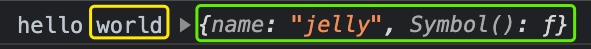
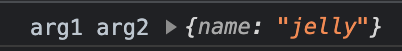

## Native Implementation of call(), apply(), bind() in JavaScript

#### 1. [Function.prototype.call](#question1)

#### 2. [Function.prototype.apply](#question2)

#### 3. [Function.prototype.bind](#question3)

#### 4. [Reference and Links](#question4)

<div id="question1" />

### I. Function.prototype.call

```js
Function.prototype.mycall = function (thisArg, ...args) {
  // 1. thisArg defaults to windows (strict mode is not allowed)
  thisArg = thisArg || window;

  // 1.1 transform primitive values
  thisArg = Object(thisArg);

  // 2. Specify this using object calls
  var fnKey = Symbol();
  thisArg[fnKey] = this; // "this" -> function object to be called

  // 3. call it with parameters
  var res = thisArg[fnKey](...args);

  // 4. Delete attributes of additional objects to eliminate side effects
  delete thisArg[fnKey];

  // 5. Return results
  return res;
};
```

**References:**

- https://blog.usejournal.com/implement-your-own-call-apply-and-bind-method-in-javascript-42cc85dba1b
- https://programmer.group/call-apply-bind-method-function-native-implementation-of-javascript.html

<div id="question2" />

### II. Function.prototype.apply

Similar implementation to `call()`, different type of parameters:

```js
Function.prototype.myApply = function (thisArg, args) {
  // 1. thisArg defaults to windows (strict mode is not allowed)
  thisArg = thisArg || window;

  // 1.1 transform primitive values
  thisArg = Object(thisArg);

  // 2. Specify this using object calls
  var fnKey = Symbol();
  thisArg[fnKey] = this; // "this" -> function object to be called

  // 3. call it with parameters
  var res = thisArg[fnKey](...args);

  // 4. Delete attributes of additional objects to eliminate side effects
  delete thisArg[fnKey];

  // 5. Return results
  return res;
};
```

**Test code:**

```js
var foo = function (msg) {
  console.log("hello " + msg, this);
};
var me = { name: "jelly" };
foo.myApply(me, ["world"]);
```



<div id="question3" />

### III. Function.prototype.bind

use `apply`, and not inherits the prototy

```js
Function.prototype.softBind = function (thisArg) {
  var self = this; // func to be bind
  var args = Array.prototype.slice.call(arguments, 1);

  return function () {
    var allArgs = args.concat([...arguments]);
    var res = self.apply(thisArg, allArgs);
    return res;
  };
};
```

Test Code:

```js
var foo = function (a, b) {
  console.log(a, b, this);
};
var me = { name: "jelly" };
foo.bind(me, "arg1")("arg2");
```



<div id="question4" />

### IV. Reference and Links

- https://programmer.group/call-apply-bind-method-function-native-implementation-of-javascript.html
- https://programmersought.com/article/35698149802/
